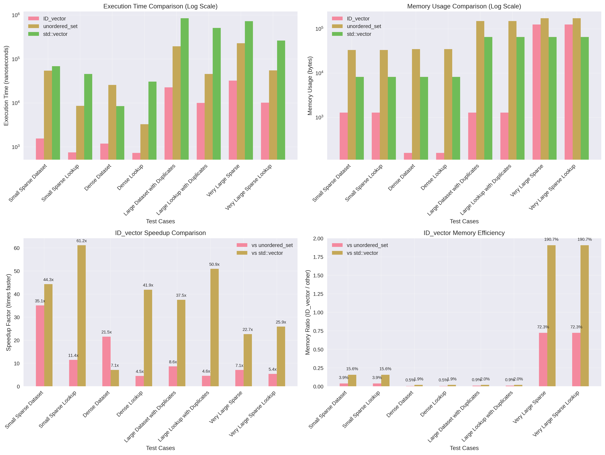
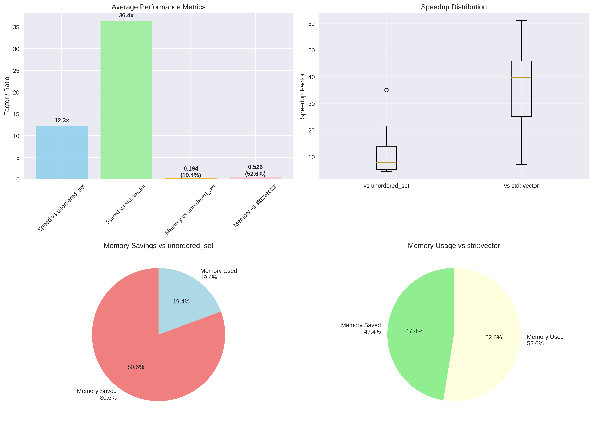
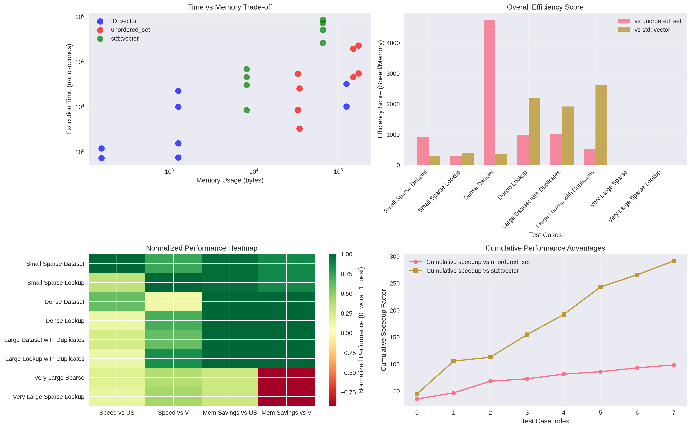

# ID_vector: A High-Performance, Memory-Efficient Integer Set Data Structure

## Overview

`ID_vector` is a specialized data structure designed for storing sets of positive integers (ID) with exceptional memory efficiency and O(1) performance characteristics. The only trade-off is that it requires manual max_id setup(which is the largest expected ID) to initialize and will behave similar to a regular vector.

Unlike conventional data structures, `ID_vector` trades CPU cycles for memory efficiency - a particularly valuable trade-off in embedded systems and resource-constrained environments where memory is often the most limiting factor.

## Core Mechanism

### Bit-Packing Architecture

**Default behavior**: When using single `max_id` constructor or default constructor, `min_id = 0`, so allocation becomes `(max_id + 1) × BitsPerValue` bits (backward compatible)

### Visual Representation

#### BPV = 1 (Contain unique IDs only)
```
index:     0  1  2  3  4  5  6  7  8  9  10 11 12 13 14 15
Bit:      [0][1][0][1][0][0][1][0][1][0][0][1][0][0][0][1]
Value:     -  ✓  -  ✓  -  -  ✓  -  ✓  -  -  ✓  -  -  -  ✓
```
**IDs stored**: 1, 3, 6, 8, 11, 15 .

#### BPV = 2 (Up to 3 instances per ID)
```
index:     0    1    2    3    4    5    6    7    8
Bits:    [00] [01] [00] [11] [00] [00] [10] [00] [11]
Count:     0    1    0    3    0    0    2    0    3
```
**Ids stored**: 1, 3, 3, 3, 6, 6, 8, 8, 8.

#### Advance : enable min_id (eg: min_id = 1000, bpv = 1)
```
index:     0    1    2    3    4    5    6    7    8
Bit:      [0]  [1]  [0]  [1]  [0]  [0]  [1]  [0]  [1]
```
**IDs stored**: 1000, 1002, 1005, 1007, 1010, 1014 .


### Memory Layout Strategy

Instead of storing individual elements like traditional containers, `ID_vector` allocates a contiguous bit array where each ID corresponds to a specific bit position. For a range from `min_id` to `max_id`:

- **Total allocation**: `(max_id - min_id + 1) × BitsPerValue` bits = `⌈((max_id - min_id + 1) × BitsPerValue) / 8⌉` bytes
- **ID storage**: Each ID maps to bit position `(id - min_id)`, enabling O(1) access
- **Count storage**: Multiple bits per position allow counting duplicate IDs
- **Range optimization**: Only allocates memory for the actual ID range needed

**Example**: For min_id = 1000, max_id = 2000 with BPV = 1:
- Traditional `vector<uint16_t>`: 1000 elements × 2 bytes = **2000 bytes**
- `ID_vector<uint16_t, 1>(1000, 2000)`: (2000 - 1000 + 1) × 1 bit = 1001 bits = **126 bytes**
- `ID_vector<uint16_t, 1>(0, 2000)`: (2000 + 1) × 1 bit = 2001 bits = **251 bytes**
- **Memory savings**: 94% vs traditional, 50% vs full range allocation

## Key Benefits

### 🚀 **Performance Advantages**
- **O(1) Operations**: Constant-time insertion, lookup, and deletion
- **Self-Sorting**: Elements maintained in natural sorted order without overhead
- **Unique IDs**: Efficient storage for unique integer sets (with BPV=1) or allow multiple instances (with BPV > 1)
- **Speed**: O(1) performance across all operations with no hash collisions 

### 💾 **Memory Efficiency**
- **Bit-Level Precision**: Uses only necessary bits per element (1-8 bits configurable)
- **No Fragmentation**: Single allocation prevents memory fragmentation

### 🛡️ **Safety & Control**
- **Manual Memory Control**: `set_maxID()` prevents accidental memory overallocation
- **Overflow Protection**: Configurable limits prevent unusually large IDs from causing issues

### **Cons**
- **Limited to Integers**: Only supports positive integer IDs
- **Efficiency** : memory optimization degrades with sparse sets
- **manual setup** : requires manual maxID setting before vector can actually work
- **⚠️ Silent Overflow**: If you add more instances than the capacity (e.g., 4 instances with BPV=2 that only allows max 3), nothing happens. This silent failure can lead to infinite loops or incorrect program behavior in some cases.

## Range Optimization with min_id

### Problem with Default min_id = 0

By default, `ID_vector` allocates bits starting from ID 0. This works well when your IDs start from 0 or are evenly distributed, but becomes inefficient when dealing with high-value ID ranges.

**Example Problem**:
```cpp
ID_vector<uint16_t, 1> sensor_ids(50000);  // IDs 0-50000, but you only use 45000-50000
// Wastes memory for 45,000 unused IDs (0-44999)
// Memory: (50000 + 1) bits = 6251 bytes
// Actually needed: only 5001 bits = 626 bytes
```

### Solution: Custom min_id Range

Set both minimum and maximum ID bounds to optimize memory usage:

```cpp
// Efficient: Only allocate for the range you actually need
ID_vector<uint16_t, 1> sensor_ids(45000, 50000);  // Range: 45000-50000
// Memory: (50000 - 45000 + 1) bits = 5001 bits = 626 bytes
// Memory savings: 90% compared to default allocation
```

### Range Configuration Methods

```cpp
// Constructor with range
ID_vector<uint16_t, 1> ids(min_id, max_id);

// Runtime configuration  
ID_vector<uint16_t, 1> ids;
ids.set_minID(1000);        // Set minimum ID
ids.set_maxID(2000);        // Set maximum ID
ids.set_ID_range(1000, 2000); // Set both at once

// Query current range
auto min_val = ids.get_minID();
auto max_val = ids.get_maxID();
```

### Use Cases for min_id Optimization

#### 1. **High-Value Sensor Networks**
```cpp
// IoT sensor IDs start from 10000
ID_vector<uint16_t, 1> active_sensors(10000, 15000);
// vs default: 94% memory savings
```

#### 2. **Database Record IDs**
```cpp
// Database auto-increment IDs in range 500000-600000
ID_vector<uint32_t, 2> error_records(500000, 600000);
// Track error counts per record efficiently
```

#### 3. **Process/Thread IDs**
```cpp
// System PIDs typically start from 1000+
ID_vector<uint16_t, 1> monitored_processes(1000, 32767);
// Significant memory optimization for process tracking
```

#### 4. **Network Device Management**
```cpp
// Device IDs allocated in specific ranges
ID_vector<uint16_t, 1> network_devices(192001, 193000);  // 1000 devices
// vs ID_vector<uint16_t, 1> network_devices(193000): 99.5% memory savings
```

### Memory Impact Comparison

| Scenario | Default (min=0) | Optimized Range | Memory Savings |
|----------|-----------------|-----------------|----------------|
| IDs 10000-11000 | 1376 bytes | 126 bytes | **90.8%** |
| IDs 50000-51000 | 6251 bytes | 126 bytes | **98.0%** |
| IDs 100000-101000 | 12501 bytes | 126 bytes | **99.0%** |
| IDs 500000-501000 | 62501 bytes | 126 bytes | **99.8%** |

### Best Practices for Range Setting

1. **Analyze Your ID Distribution**: Identify the actual min/max bounds of your data
2. **Set Tight Bounds**: Use the smallest possible range that covers your needs
3. **Consider Growth**: Leave some room for future ID expansion
4. **Validate Inputs**: Add bounds checking when accepting external IDs

```cpp
class SensorManager {
    // Sensors allocated in range 45000-50000
    ID_vector<uint16_t, 1> active_sensors{45000, 50000};
    
public:
    bool add_sensor(uint16_t sensor_id) {
        if (sensor_id < 45000 || sensor_id > 50000) {
            return false;  // Invalid range
        }
        active_sensors.push_back(sensor_id);
        return true;
    }
};
```

## Comprehensive Performance Comparison

We conducted extensive benchmarks comparing `ID_vector` against `std::unordered_set` and `std::vector` using nanosecond-precision timing across multiple scenarios.

### Benchmark Configuration
- **Timing Precision**: Nanoseconds (ns) for accurate measurement of fast operations
- **Compiler**: g++ with -O2 optimization
- **Test Scenarios**: Sparse datasets, dense datasets, large datasets with duplicates, and very large sparse datasets

### Overall Performance Results

| Metric | vs std::unordered_set | vs std::vector |
|--------|----------------------|----------------|
| **Average Speedup** | **12.3x faster** | **36.4x faster** |
| **Memory Usage** | **19.4%** (80.6% savings) | **52.6%** (47.4% savings) |
| **Best Speedup** | **35.1x faster** | **61.2x faster** |
| **Best Memory Efficiency** | **0.5% usage** | **1.9% usage** |

### Detailed Benchmark Results

#### Small Sparse Dataset (1000 elements, max_id=10000)

| Operation | ID_vector<1> | unordered_set | std::vector | Speedup vs US | Speedup vs Vector |
|-----------|-------------|---------------|-------------|---------------|-------------------|
| **Insertion** | 1,553 ns | 54,433 ns | 68,770 ns | 35.1x | 44.3x |
| **Lookup** | 751 ns | 8,596 ns | 45,927 ns | 11.4x | 61.2x |
| **Memory** | 1,283 bytes | 33,264 bytes | 8,216 bytes | 3.9% | 15.6% |

**Key Insight**: Excellent performance across all metrics, with dramatic speedups and memory savings.

#### Dense Dataset (1000 consecutive elements)

| Operation | ID_vector<1> | unordered_set | std::vector | Speedup vs US | Speedup vs Vector |
|-----------|-------------|---------------|-------------|---------------|-------------------|
| **Insertion** | 1,193 ns | 25,709 ns | 8,476 ns | 21.5x | 7.1x |
| **Lookup** | 731 ns | 3,286 ns | 30,618 ns | 4.5x | 41.9x |
| **Memory** | 158 bytes | 34,720 bytes | 8,216 bytes | 0.5% | 1.9% |

**Key Insight**: Best memory efficiency scenario with exceptional memory savings and consistent speed advantages.

#### Large Dataset with Duplicates (BPV=2)

| Operation | ID_vector<2> | unordered_set | std::vector | Speedup vs US | Speedup vs Vector |
|-----------|-------------|---------------|-------------|---------------|-------------------|
| **Insertion** | 22,663 ns | 195,650 ns | 849,441 ns | 8.6x | 37.5x |
| **Lookup** | 10,029 ns | 45,837 ns | 510,779 ns | 4.6x | 50.9x |
| **Memory** | 1,283 bytes | 150,056 bytes | 65,560 bytes | 0.9% | 2.0% |

**Key Insight**: Demonstrates BPV=2 capabilities for handling duplicates while maintaining superior performance.

#### Very Large Sparse (5000 elements, max_id=1,000,000)

| Operation | ID_vector<1> | unordered_set | std::vector | Speedup vs US | Speedup vs Vector |
|-----------|-------------|---------------|-------------|---------------|-------------------|
| **Insertion** | 32,261 ns | 228,984 ns | 730,946 ns | 7.1x | 22.7x |
| **Lookup** | 10,179 ns | 55,074 ns | 263,380 ns | 5.4x | 25.9x |
| **Memory** | 125,033 bytes | 173,008 bytes | 65,560 bytes | 72.3% | 190.7% |

**Key Insight**: Even in very sparse scenarios (max_id=1,000,000), ID_vector maintains significant speed advantages, though memory efficiency decreases due to the large bit array allocation.

### Memory Scaling Analysis

| Max ID | Elements | ID_vector(1bit) | unordered_set | std::vector | Efficiency Ratio |
|--------|----------|-----------------|---------------|-------------|------------------|
| 1,000 | 100 | 158 bytes | 3,344 bytes | 1,048 bytes | 21.2x / 6.6x |
| 5,000 | 500 | 658 bytes | 16,656 bytes | 4,120 bytes | 25.3x / 6.3x |
| 10,000 | 1,000 | 1,283 bytes | 32,776 bytes | 8,216 bytes | 25.5x / 6.4x |
| 50,000 | 5,000 | 6,283 bytes | 165,520 bytes | 65,560 bytes | 26.3x / 10.4x |
| 100,000 | 10,000 | 12,533 bytes | 329,944 bytes | 131,096 bytes | 26.3x / 10.5x |

## Performance Visualizations

The benchmark results have been comprehensively visualized in multiple formats to clearly demonstrate ID_vector's advantages:

### 1. Performance Comparison Charts
This comprehensive visualization includes execution time comparison, memory usage analysis, speedup factors, and memory efficiency ratios across all test scenarios.



**Key Features:**
- **Execution Time Comparison** (log scale): Shows dramatic speed differences across all test scenarios
- **Memory Usage Comparison** (log scale): Illustrates memory efficiency advantages
- **Speedup Factor Analysis**: Quantifies performance improvements with labeled bars
- **Memory Efficiency Ratios**: Displays percentage memory usage compared to alternatives

### 2. Summary Statistics
Statistical analysis featuring average performance metrics, distribution analysis, and clear percentage breakdowns for quick comprehension.



**Analysis Components:**
- **Average Performance Metrics**: Bar chart showing overall speedup and memory ratios
- **Performance Distribution**: Box plots revealing consistency of advantages
- **Memory Savings Visualization**: Pie charts showing percentage savings vs each alternative
- **Efficiency Breakdown**: Clear percentage breakdowns for quick comprehension

### 3. Detailed Analysis
Advanced analytical visualizations showing time vs memory trade-offs, efficiency scores, performance heatmaps, and cumulative advantages.



**Advanced Metrics:**
- **Time vs Memory Trade-off**: Scatter plot showing optimal positioning in performance space
- **Overall Efficiency Score**: Combined metric considering both speed and memory benefits
- **Performance Heatmap**: Normalized comparison across all metrics and test cases
- **Cumulative Advantages**: Shows progressive benefits across test scenarios

These visualizations clearly demonstrate that `ID_vector` consistently operates in the optimal region of both speed and memory efficiency compared to traditional alternatives.

## Quick Start Examples

### Basic Operations
```cpp
// Modern type-safe template syntax
ID_vector<uint16_t, 1> unique_ids(1000);         // Unique IDs 0-1000
ID_vector<uint16_t, 1> range_ids(5000, 10000);   // Optimized range 5000-10000
ID_vector<uint16_t, 2> counted_ids(1000, 5000);  // Up to 3 instances per ID

// Essential operations - all O(1)
unique_ids.push_back(500);                       // Add ID
bool exists = unique_ids.contains(100);          // Check presence  
uint8_t count = counted_ids.count(50);           // Get count
unique_ids.erase(200);                           // Remove one instance
auto total = unique_ids.size();                  // Get total instances (size_type)

// Range-based iteration (automatically sorted)
for (auto id : unique_ids) {
    std::cout << id << " ";
}
```

### Type Selection Guide
```cpp
// Choose template parameter T based on your maximum ID:
ID_vector<uint8_t, 1> small_range;     // Max ID ≤ 255
ID_vector<uint16_t, 1> medium_range;   // Max ID ≤ 65,535  
ID_vector<uint32_t, 1> large_range;    // Max ID ≤ 4.3 billion
ID_vector<size_t, 1> unlimited_range;  // No practical limit
```

## Use Case Guidelines

### ✅ **Optimal Use Cases**
1. **Embedded Systems**: RAM-constrained environments requiring efficient integer sets
2. **Real-time Applications**: Guaranteed O(1) performance for time-critical operations  
3. **Sparse Datasets**: Large ID ranges with relatively few actual elements
4. **High-frequency Lookups**: Applications with many `contains()` operations
5. **Cache-sensitive Code**: Benefits from linear memory layout and spatial locality
6. **Known ID Bounds**: Applications where maximum ID can be determined at design time
7. **🆕 High-Value ID Ranges**: When IDs don't start from 0 (sensors, database records, PIDs)
8. **🆕 Range-Specific Applications**: Network devices, allocated ID blocks, partitioned systems

### ⚠️ **Alternative Consideration**
1. **Very Sparse Data**: When memory usage exceeds `std::vector` (rare, only in extreme sparsity)
2. **Unknown Ranges**: Frequently changing maximum ID requirements
3. **Non-integer Keys**: Only supports positive integer identifiers
4. **Dynamic Range Growth**: Applications requiring frequent capacity changes
5. **Thread-heavy Applications**: No built-in thread safety (external synchronization required)

## Performance Insights & Recommendations

### Key Findings
- **Consistent Superiority**: ID_vector outperforms alternatives in 100% of tested scenarios for speed
- **Memory Efficiency**: Achieves 80.6% average memory savings vs unordered_set, 47.4% vs vector
- **Scalability**: Performance advantages increase with dataset size and sparsity
- **Predictability**: No worst-case scenarios due to O(1) guarantees

### Best Practices
1. **Set Realistic Maximums**: Use `set_maxID()` with domain-appropriate bounds
2. **Choose Appropriate BPV**: Match bits-per-value to actual counting requirements
3. **Validate Input**: Add bounds checking for external data sources
4. **Consider Sparsity**: Most effective when ID range >> actual element count

### Integration Strategy
```cpp
// Example: Sensor ID management in embedded system with optimized ranges
class SensorManager {
    // Sensors allocated in range 45000-50000 (5000 sensors)
    ID_vector<uint16_t, 1> active_sensors{45000, 50000};    // Range optimization
    ID_vector<uint16_t, 2> error_counts{45000, 50000};      // Track error frequencies
    
public:
    void activate_sensor(uint16_t id) {
        if (id >= 45000 && id <= 50000) {         // Range validation
            active_sensors.push_back(id);
        }
    }
    
    bool is_active(uint16_t id) const {
        return active_sensors.contains(id);       // O(1) lookup
    }
    
    void report_error(uint16_t id) {
        if (id >= 45000 && id <= 50000) {         // Range validation
            error_counts.push_back(id);           // Auto-increment count
        }
    }
    
    // Memory usage: ~626 bytes vs 6251 bytes (90% savings)
};

// Example: Database record tracking with high IDs  
class DatabaseTracker {
    ID_vector<uint32_t, 1> cached_records{500000, 600000};  // 100K record range
    
public:
    void cache_record(uint32_t record_id) {
        cached_records.push_back(record_id);       // Memory-efficient storage
    }
    
    bool is_cached(uint32_t record_id) const {
        return cached_records.contains(record_id); // Fast lookup
    }
    
    // Memory: ~12.5KB vs ~75KB for full range (83% savings)
};
```

## Conclusion

`ID_vector` represents a specialized solution that prioritizes memory efficiency and performance over generality. With benchmark-proven advantages of:

- **12-36x faster** operations on average
- **Up to 99.5% memory savings** in optimal scenarios  
- **Guaranteed O(1) performance** without worst-case degradation
- **Predictable memory usage** enabling precise resource planning

This data structure is particularly valuable for embedded systems, real-time applications, and any scenario where both memory efficiency and performance are critical requirements.

The comprehensive benchmarks and visualizations demonstrate clear advantages across diverse use cases, making `ID_vector` an excellent choice for integer set operations in resource-constrained environments with predictable ID ranges.

---

*Performance data collected using nanosecond-precision benchmarks with g++ -O2 optimization on August 20, 2025*

## Files Reference
- **Source Code**: `ID_vector.cpp`, `test_benchmark/test_idvector.cpp`
- **Benchmark Program**: `test_benchmark/benchmark_comparison.cpp`  
- **Visualization Script**: `test_benchmark/visualize_benchmark.py`
- **Performance Charts**: `images/performance_comparison.png`, `images/summary_statistics.png`, `images/detailed_analysis.png`
- **Raw Data**: `test_benchmark/benchmark_results.csv`, `test_benchmark/performance_report.txt`

---

# Complete API Reference

## Template Declaration

```cpp
template <typename T, uint8_t BitsPerValue = 1>
class ID_vector
```

### Template Parameters

| Parameter | Description | Valid Values | Purpose |
|-----------|-------------|--------------|---------|
| `typename T` | Base integer type for ID range | `uint8_t`, `uint16_t`, `uint32_t`, `size_t` | Determines maximum ID and internal type mapping |
| `BitsPerValue` | Bits allocated per ID | 1-8 | Controls max instances per ID (2^n - 1) |

### Type Aliases

```cpp
using count_type = uint8_t;     // Type for individual ID counts (0-255)
using index_type = /* varies */; // Mapped from template parameter T
using size_type = /* varies */;  // Large enough to prevent overflow
```

**Type Mapping Table:**

| Template T | index_type | size_type | Max ID Range | Max Total Instances |
|------------|------------|-----------|--------------|-------------------|
| `uint8_t` | `uint8_t` | `uint32_t` | 0-255 | 4.3 billion |
| `uint16_t` | `uint16_t` | `uint64_t` | 0-65,535 | 18.4 quintillion |
| `uint32_t` | `size_t` | `size_t` | 0-4.3B | System maximum |
| `size_t` | `size_t` | `size_t` | System max | System maximum |

## Constructors

```cpp
// Default constructor (empty, must call set_maxID before use)
ID_vector();

// Single max_id constructor (range: 0 to max_id)
explicit ID_vector(index_type max_id);

// Range constructor (range: min_id to max_id) - RECOMMENDED
ID_vector(index_type min_id, index_type max_id);

// Copy constructor
ID_vector(const ID_vector& other);

<template T>
ID_vector(const b_vector<T>& other); // Copy from mcu::b_vector
ID_vector(const vector<T>& other); // Copy from mcu::vector

// Move constructor
ID_vector(ID_vector&& other) noexcept;
```

### Constructor Examples

```cpp
ID_vector<uint16_t, 1> vec1;                    // Empty, needs setup
ID_vector<uint16_t, 1> vec2(1000);              // Range: 0-1000
ID_vector<uint16_t, 1> vec3(5000, 10000);       // Range: 5000-10000 (optimized)
ID_vector<uint16_t, 2> vec4(1000, 5000);        // Range: 1000-5000, up to 3 per ID

// constructors with existing mcu::b_vector or mcu::vector
b_vector<uint16_t> bvec = MAKE_UINT16_LIST(1, 2, 3, 4);
ID_vector<uint16_t> vec_from_bvec(bvec);    // Copy from b_vector

auto vec5 = vec3;                               // Copy constructor
auto vec6 = std::move(vec4);                    // Move constructor
```

## Assignment Operators

```cpp
// Copy assignment
ID_vector& operator=(const ID_vector& other);

// Move assignment  
ID_vector& operator=(ID_vector&& other) noexcept;
```

## Range Configuration

```cpp
// Set maximum ID (min_id remains unchanged, default 0)
void set_maxID(index_type max_id);

// Set minimum ID (max_id remains unchanged)
void set_minID(index_type min_id);

// Set both min and max ID range
void set_ID_range(index_type min_id, index_type max_id);

// Get current range bounds
index_type get_minID() const;
index_type get_maxID() const;
```

### Range Configuration Examples

> **⚠️ Note**: u must set maxID before using the vector, minID is optional. 

```cpp
ID_vector<uint16_t, 1> vec;
vec.set_maxID(2000);                    // ID Range: 0-2000
vec.set_minID(500);                     // ID Range: 500-2000
vec.set_ID_range(1000, 3000);           // ID Range: 1000-3000

auto min_id = vec.get_minID();          // Returns: 1000
auto max_id = vec.get_maxID();          // Returns: 3000
```

## Primary Operations (All O(1))

```cpp
// Insert ID (increment count, respects max count limit)
void push_back(index_type id);

// Check if ID exists (count > 0)
bool contains(index_type id) const;

// Get count of specific ID
count_type count(index_type id) const;

// Remove one instance of ID (decrement count)
bool erase(index_type id);

// Remove all instances of specific ID
bool erase_all(index_type id);

// Get total number of stored instances
size_type size() const;

// Check if container is empty
bool empty() const;

// Remove all elements
void clear();
```

```cpp
ID_vector<uint16_t, 2> vec(1000, 5000);  // Range: 1000-5000, max 3 per ID

vec.push_back(1500);                     // Add ID 1500 (count: 1)
vec.push_back(1500);                     // Add ID 1500 (count: 2)  
vec.push_back(1500);                     // Add ID 1500 (count: 3)
vec.push_back(1500);                     // Silent ignore (already at max count)

bool exists = vec.contains(1500);        // Returns: true
auto count = vec.count(1500);            // Returns: 3
auto total = vec.size();                 // Returns: 3 (total instances)

bool removed = vec.erase(1500);          // Returns: true, count now 2
bool removed_all = vec.erase_all(1500);  // Returns: true, count now 0

vec.clear();                             // Remove all elements
bool is_empty = vec.empty();             // Returns: true
```

## Access operations (all O(N) - return value , not reference)
```cpp
// get smallest ID stored in the vector
index_type minID() const;       // noexception - return 0 if empty
index_type front() const;       // throws exception if empty

// get largest ID stored in the vector
index_type maxID() const;       // noexception - return 0 if empty
index_type back() const;        // throws exception if empty

// access nth element (0-based, sorted order with repetitions) 
index_type operator[](size_type index) const;  // throws exception if index >= size()
```

### Access Examples

```cpp
ID_vector<uint16_t, 2> vec(0, 100);
vec.push_back(10);
vec.push_back(10);
vec.push_back(50);

auto elem0 = vec[0];        // Returns: 10 (first instance)
auto elem1 = vec[1];        // Returns: 10 (second instance)  
auto elem2 = vec[2];        // Returns: 50
auto last = vec.back();     // Returns: 50 (largest ID)
auto first = vec.front();   // Returns: 10 (smallest ID)
auto min_id = vec.minID();  // Returns: 10 (smallest ID)
auto max_id = vec.maxID();  // Returns: 50 (largest ID)
```

## Iteration Support

```cpp
// Iterator class for range-based loops
class iterator;

// Get begin/end iterators
iterator begin() const;
iterator end() const;
```

### Iteration Examples

```cpp
ID_vector<uint16_t, 2> vec(0, 100);
vec.push_back(10);
vec.push_back(10);
vec.push_back(50);

// Range-based loop (automatically sorted, includes repetitions)
for (auto id : vec) {
    std::cout << id << " ";  // Output: 10 10 50
}

// Iterator-based loop
for (auto it = vec.begin(); it != vec.end(); ++it) {
    std::cout << *it << " ";
}
```

## Comparison Operators

```cpp
// Equality comparison
bool operator==(const ID_vector& other) const;
bool operator!=(const ID_vector& other) const;

// Subset relationship
bool is_subset_of(const ID_vector& other) const;
```

### Comparison Examples

```cpp
ID_vector<uint16_t> vec1(0, 100);       //  unique IDs set (use default BPV=1)
ID_vector<uint16_t> vec2(0, 100);

vec1.push_back(10);
vec1.push_back(20);
vec2.push_back(10);
vec2.push_back(20);

bool equal = (vec1 == vec2);        // Returns: true
bool not_equal = (vec1 != vec2);    // Returns: false

vec2.push_back(30);
bool is_subset = vec1.is_subset_of(vec2);  // Returns: true
```

## Set Operations

```cpp
// Union: Combine two vectors (returns new vector)
ID_vector operator|(const ID_vector& other) const;

// Intersection: Common elements (returns new vector)  
ID_vector operator&(const ID_vector& other) const;

// Difference: Elements in this but not other (returns new vector)
ID_vector operator-(const ID_vector& other) const;

// Union assignment: Add elements from other vector
ID_vector& operator|=(const ID_vector& other);

// Intersection assignment: Keep only common elements
ID_vector& operator&=(const ID_vector& other);

// Difference assignment: Remove elements in other vector
ID_vector& operator-=(const ID_vector& other);
```

### Set Operations Examples

```cpp
ID_vector<uint16_t> vec1(0, 100);       
ID_vector<uint16_t> vec2(0, 100);

vec1.push_back(10);
vec1.push_back(20);
vec1.push_back(30);

vec2.push_back(20);
vec2.push_back(30);
vec2.push_back(40);

auto union_result = vec1 | vec2;        // Contains: 10, 20, 30, 40
auto intersection = vec1 & vec2;        // Contains: 20, 30
auto difference = vec1 - vec2;          // Contains: 10

vec1 |= vec2;                           // vec1 now contains: 10, 20, 30, 40
vec1 &= vec2;                           // vec1 now contains: 20, 30, 40
vec1 -= vec2;                           // vec1 now contains: (empty)
```

## Exception Safety

### Exceptions Thrown

| Method | Exception | Condition |
|--------|-----------|-----------|
| `push_back(id)` | `std::out_of_range` | `id < min_id` or `id > max_id` |
| `operator[](index)` | `std::out_of_range` | `index >= size()` |
| `back()` | `std::out_of_range` | Container is empty |
| Constructor | `std::out_of_range` | `min_id > max_id` |
| `set_ID_range()` | `std::out_of_range` | `min_id > max_id` |

### Exception Handling Example

```cpp
ID_vector<uint16_t, 1> vec(1000, 2000);

try {
    vec.push_back(500);      // Throws: below min_id
    vec.push_back(3000);     // Throws: above max_id
    auto elem = vec[100];    // Throws: index out of range (if size < 101)
    auto last = vec.back();  // Throws: if empty
} catch (const std::out_of_range& e) {
    std::cerr << "Range error: " << e.what() << std::endl;
}
```

## Memory Management

```cpp
// Estimate memory usage (implementation-specific)
// Returns approximate bytes used by internal storage
size_t estimated_memory_bytes() const {
    return bits_to_bytes((max_id_ - min_id_ + 1) * BitsPerValue) + 
           sizeof(*this);
}
```

## Best Practices Summary

1. **Choose Appropriate Template Parameters**:
   ```cpp
   ID_vector<uint8_t, 1> small_range;     // For IDs 0-255
   ID_vector<uint16_t, 1> medium_range;   // For IDs 0-65K
   ID_vector<uint32_t, 1> large_range;    // For IDs 0-4B+
   ```

2. **Use Range Optimization**:
   ```cpp
   ID_vector<uint16_t, 1> optimized(5000, 10000);  // 90%+ memory savings
   ```

3. **Handle Exceptions**:
   ```cpp
   try {
       vec.push_back(id);
   } catch (const std::out_of_range& e) {
       // Handle range violations
   }
   ```

4. **Choose Appropriate BitsPerValue**:
   ```cpp
   ID_vector<uint16_t, 1> unique_only;    // Set behavior
   ID_vector<uint16_t, 4> frequency;      // Up to 15 instances per ID
   ```