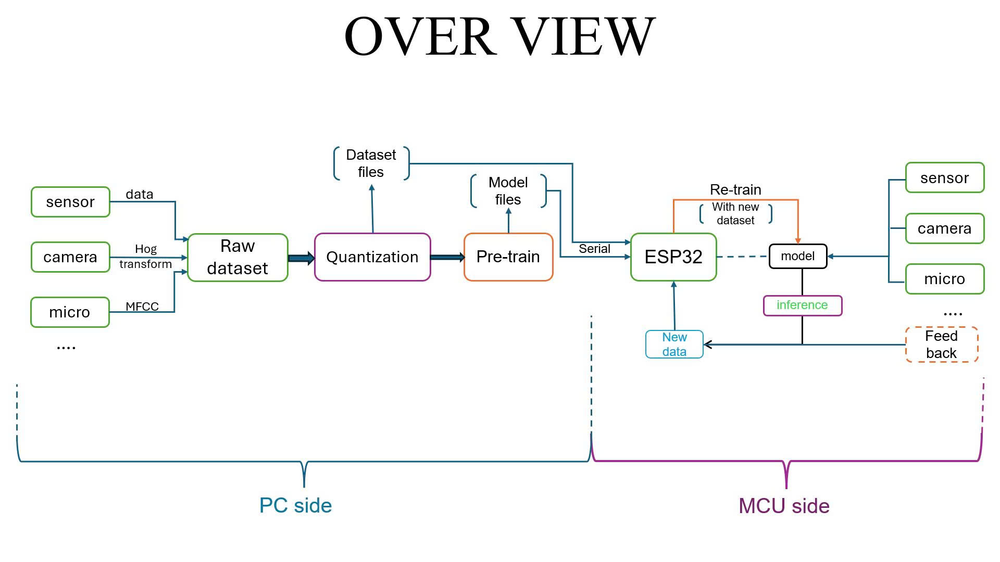
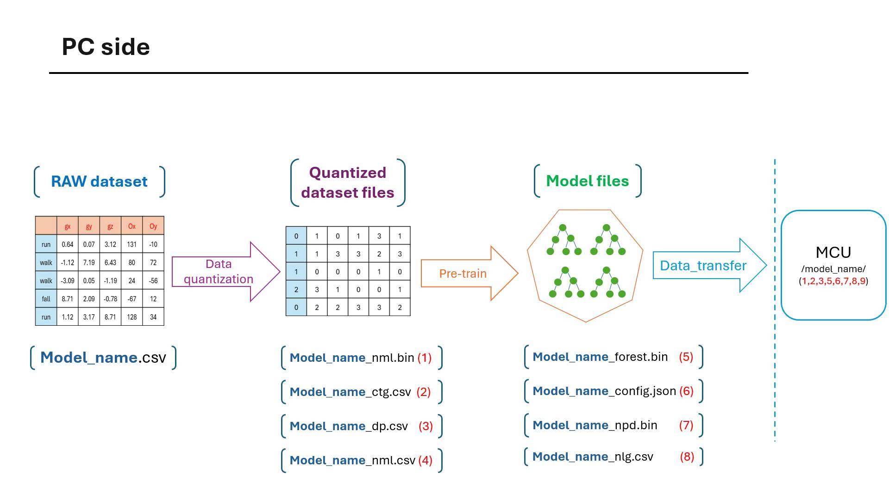
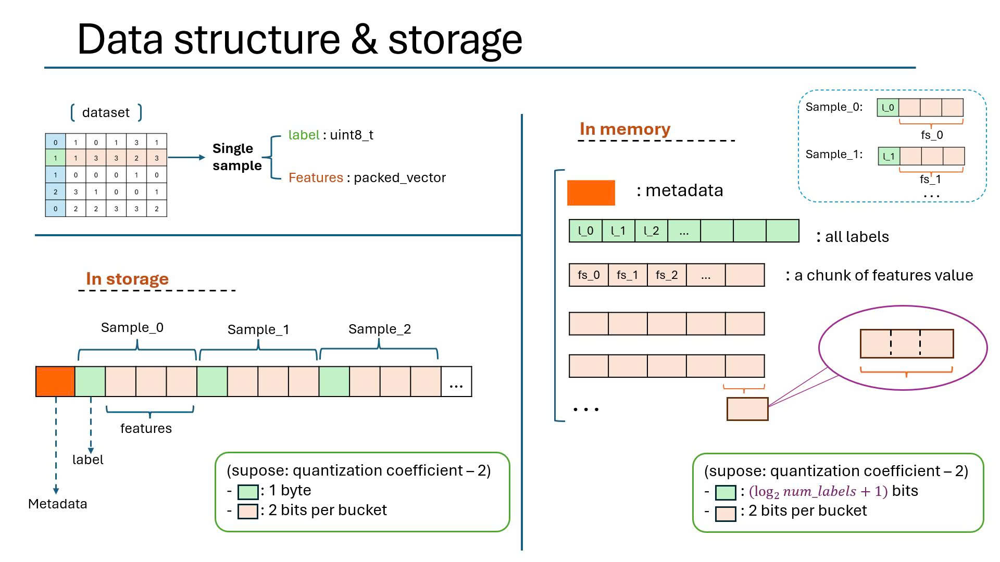
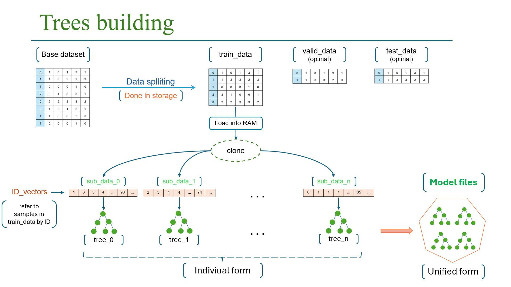
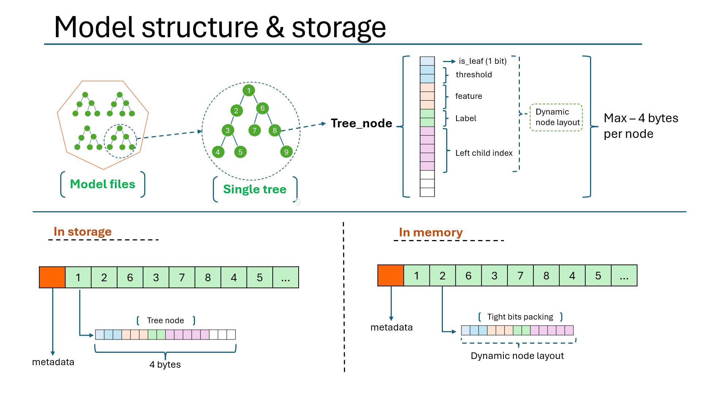
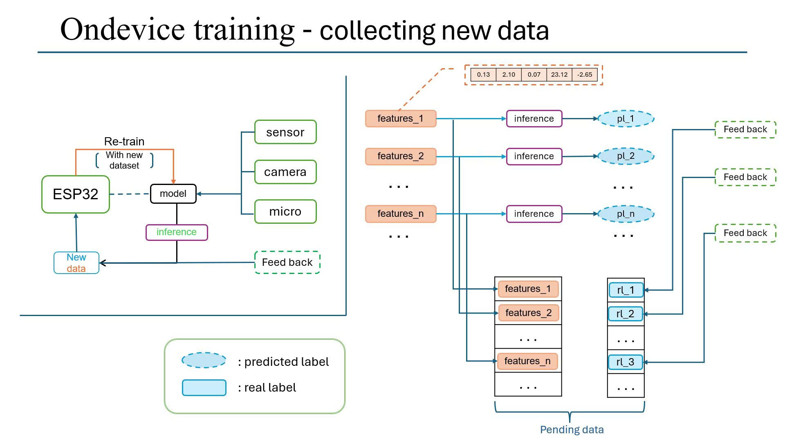
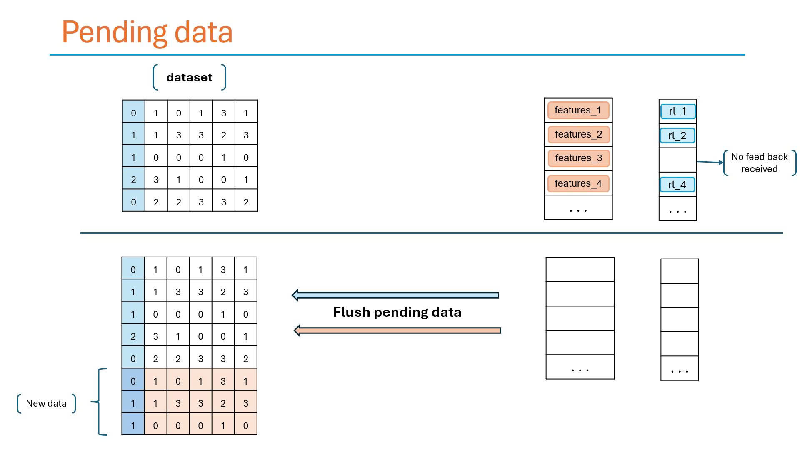
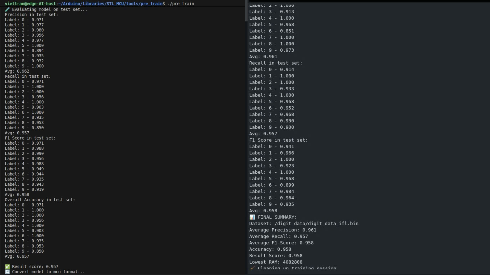

# Random forest for microcontrollers documentation

This is the technical documentation for the MCU random forest library, analyzing and explaining how the entire algorithm is built, how it stores and compresses data, and how to use it efficiently on a microcontroller.

## Overview



**Core ideas:** Normally, models embedded in microcontrollers are difficult to update, as they need to be re-uploaded code and often soldered to a larger system. This library is built to help build and retrain models on the microcontroller itself, helping them adapt to new data during operation.

**Why random forest?** Random Forest is an algorithm that works well on many datasets, especially with sensor data. It may be less efficient than modern neural networks at learning information from data (making the model size larger), but it requires less memory during model building & training. It is also better suited for quantization, both of the data and the model.

**Target devices:** This library is designed to be extensible for many types of microcontrollers, with macros and definitions that allow portability when switching to other microcontrollers. However, currently the tests and code only ensure stable running on esp32 variants. So in this whole workspace, the two concepts `mcu` and `esp32` can be considered synonymous

**Toolchain:** The entire pipeline consists of two main stages: PC side and MCU side. All tools are contained in the [tools/](../tools/) folder.

## PC side
- The pipeline of this algorithm goes through many steps on a `PC_side` before moving to the microcontroller stage(MCU side). Bassically, there are 2 main steps in `PC_side`: data quantization and model pre-training.



**Data quantization tool:** 
  - quanization dataset  
  - generate quantized dataset and [Rf_quantizer](./details_docs/Rf_quantizer.md) to be used on microcontroller
  - See more details : [Data quantization tools](../tools/data_quantization/README.md)

**Model pre-training tool:** 
  - Pre-trained model - ready to embed and run on microcontroller 
  - Find optimal configuration and object model packaging support - minimize burden on microcontroller 
  - See more details : [Model pre-training tools](../tools/pre_train/README.md) 

## Data transfer tools:
- After quantization and pre-training, the generated files need to be transferred to the microcontroller's filesystem (SD card, SPIFFS, LittleFS, ...). This step is done using the data transfer tools.
- used to transfer files from pc to microcontroller:hog config file(for vision tasks), dataset (after quantization), model, quantizer, node_predictor, ...
- See more details : [Data transfer tools](./Data_Transfer.md)

## Data structure & storage 
- In this library, each dataset is represented by an `Rf_data` object.
- `Rf_data` objects have 2 different structures when stored and when loaded into RAM :



The storage structure is quite simple, so here we will discuss the structure of `Rf_data` when loaded into RAM:
 - a `packed_vector` containing labels of all samples. It uses only the exact number of bits needed to store each label. (e.g., for 3 classes, only 2 bits per label are used)
 - a vector containing data chunks - the packed_vector . Each chunk contains the feature values ​​of the samples in turn and has a certain capacity (8 KB (32 KB with PSRAM)).
 - The order of label-features in the vectors is implicitly the ID of that sample. This eliminates the need to store IDs for samples, saving 4 bytes per sample -> Provides extremely strong compression ratios even with small datasets and few features

**Why use chunks for features?**
  - Previously, `Rf_data` used `mcu::unordered_map` to store samples and manage them via ID.
  - `mcu::unordered_map` uses double pointers, which is extremely powerful in defragmenting memory. However, it has two weaknesses :
    - costs more 4 bytes per sample to store the ID
    - each heap allocation required few bytes of overhead.
  This is extremely expensive given that each quantized sample only takes up a few bytes.
  -> decided to switch to vectors to store and interpolate IDs from the order. However vector is a contiguous array of data, extending it will cause severe memory fragmentation, even insufficient when it exceeds the largest block in the heap.

**Conclusion:**
  - This architecture actually uses the minimum amount of memory needed to load the samples into RAM. No further optimization and compression is possible.


## Tree buliding 
- In this library, each decision tree is represented by an `Rf_tree` object.
This section will go over how trees are built and modeled in this algorithm:



- The original dataset (base_dataset) will be split into train_data, test_data(optinal) and validation_data (optinal). in default (oob_score, DEV_STAGE = 0), train_data = base_dataset.
- train_data will be split into multiple subb_datasets using bootstrap sampling method. Each sub_dataset will be used to build a decision tree.
- Each sub_dataset has the same size as train_data. This is excessive with both the limited RAM and storage on the microcontroller. So the sub_dataset is essentially a set of IDs that map to train_data samples.
- The trees are built breadth-first. (for minimizing tree node layout size)
- During the model creation process in particular (and the whole algorithm in general), components are loaded into RAM and released into storage rhythmically, interleaved. This helps to limit the peak RAM usage.

## Model structure & storage
 - The model is actually made up of individual trees (`Rf_tree` objects). 
 - Similar to `Rf_data`, `Rf_tree` also has two different structures when stored and when loaded into RAM : 



- Rf_tree stores nodes (Tree_node) as an array form (`mcu::vector` / `mcu::packed_vector`).
- `Tree_node` encapsulates components with `node_layout`.
- In storage , `node_layout` is fixed (4 bytes per node)
- in RAM, `node_layout` is dynamic. It is computed at model build time to adapt even when dataset changes (new data added during lifecycle). The `node_layout` is helped to calculate by the `node_predictor` created in the [tools : pre-train](../tools/pre_train/).
- The dynamic `node_layout` mechanism helps reduce RAM usage when loading the model into RAM (can be up to 40% smaller than the stored size).
- The model has two forms: 
    - Individual form : used internally during construction, training and assessment
    - Unified form : formed after the construction/training process is completed and officially used.

## Re-building & ondevice training
This section describes the mechanism and instructions on how to collect feedback, add new data to the dataset, and retrain the model on the microcontroller itself.



### Collect new data & feedback mechanism

`pending_data`: The container holds new data collected during microcontroller operation, waiting for real label feedback before being added to the main dataset and used for retraining the model. It consists of 2 containers containing the features and labels respectively.

How it works:
- Any inferred patterns will also be added to `pending_data` container, waiting for real label feedback.
- Feedback : When the real label of a sample is known (e.g., user correction, external sensor confirmation), the `add_actual_label()` function is called to add the real label to the real label container in `pending_data`.
- Not everey inference requies feedback. Samples with no response will be discarded after a certain waiting time. U can change this time via `set_feedback_timeout()` function (max ~ 20 days).
- pending_data has a limited maximum capacity. default is 100 samples. U can change this value via `set_max_pending_samples()` function.

Add new data into the main dataset:
- When the number of samples in `pending_data` is full, it will be automatically plushed or u can manually call `push_pending_data()` function.
- Only samples with real labels will be added to the main dataset. Samples without real labels will be discarded.
- After pushing, `pending_data` will be cleared and ready to collect new data.



### Rebuild model / ondevice training
- Activation mechanism:
    - after each cycle reaches a certain number of inferences.
    - When model accuracy drops below a certain threshold (based on feedback data) - `get_practical_inference_score()` or `get_last_n_inference_score()`
- call `enable_retrain()` to ensure model retraining is enabled.
- call `build_model()` to bulid model with new data.
- call `training()` after building model to further improve model performance (Should only be called together with the `enable_auto_config()` function).

>**Note:** Inside the algorithm, the component classes and algorithm processes are built much more complexly to ensure the following factors: avoiding peak ram usage, avoiding heap fragmentation and stack overflow (Microcontrollers are extremely sensitive to this), adapting to new data (dataset grows, causing classes like config, node_predictor.. (resource preparation and node_layout packaging) to adapt accordingly), classes, resources are released and loaded into RAM in a rhythmic rotation.. This document only provides a preliminary introduction.

## Model Training: PC vs MCU Equivalence

The Random Forest models trained on PC and deployed on MCU will produce **equivalent results**, with only negligible accuracy differences (typically less than 0.03%). The minor variations are due to the MCU's `Rf_random` random number generator being slightly less random than the PC version.

**Why is there a difference?**
- **PC version** uses `std::mt19937` (Mersenne Twister), providing high-quality pseudo-random number generation
- **MCU version** uses `Rf_random`, a lighter-weight RNG optimized for embedded systems with limited resources
- The RNG affects tree diversity during training (feature selection, sample bootstrap)
- This difference is negligible and typically results in <0.03% accuracy reduction

**Visual Comparison:**



**Live Demonstration:**

Watch this YouTube video to see the PC and MCU versions producing nearly identical results on the digit classification task:

📺 **[YouTube: STL_MCU Random Forest PC vs MCU Equivalence Test](https://youtu.be/cGReRQigrko)**

The video demonstrates:
- Pre-training a model on PC
- Transferring the model to ESP32
- Running inference on both platforms
- Comparing accuracy and performance metrics
- Showing the negligible differences between versions

## Implementation details

This section provides a comprehensive guide to using the `RandomForest` class API for implementing machine learning models on microcontrollers. For a complete working example, see [examples/](../examples/).

### 0. Macro Configuration

Before including the library, you can configure various aspects of the Random Forest implementation through preprocessor macros. For detailed information about all available macros, see the [Configuration Macros Reference](./Configuration_Macros_Reference.md).

Common configuration macros:

```cpp
#define DEV_STAGE              // Enable development features and detailed logging
#define RF_DEBUG_LEVEL 1       // Set debug verbosity (0-3)
#define RF_USE_PSRAM           // Enable PSRAM support for larger models
#define RF_STATIC_MODEL        // Disable on-device training (inference only)

#include "random_forest_mcu.h"
```

**Key Configuration Categories:**
- **Board Configuration**: Auto-detection and PSRAM support
- **Storage Configuration**: Filesystem selection (SD_MMC, SPI, LittleFS)
- **Debug Configuration**: Logging levels and memory tracking
- **Training Configuration**: Enable/disable on-device training features

### 1. Decision Tree Mode

When you configure the model with only **one tree** (`num_trees = 1`), the system automatically switches to **Decision Tree Mode**. This is a specialized configuration optimized for training a single, comprehensive decision tree rather than an ensemble.

### Activation

**PC-side (`model_config.json`):**
```json
{
    "num_trees": {"value": 1},
    "use_bootstrap": {"value": true},  // Will be overridden to false
    "training_score": {"value": "oob_score"},  // Will switch to validation
    "max_depth": {
        "value": 50,
        "status": "enabled"
    }
}
```

**MCU-side (Arduino):**
```cpp
RandomForest forest = RandomForest("model_name");
forest.enable_decision_tree_mode(); 
forest.build_model();     // Uses all features and all training data
```

#### Automatic Adjustments

When in Decision Tree Mode, the following configurations are automatically adjusted:

1. **Bootstrap Sampling Disabled**: `use_bootstrap` is set to `false`
2. **Full Dataset Usage**: `bootstrap_ratio` is set to `1.0` 
3. **All Features Considered**: At each split, all features are evaluated (not just √n random features)
4. **Evaluation Method**: setting `training_score` is switched to `VALID_SCORE` (if it was `OOB_SCORE`)


### Trade-offs

**Advantages:**
- ✅ Faster training time
- ✅ Faster inference time (~40% faster than 20-tree forest)
- ✅ Minimal memory usage

**Disadvantages:**
- ⚠️ The likelihood of being overfitted is higher.
- ⚠️ Less robust than ensemble methods
- ⚠️ Lower accuracy on complex problems


### 2. Model Initialization

#### Basic Initialization

```cpp
using namespace mcu;

// Method 1: Constructor with model name
RandomForest forest = RandomForest("model_name");

// Method 2: Default constructor + init()
RandomForest forest;
forest.init("model_name");
```

The model name corresponds to the directory containing model files in the filesystem (e.g., `/model_name/`).

#### Filesystem Setup

Initialize the filesystem before using the model:

```cpp
const RfStorageType STORAGE_MODE = RfStorageType::SD_MMC_1BIT;

if (!RF_FS_BEGIN(STORAGE_MODE)) {
    Serial.println("❌ File system initialization failed");
    return;
}
```

### 3. Setup and Configuration APIs

#### Training Configuration

**Set Training Score Method**

```cpp
void set_training_score(Rf_training_score score);
```

Configures how the model is evaluated during training. Available options:

| Option | Description | Use Case |
|--------|-------------|----------|
| `OOB_SCORE` (default) | Out-of-Bag scoring using bootstrap samples not used in tree training | Fast evaluation without separate validation set |
| `VALID_SCORE` | Validation set scoring using separate validation data | When you have sufficient data for splitting |
| `K_FOLD_SCORE` | K-fold cross-validation scoring | Most robust evaluation, but slowest |

Example:
```cpp
forest.set_training_score(Rf_training_score::OOB_SCORE);
```

**Set Metric Score**
`mectric_score` defines which performance metrics are calculated during training and model evaluation, including historical reasoning. 

```cpp
void set_metric_score(Rf_metric_scores flag);  // Replace current metric
void add_metric_score(Rf_metric_scores flag);  // Add to existing metrics
```

Available metrics:
- `ACCURACY`: Overall classification accuracy
- `PRECISION`: Precision per class
- `F1_SCORE`: F1-score per class
- `RECALL`: Recall per class

Example:
```cpp
forest.set_metric_score(Rf_metric_scores::ACCURACY);
forest.add_metric_score(Rf_metric_scores::F1_SCORE);  // Now uses both
```

**Set Data Split Ratios**

```cpp
void set_train_ratio(float ratio);    // Default: 0.8
void set_valid_ratio(float ratio);    // Default: 0.1
```

Ratios must sum to ≤ 1.0. Test ratio is automatically calculated.

**Set Model Parameters**

```cpp
void set_num_trees(uint8_t n_trees);           // Number of trees in forest
void set_random_seed(uint32_t seed);           // Random seed for reproducibility
void use_default_seed();                       // Use default seed (0)
```

**Set Split Criterion**

```cpp
void set_criterion(const char* criterion);     // "gini" or "entropy"
void set_impurity_threshold(float threshold);  // Minimum gain for split
```

Example:
```cpp
forest.set_criterion("gini");
forest.set_impurity_threshold(0.05f);  // Gini: 0.0-0.25, Entropy: 0.0-0.1
```

#### Mode Control

| API | Description |
|-----|-------------|
| `enable_retrain()` | Enable on-device retraining and pending data collection |
| `disable_retrain()` | Disable retraining to save memory during inference |
| `enable_auto_config()` | Auto-adjust config when dataset grows significantly |
| `disable_auto_config()` | Use pre-optimized configuration from PC tools (default) |

### 4. Model Building and Training

#### Build Model

```cpp
bool build_model();
```

Builds the Random Forest model from the base dataset. This is used for:
- Initial model creation from transferred dataset
- Rebuilding model after adding new data
- Refreshing model when accuracy drops

Example:
```cpp
if (!forest.build_model()) {
    Serial.println("❌ Model building failed");
    return;
}
```

#### Training (Hyperparameter Tuning)

```cpp
void training(int epochs = 99999);
```

Performs grid search over hyperparameters to find optimal configuration. This uses k-fold cross-validation or OOB scoring depending on `training_score` setting.

**Important Notes:**
- Only works when `enable_auto_config()` is enabled

- Much slower than `build_model()` but finds better hyperparameters
- Should be called after `build_model()` for best results

Example:
```cpp
forest.enable_auto_config();
forest.build_model();        // Build with current config
forest.training(50);         // Search for better hyperparameters (max 50 iterations)
```

#### Load/Release Model

```cpp
bool loadForest();      // Load model trees into RAM for inference
bool releaseForest();   // Release model from RAM back to storage
```

Example:
```cpp
if (!forest.loadForest()) {
    Serial.println("❌ Failed to load forest");
    return;
}

// ... perform predictions ...

forest.releaseForest();  // Free RAM when done
```

### 5. Inference APIs

#### Prediction

```cpp
void predict(const T& features, rf_predict_result_t& result, bool get_original_label = true);
void predict(const float* features, size_t length, rf_predict_result_t& result, bool get_original_label = true);
```

Performs prediction on input features.

**Parameters:**
- `features`: Feature vector (supports `mcu::vector`, `mcu::b_vector`, or raw `float*`)
- `result`: Output structure containing prediction results
- `get_original_label`: Set to `false` for faster prediction without label string lookup

**Result Structure:**
```cpp
typedef struct rf_predict_result_t {
    size_t prediction_time;     // Inference time in microseconds
    char label[RF_MAX_LABEL_LENGTH];  // Predicted label string
    label_type i_label;         // Internal label ID
    bool success;               // Whether prediction succeeded
} rf_predict_result_t;
```

Example:
```cpp
b_vector<float> features = MAKE_FLOAT_LIST(1.2, 3.4, 5.6, ...);
rf_predict_result_t result;

forest.predict(features, result);

if (result.success) {
    Serial.printf("Predicted: %s (Time: %lu μs)\n", 
                  result.label, result.prediction_time);
}
```

#### Warmup Prediction

```cpp
void warmup_prediction();
```

Initializes prediction caches to avoid delays on first real inference (typically 8-12ms savings).

```cpp
forest.loadForest();
forest.warmup_prediction();  // Now first real prediction will be fast
```

### 6. Data Collection and Feedback APIs

When `enable_retrain()` is active, the model automatically collects inference samples into a pending data buffer for potential retraining.

#### Feedback Mechanism

```cpp
void add_actual_label(const char* label);
void add_actual_label(String label);         // Arduino
void add_actual_label(std::string label);    // C++
template<typename T> void add_actual_label(const T& label);  // Numeric types
```

Provides ground truth labels for pending samples. The feedback system:
- Associates labels with predictions in chronological order
- Automatically discards samples without feedback after timeout
- Enables practical accuracy tracking

Example:
```cpp
// Perform inference
forest.predict(sample_features, result);

// Later, when true label is known (e.g., user correction)
forest.add_actual_label("actual_label");
```

#### Feedback Timeout

```cpp
void set_feedback_timeout(long unsigned timeout);  // timeout in milliseconds
```

Sets maximum wait time for feedback before discarding pending samples (default: ~20 days).

```cpp
forest.set_feedback_timeout(3600000);  // 1 hour timeout
```

#### Pending Data Management

```cpp
void set_max_pending_samples(size_t max_samples);  // Default: 100
void flush_pending_data();                          // Write to dataset and log
void write_pending_data_to_dataset();              // Write to dataset only
void log_pending_data();                           // Log inferences only
```

Example workflow:
```cpp
// Configure pending data
forest.enable_retrain();
forest.set_max_pending_samples(200);
forest.set_feedback_timeout(1800000);  // 30 minutes

// Inference loop
for (int i = 0; i < samples.size(); i++) {
    forest.predict(samples[i], result);
    
    // Provide feedback when available
    if (true_labels_known[i]) {
        forest.add_actual_label(true_labels[i]);
    }
}

// Manual flush if needed (auto-flushes when full)
forest.flush_pending_data();
```

### 7. Model Evaluation APIs

#### Practical Inference Score

```cpp
float get_practical_inference_score(uint8_t flag);
float get_practical_inference_score();  // Uses current metric_score
```

Calculates score based on logged predictions with actual label feedback.

```cpp
float score = forest.get_practical_inference_score(Rf_metric_scores::ACCURACY);
Serial.printf("Practical accuracy: %.2f%%\n", score * 100.0f);
```

#### Last N Inferences Score

```cpp
float get_last_n_inference_score(size_t num_inference, uint8_t flag);
float get_last_n_inference_score(size_t num_inference);
```

Evaluates performance over the most recent N predictions.

```cpp
float recent_score = forest.get_last_n_inference_score(50);
if (recent_score < 0.8f) {
    Serial.println("⚠️ Recent accuracy dropped, consider retraining");
    forest.build_model();
}
```

#### Best Training Score

```cpp
float best_training_score() const;
```

Returns the best evaluation score achieved during last training session.

### 8. Model Information APIs

| API | Return Type | Description |
|-----|-------------|-------------|
| `able_to_inference()` | `bool` | Check if model is ready for predictions |
| `get_quantization_coefficient()` | `uint8_t` | Get bits per feature value |
| `get_model_name(char*, size_t)` | `void` | Retrieve model name |
| `get_label_view(label_type, const char**, uint16_t*)` | `bool` | Get string view of label |
| `get_all_original_labels()` | `vector<String>` | Get all label strings |
| `total_nodes()` | `size_t` | Total nodes in forest |
| `total_leaves()` | `size_t` | Total leaf nodes |
| `avg_nodes_per_tree()` | `float` | Average nodes per tree |
| `avg_leaves_per_tree()` | `float` | Average leaves per tree |
| `avg_depth_per_tree()` | `float` | Average tree depth |
| `max_depth_tree()` | `uint16_t` | Maximum depth across trees |
| `bits_per_node()` | `uint8_t` | Bits used per node in layout |
| `model_size_in_ram()` | `size_t` | RAM usage when loaded (bytes) |
| `get_total_logged_inference()` | `size_t` | Count of logged predictions |

Example:
```cpp
Serial.printf("Model: %zu nodes, %.1f avg depth\n", 
              forest.total_nodes(), forest.avg_depth_per_tree());
Serial.printf("RAM size: %zu bytes\n", forest.model_size_in_ram());
Serial.printf("Logged inferences: %zu\n", forest.get_total_logged_inference());
```

### 9. Development Stage APIs

Available only when `DEV_STAGE` is defined:

| API | Description |
|-----|-------------|

| `lowest_ram()` | Minimum RAM recorded during training |
| `lowest_storage()` | Minimum storage recorded during training |
| `model_report()` | Print detailed metrics on test set |
| `visual_result()` | Print predicted vs actual for all test samples |
| `precision(Rf_data&)` | Calculate precision on dataset |
| `recall(Rf_data&)` | Calculate recall on dataset |
| `f1_score(Rf_data&)` | Calculate F1-score on dataset |
| `accuracy(Rf_data&)` | Calculate accuracy on dataset |

### 10. Complete Workflow Example

```cpp
#define DEV_STAGE
#define RF_DEBUG_LEVEL 2
#define RF_USE_PSRAM

#include "random_forest_mcu.h"

using namespace mcu;

void setup() {
    Serial.begin(115200);
    
    // 1. Initialize filesystem
    if (!RF_FS_BEGIN(RfStorageType::SD_MMC_1BIT)) {
        Serial.println("❌ Filesystem failed");
        return;
    }
    
    // 2. Initialize model
    RandomForest forest = RandomForest("walker_fall");
    
    // 3. Configure (optional)
    forest.set_num_trees(20);
    forest.set_training_score(Rf_training_score::OOB_SCORE);
    forest.enable_retrain();
    forest.set_max_pending_samples(150);
    
    // 4. Build model (if needed)
    forest.build_model();
    
    // 5. Train (optional - for hyperparameter tuning)
    // forest.training(30);
    
    // 6. Load for inference
    if (!forest.loadForest()) {
        Serial.println("❌ Load failed");
        return;
    }
    
    // 7. Warmup
    forest.warmup_prediction();
    
    // 8. Inference loop
    vector<b_vector<float>> samples = { /* ... */ };
    vector<String> true_labels = { /* ... */ };
    
    for (int i = 0; i < samples.size(); i++) {
        rf_predict_result_t result;
        forest.predict(samples[i], result);
        
        if (result.success) {
            Serial.printf("Predicted: %s\n", result.label);
            
            // Provide feedback
            forest.add_actual_label(true_labels[i]);
        }
    }
    
    // 9. Check performance
    float score = forest.get_practical_inference_score();
    Serial.printf("Accuracy: %.2f%%\n", score * 100.0f);
    
    // 10. Retrain if needed
    if (score < 0.8f) {
        Serial.println("🔄 Retraining...");
        forest.flush_pending_data();
        forest.build_model();
        forest.loadForest();
    }
    
    // 11. Cleanup
    forest.releaseForest();
}

void loop() {
    // Real-time inference
}
```