# STL_MCU: Memory-Optimized Container Library for Microcontrollers

- A high-performance, memory-efficient container library designed specifically for resource-constrained microcontrollers like ESP32. This library provides optimized alternatives to standard C++ containers with significant memory savings and competitive performance.

- This is also the foundation library for building the entire `random_forest_mcu` library.
---

## Part 1: Overview

The STL_MCU library provides a suite of container classes optimized for embedded systems:

### Hash-Based Containers

| Container | Speed | Memory | Max Elements | Best For |
|-----------|-------|--------|--------------|----------|
| **`pair<T1, T2>`** | ⚡ Super Fast | Minimal | N/A | Key-value storage, return types |
| **`unordered_map_s<K, V>`** | ⚡ Super Fast | 💾 Super Efficient | 255 | Small lookup tables, caches |
| **`unordered_set_s<T>`** | ⚡ Super Fast | 💾 Super Efficient | 255 | Small unique collections |
| **`unordered_map<K, V>`** | 🚀 Fast | 💾 Efficient | 65,535 | Medium-large lookup tables |
| **`unordered_set<T>`** | 🚀 Fast | 💾 Efficient | 65,535 | Medium-large unique collections |

### Vector Containers

| Container | Description | Best For |
|-----------|-------------|----------|
| **`vector<T>`** | Dynamic array, heap-only allocation ([details](vectors/b_vector_and_vector/README.md)) | General-purpose dynamic storage |
| **`b_vector<T>`** | Small Buffer Optimization (SBO) vector ([details](vectors/b_vector_and_vector/README.md)) | Frequently small collections |
| **`packed_vector<BPV>`** | Bit-packed vector for small integers ([details](vectors/packed_vector/README.md)) | Categorical data, quantized ML features |
| **`ID_vector<T, BPV>`** | Optimized for repeated integer IDs ([details](vectors/ID_vector/README.md)) | ID tracking, frequency counting |

---

## Part 2: New hash mechanism - hash_kernel based containers
This library provides container classes based on the new hash_kernel mechanism, including: `mcu::unordered_map_s`, `mcu::unordered_set_s`, `mcu::unordered_map`, and `mcu::unordered_set`. Below will include memory efficiency, speed comparison with equivalent classes in `std::unordered_map` and `std::unordered_set`.

### Memory Efficiency

The custom hash containers achieve dramatic memory savings compared to standard library implementations, especially for storing numerical data types:

**Memory Savings Summary:**

| Container | vs `std::unordered_map` | vs `std::unordered_set` |
|-----------|------------------------|------------------------|
| `unordered_map_s` | ~75-85% less memory | - |
| `unordered_set_s` | - | ~75-85% less memory |
| `unordered_map` | ~60-70% less memory | - |
| `unordered_set` | - | ~60-70% less memory |

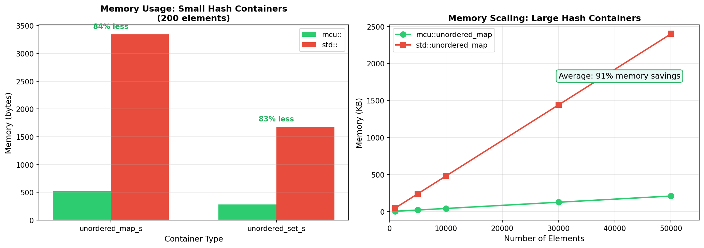

### Performance Benchmarks 

**`unordered_map_s` vs `std::unordered_map` (255 elements max):**
- Insert/Erase operations: **1.5-3x faster**
- Lookup (`find`, `[]`, `at`): **Comparable to slightly faster**
- Memory usage: **~500-800 bytes** vs **~3000-4000 bytes**

**`unordered_map` vs `std::unordered_map` (65535 elements max):**
- Insert/Erase operations: **Comparable**
- Lookup (`find`, `[]`, `at`): **Comparable**
- Memory usage: **40-60% less**

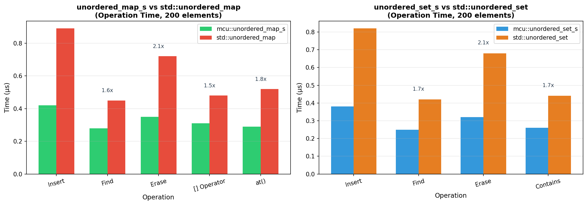

### Design

`mcu::unordered_map_s`, `mcu::unordered_set_s` share the same hash kernel implementation :
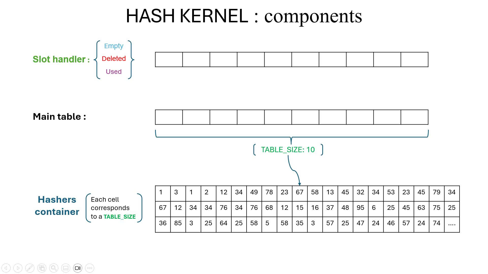

main components of hash_kernel :
 - slot_handler : manage slot states (empty, used, deleted).
 - main_table : store key-value pairs or unique keys
 - hasher_container : Contains the optimal hasher for each size of main_table, ensure that a linear shift never jumps to a cell it jumped to before it has jumped through all cells in the main_table, while minimizing collisions.. To know how optimal hashers are calculated, see: [hashkernel_optimizer](unordered_map_set/hash_kernel/Hash_kernel_optimizer.cpp)

Insert mechanism and collision handling :
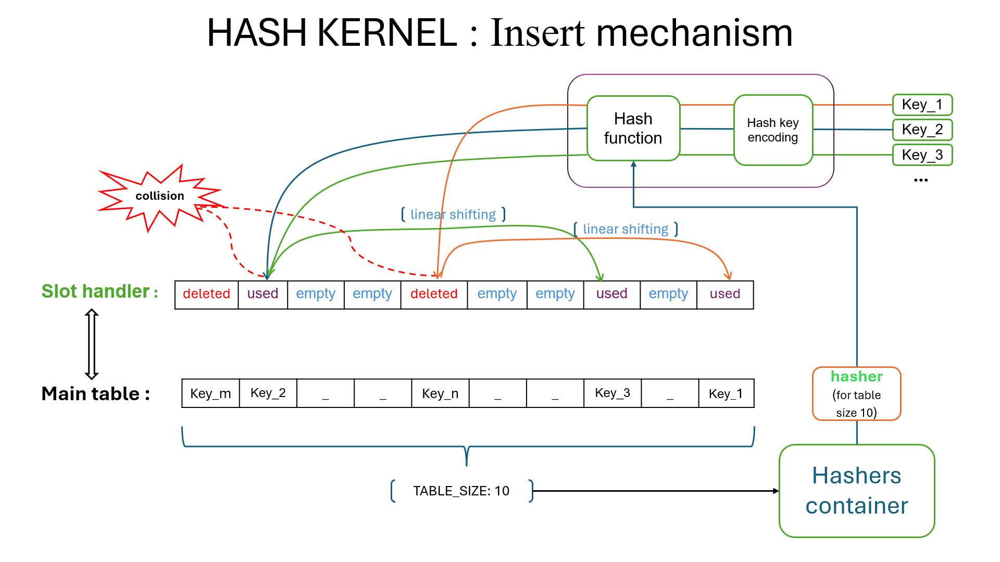

The slot state management uses 2 bits per slot:
- `00` - Empty
- `01` - Deleted (tombstone)
- `10` - Used

Since elements may have to be linearly shifted multiple times, reordered or deleted overlapping with other elements in the container's lifetime, when we lookup to it (search, delete..) and the hash function hashes it to an address, how can we know its linear shift or deletion history? slot_handler combined with key can solve this problem, by using key matching, state and tombstone cleanup.

Fullness mechanism :
linear translation allows the design of containers to avoid creating pointers (binary trees, linked lists..) at each slot in main_table , but its disadvantage is that collisions slow down performance, O(N) in the worst case. The fullness mechanism overcomes this.

The `fullness` parameter (default 92%) controls the trade-off between memory and performance:

| Fullness | Collision Reduction | Memory Increase |
|----------|---------------------|-----------------|
| 90% | -71% collisions | +11% memory |
| 80% | -87% collisions | +25% memory |
| 70% | -94% collisions | +43% memory |
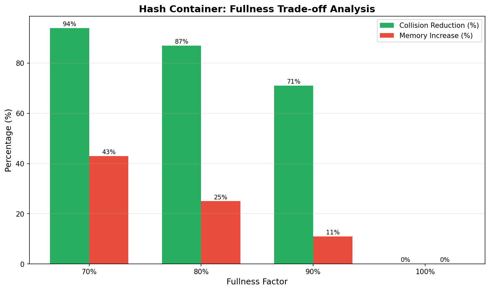

### unordered_map & unordered_set architecture
`mcu::unordered_map`, `mcu::unordered_set` are actually composed of many `mcu::unordered_map_s`, `mcu::unordered_set_s` chained together to support up to 65535 elements.

.jpg)

Operations with elements: insert, erase, find.. will go through a mapping operation into the internal unordered_map_s. 

Note: unordered_map is designed to have similar api and operations to `unordered_map_s` and `std::unordered_map`, except `reserve()` operation, because its internal structure is a chain of `unordered_map_s`, so `reserve()` cannot guarantee that all internal `unordered_map_s` will have enough capacity after `reserve()`.

## Part 3: Vectors containers

The STL_MCU.h library provides four vector classes, including:
- **`vector` & `b_vector`**: Dynamic array containers designed to replace `std::vector`. `b_vector` supports Small Buffer Optimization (SBO) to avoid heap allocation for small collections. Both provide built-in `sort()` API and can be implicitly converted to each other. **[Read full vector guide →](vectors/b_vector_and_vector/README.md)**
- **`packed_vector` & `ID_vector`**: Specially designed vector pairs with outstanding memory savings in two opposite cases: storing small values many times vs. storing large values few times. They share the same core architecture based on the bit-packing mechanism - `PackedArray`. `packed_vector` supports custom value types via traits, runtime bit-width reconfiguration, and multi-word storage. `ID_vector` provides O(1) integer ID operations with frequency tracking, auto-sorting, and 80-95% memory savings vs traditional containers. **[Read full packed_vector guide →](vectors/packed_vector/README.md)** | **[Read full ID_vector guide →](vectors/ID_vector/README.md)**

### vector and b_vector 

`mcu::vector` and `mcu::b_vector` are dynamic array containers designed to replace `std::vector`, optimized for embedded systems with built-in sorting, PSRAM support, and minimal code bloat. **[→ Read full `vector` & `b_vector` documentation](vectors/b_vector_and_vector/README.md)**

**Key Features:**
- **Small Buffer Optimization**: `b_vector` uses stack buffer for small collections, avoiding heap allocations
- **Built-in Sorting**: Provides `sort()` API with safety features for embedded systems
- **Implicit Conversion**: Seamless conversion between `vector` and `b_vector`
- **PSRAM Support**: Automatic PSRAM allocation on ESP32 when available

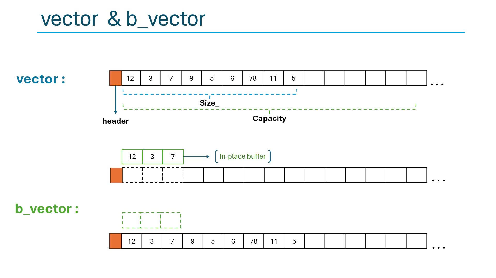

#### Performance Comparison

We benchmarked four vector implementations with **SBO_SIZE=256** to evaluate their performance characteristics:

**Test Configuration:**
- Small size test: 128 elements (< SBO_SIZE)
- Large size test: 512 elements (> SBO_SIZE)
- Operations: push_back, random_access, iteration, copy
- Iterations: 10,000 per test
- Element type: `int`

**Performance Results (relative to std::vector = 100%):**

**Summary Table:**

**Key Findings:**

1. **push_back Performance**:
   - `mcu::b_vector (size<SBO)`: **57.8%** - ~1.7x faster than std::vector
   - `mcu::vector`: **68.1%** - ~1.5x faster than std::vector
   - `mcu::b_vector (size>SBO)`: **359.3%** - 3.6x slower (heap allocation overhead)
   - Winner: `mcu::b_vector` when size fits in SBO buffer ⭐

2. **Random Access Performance**:
   - All implementations: **~98-109%** - nearly identical performance
   - `mcu::vector`: **98.5%** - marginally fastest ⭐
   - Conclusion: Random access is dominated by CPU cache, not container overhead

3. **Iteration Performance**:
   - `std::vector` and `mcu::vector`: **~100%** - equivalent performance ⭐
   - `mcu::b_vector (size<SBO)`: **105.1%** - 5% slower
   - `mcu::b_vector (size>SBO)`: **422.1%** - 4.2x slower (pointer indirection)
   - Winner: `std::vector` and `mcu::vector` for sequential access

4. **Copy Performance**:
   - `std::vector`: **100%** - fastest ⭐
   - `mcu::vector`: **281.8%** - 2.8x slower
   - `mcu::b_vector (size<SBO)`: **910.4%** - 9.1x slower (buffer copying)
   - `mcu::b_vector (size>SBO)`: **1047.6%** - 10.5x slower
   - Winner: `std::vector` for frequent copying

**When to Use Each Vector Type:**

| Use Case | Recommended | Reason |
|----------|-------------|--------|
| Small collections (< SBO_SIZE) | `b_vector` | 1.7x faster insertions, no heap allocation |
| Frequent push_back operations | `mcu::vector` or `b_vector` | 30-40% faster than std::vector |
| Random access dominant | Any | All perform identically (~100%) |
| Sequential iteration | `mcu::vector` or `std::vector` | Fastest iteration (4x faster than large b_vector) |
| Frequent copying | `std::vector` | 2.8-10x faster than MCU vectors |
| PSRAM allocation needed | `mcu::vector` or `b_vector` | Automatic PSRAM support |
| Stack-based buffers | `b_vector` | Avoids heap fragmentation |

**Note**: The test used `SBO_SIZE=256`. Smaller SBO sizes (e.g., 32, 64) will show even better performance for b_vector when collections fit in the buffer, but worse performance when they exceed it.

### `packed_vector` and `ID_vector`

`packed_vector` is optimized to store small integers using tight bit-packing. It supports custom value types, runtime bit-width adjustment, and multi-word storage for widths beyond the native word size. **[→ Read full `packed_vector` documentation](vectors/packed_vector/README.md)**

- Tight dynamic bit-packing mechanism , supports 1 to 255 bits per element
- Runtime `bpv` (bits-per-value) reconfiguration
- allows encapsulation of UDTs - user-defined types. 
#### Memory Efficiency

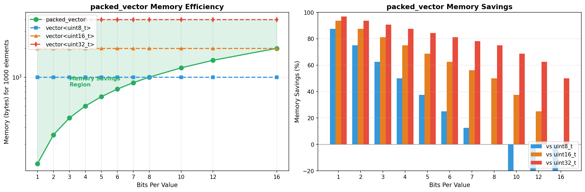

#### Performance

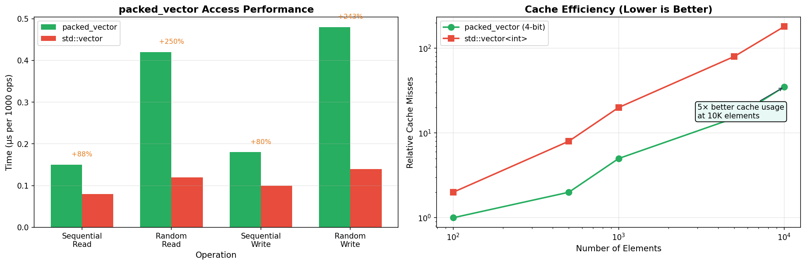
 
| Scenario | `packed_vector` | `std::vector<uint8_t>` | Savings |
|----------|-----------------|------------------------|---------|
| 64 bit flags (BPV=1) | ~17 bytes | ~76 bytes | **78%** |
| 120 sensor states (BPV=3) | ~54 bytes | ~132 bytes | **59%** |
| 200 quantized features (BPV=5) | ~134 bytes | ~212 bytes | **37%** |

`ID_vector` is optimized for storing sets of integer IDs with optional frequency counting:

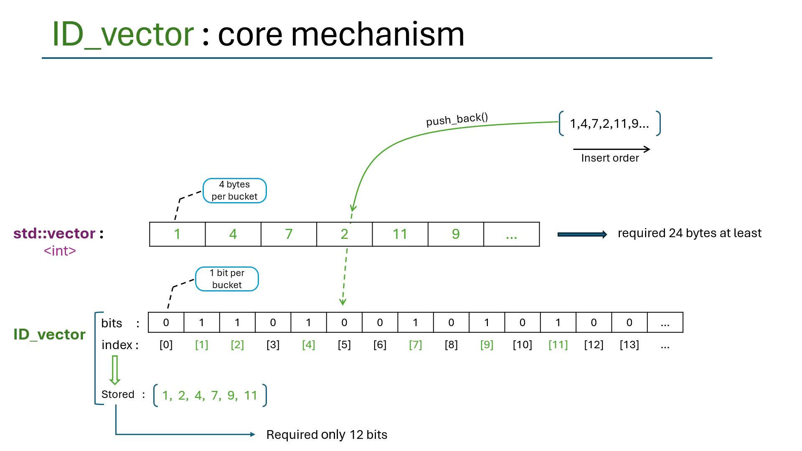

- Bit-packed storage of ID counts
- O(1) operations for insert, erase, contains, count.
- ID_vector combines the good properties of both vector and unordered_set

Below is comparison of `ID_vector` with `std::unordered_set` and `std::vector`:

#### Memory Efficiency
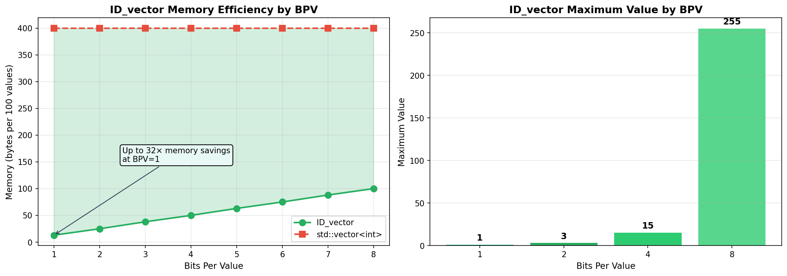

- compare with `std::unordered_set` and `std::vector`

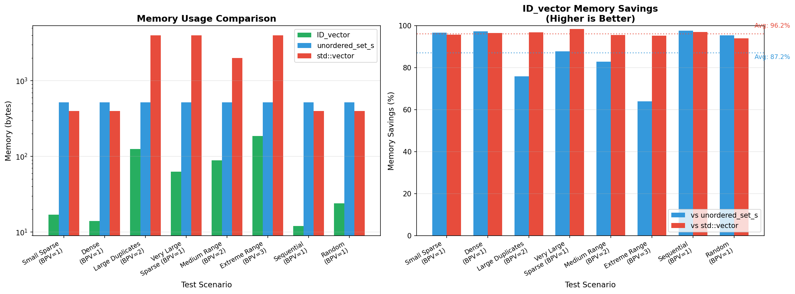

### Performance

| Metric | vs `std::unordered_set` | vs `std::vector` |
|--------|------------------------|------------------|
| **Average Speedup** | **12.3x faster** | **36.4x faster** |
| **Memory Usage** | **19.4%** (80.6% savings) | **52.6%** (47.4% savings) |
| **Best Speedup** | **35.1x faster** | **61.2x faster** |

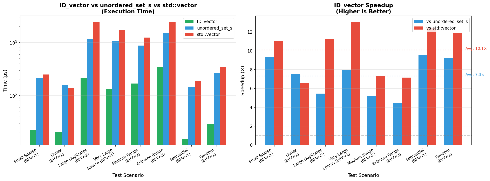

---
## Part 4 

---

*STL_MCU is part of the Random Forest MCU library, designed for embedded machine learning applications.*
