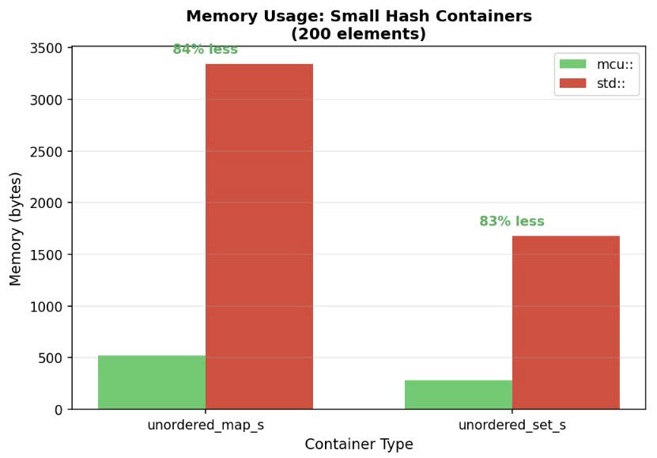
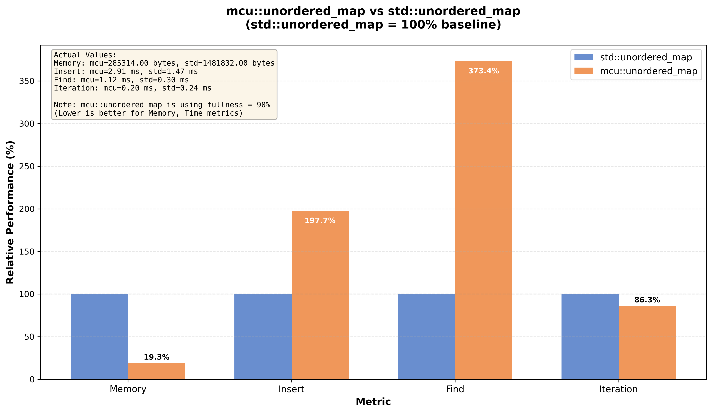

## unordered_map_set: Hash-Based Containers for MCUs

This directory contains all hash-based containers used in `STL_MCU`. They share a common hashing core (`hash_kernel`) and are designed to replace `std::unordered_map` / `std::unordered_set` on microcontrollers.

- `mcu::unordered_map_s<K, V>` – small, fixed-capacity hash map (up to 255 elements)
- `mcu::unordered_set_s<T>` – small, fixed-capacity hash set (up to 255 elements)
- `mcu::unordered_map<K, V>` – scalable hash map (up to 65,535 elements)
- `mcu::unordered_set<T>` – scalable hash set (up to 65,535 elements)
- `mcu::pair<T1, T2>` – lightweight pair used by the maps
- `hash_kernel` – core hashing and shifting engine

For benchmark charts and high-level comparison vs `std::unordered_map` / `std::unordered_set`, see **Part 2: New hash mechanism - hash_kernel based containers** in `docs/STL_MCU.md`.

---

## 1. Hash Kernel Design (Overview)

`mcu::unordered_map_s`, `mcu::unordered_set_s` are built on the same `hash_kernel` mechanism described in [STL_MCU.md](../STL_MCU.md):


**Main components of hash_kernel:**

- **slot_handler** – manages per-slot state using 2 bits per slot: `Empty`, `Deleted`, `Used`.
- **main_table** – contiguous array storing either `pair<K, V>` (maps) or `T` (sets).
- **hasher_container** – precomputed hash functions and Shifting steps per capacity to ensure good spread and low collision chains. See how optimal hashers are calculated offline [hash_kernel_optimizer](./hash_kernel/Hash_kernel_optimizer.cpp).

### Insert Mechanism and Collision Handling


When inserting an element:
1. Hash function maps key to initial slot index
2. If slot marked `Used` or `Deleted`, apply `Linear Shifting` step to find next slot
3. Shifting continues until finding an `Empty` slot.
4. Key matching ensures correct retrieval despite collision chains

### Fullness Mechanism

`Linear shifting` allows the design of containers to avoid creating pointers (binary trees, linked lists..) at each slot in main_table , but its disadvantage is that collisions slow down performance, O(N) in the worst case. The fullness mechanism overcomes this.


The `fullness` parameter controls virtual capacity vs actual capacity to reduce collision chains:

| Fullness | Collision Reduction | Memory Increase |
|----------|---------------------|-----------------|
| 90% | -71% collisions | +11% memory |
| 80% | -87% collisions | +25% memory |
| 70% | -94% collisions | +43% memory |


The result is a pointer-free data structure (no node allocations per element) with predictable memory usage and good performance on MCUs.

### Memory Efficiency

Below is a performance comparison with std::unordered_set, std::unordered_map, with integer data, fullness = 92% (default) :



**Note**: for String or UDTs data, the memory saving advantage can be reduced.

### Performance Benchmarks
Below is a performance comparison with std::unordered_set, std::unordered_map, with integer data, fullness = 92% (default) :


### Usage Scenarios
- Use `unordered_map_s` / `unordered_set_s` when:
    - Maximum element count is known and ≤ 255.
    - You want minimal memory overhead and high speed.
    - The dataset is small configuration, routing, or cached state.
---


## 3. Unordered Map/Set Implementations

 - `unordered_map_s`, `unordered_set_s`  are the most optimized for both performance and memory, but the trade-off is that they can only hold a maximum of 255 elements. 

**Note**: hash_kernel can be extended to 65535 elements, but that means needing 128 Kbs of disk to store best_hashers, which is not suitable for mcu (And my personal computer isn't powerful enough to run `Hash_kernel_optimizer` to find best_hashers for 65535 slots.)

- To overcome that drawback, `unordered_map`, `unordered_set`  are built on top of `unordered_map_s`, `unordered_set_s` by chaining multiple segments internally (inner map) to support up to 65535 elements.

- Because the mechanism of operation is similar, next we will only introduce the structure and benchmark of `mcu::unordered_map`

### Design 

- unordered_map uses multiple unordered_map_s as internal segments(inner map) to store data. 
- There have 3 type of inner maps:
    - `Available Map` : Maps are activated and allocated space
    - `Reserve type 1` : The map was activated and used, but all of its elements were deleted during the operation. collapsed to a minimum
    - `Reserve type 2` : inactive maps (in pointer form), waiting to be activated when needed.
 
.jpg)

- Insert mechanism: 
    - Every time a Key is inserted, it go through a mapping function - `KeyMappingIN` into inner map segement.
    - `KeyMappingIN` func optimized to choose the most suitable inner map , ensures optmial memory and performance (internal member using in that process is also `unordered_map_s`).


### Memory Efficiency & Performance

- Despite the many layers of abstraction required to trade off large capacity and memory savings, `mcu::unordered_map` still maintains performance relative to `std::unoredered_map`.



**Note**: `mcu::unordered_map` architecture has 2 weaknesses
 - The reserve() function cannot accurately estimate the required memory input from the user, and may still allocate more.
 - for non-numerical Key (String, UDTs..), elements will be heavily dispersed within inner maps.allocations can be inefficient and exhaust innerMaps before they are actually filled

---

## 4. API Usage Patterns

All four hash containers share similar APIs modeled after STL, with some MCU-specific enhancements for memory control.

### Enable PSRAM (For PSPRAM-capable boards like ESP32)

For mcu boards with external PSRAM, enable it at the **top of your program** before including STL_MCU:

```cpp
#define RF_USE_PSRAM    // Enable PSRAM usage

#include "STL_MCU.h"
using namespace mcu;

void setup() {
    // Containers will automatically use PSRAM when available
    unordered_map<uint16_t, int> large_map(10000);  // Uses PSRAM
}
```

**Benefits of PSRAM**:
- Keep DRAM free for other operations
- Automatic fallback to DRAM if PSRAM unavailable
- Check memory usage: `map.is_table_in_psram()` returns true if allocated in PSRAM

**Without PSRAM**: Maximum ~10,000 elements in vectors container (DRAM limited on most mcu boards)

### 4.1 unordered_map_s - Small Hash Map (≤255 elements)


```cpp
#include "STL_MCU.h"
using namespace mcu;

// Basic initialization
unordered_map_s<uint8_t, int> config;           // Empty map
unordered_map_s<uint16_t, float> sensors(50);   // Reserve for 50 elements

// Insert elements
config.insert(1, 100);                          // Key-value pair
config[2] = 200;                                // Operator[] (auto-inserts)
auto [it, success] = config.insert(pair<uint8_t, int>(3, 300));

// Access elements
int val = config[1];                            // Operator[] (creates if missing)
int val2 = config.at(2);                        // at() (returns default if missing)
auto it = config.find(3);                       // Iterator-based lookup
if (it != config.end()) {
    Serial.println(it->second);
}

// Modify elements
config[1] = 150;                                // Update existing
if (config.contains(1)) {
    config.erase(1);                            // Remove by key
}

// Iteration
for (auto& [key, value] : config) {
    Serial.printf("Key: %d, Value: %d\n", key, value);
}

// Memory management
config.reserve(100);                            // Pre-allocate for 100 elements
config.set_fullness(0.8);                       // 80% fullness (less collision)
config.fit();                                   // Shrink to actual size
config.clear();                                 // Remove all elements

// Capacity queries
uint16_t count = config.size();                 // Current element count
uint16_t cap = config.capacity();               // Current capacity
uint16_t max = config.map_ability();            // Max possible (based on fullness)
size_t mem = config.memory_usage();             // Total memory in bytes
```

### 4.2 unordered_set_s - Small Hash Set (≤255 elements)

```cpp
#include "STL_MCU.h"
using namespace mcu;

// Basic initialization
unordered_set_s<uint8_t> active_ids;            // Empty set
unordered_set_s<uint16_t> seen_values(30);      // Reserve for 30 elements

// Insert elements
active_ids.insert(10);                          // Single value
active_ids.insert(20);
active_ids.insert(30);

// Check membership
if (active_ids.contains(10)) {
    Serial.println("ID 10 is active");
}

auto it = active_ids.find(20);                  // Iterator-based lookup
if (it != active_ids.end()) {
    Serial.println("Found 20");
}

// Remove elements
active_ids.erase(10);                           // Remove by value

// Iteration
for (const auto& id : active_ids) {
    Serial.printf("ID: %d\n", id);
}

// Set operations (manual implementation needed)
unordered_set_s<uint8_t> set_a, set_b, intersection;
// ... populate set_a and set_b ...
for (const auto& elem : set_a) {
    if (set_b.contains(elem)) {
        intersection.insert(elem);              // Intersection
    }
}

// Memory management
active_ids.set_fullness(0.9);                   // 90% fullness (default: 92%)
active_ids.fit();                               // Shrink to actual size
active_ids.clear();                             // Remove all elements

// Capacity queries
uint16_t count = active_ids.size();
uint16_t max = active_ids.set_ability();        // Max possible elements
```

### 4.3 unordered_map - Large Hash Map (≤65,535 elements)

```cpp
#include "STL_MCU.h"
using namespace mcu;

// Basic initialization
unordered_map<uint16_t, int> data;              // Empty map
unordered_map<uint16_t, float> readings(1000);  // Reserve for ~1000 elements

// Insert and access (same API as unordered_map_s)
data[100] = 42;
data.insert(200, 84);
auto [it, ok] = data.insert(pair<uint16_t, int>(300, 126));

// Lookup
if (data.contains(100)) {
    int value = data[100];
}

// Iterator usage
for (auto& [key, val] : data) {
    val *= 2;                                   // Modify values in-place
}

// Advanced: fullness tuning
data.set_fullness(0.85);                        // Trade memory for speed
auto [success, new_max] = data.set_fullness(0.75);  // Returns pair

// Memory optimization
size_t freed = data.fit();                      // Returns bytes freed
Serial.printf("Freed %d bytes\n", freed);

// Bulk operations
data.reserve(5000);                             // Pre-allocate capacity
data.clear();                                   // Reset (keeps some memory)

// Capacity info
uint16_t size = data.size();
uint16_t ability = data.map_ability();          // Max capacity
size_t mem = data.memory_usage();               // Total bytes used
```

**Note**: `unordered_map` automatically manages multiple internal `unordered_map_s` segments. Elements are distributed across segments for optimal performance.

### 4.4 unordered_set - Large Hash Set (≤65,535 elements)

```cpp
#include "STL_MCU.h"
using namespace mcu;

// Basic initialization  
unordered_set<uint16_t> unique_ids;             // Empty set
unordered_set<uint16_t> processed(2000);        // Reserve for ~2000 elements

// Insert elements
unique_ids.insert(1000);
unique_ids.insert(2000);
unique_ids.insert(3000);

// Check and remove
if (unique_ids.contains(1000)) {
    unique_ids.erase(1000);
}

// Iteration
for (const auto& id : unique_ids) {
    Serial.printf("Unique ID: %d\n", id);
}

// Bulk insertion (manual)
for (uint16_t i = 0; i < 100; i++) {
    unique_ids.insert(i * 10);
}

// Memory tuning
unique_ids.set_fullness(0.8);                   // Reduce collisions
unique_ids.fit();                               // Compact memory

// Capacity queries
uint16_t count = unique_ids.size();
uint16_t max_cap = unique_ids.set_ability();
size_t memory = unique_ids.memory_usage();
```

**Note**: `unordered_set` uses the same multi-segment architecture as `unordered_map` for large capacity support.

---

## 5. Key API Differences from std::

| Feature | STL_MCU | std:: | Notes |
|---------|---------|-------|-------|
| `insert()` | Returns `bool` or `pair<iterator, bool>` | Returns `pair<iterator, bool>` | Simplified for sets |
| `at()` | Returns default value if missing | Throws exception | No exceptions on MCU |
| `operator[]` | Creates default if missing | Same | Consistent behavior |
| `set_fullness()` | MCU-specific (0.7-1.0) | N/A | Memory/speed tradeoff |
| `fit()` | Shrinks to size | N/A | Explicit memory control |
| `map_ability()` / `set_ability()` | Max capacity | `max_size()` | Based on fullness |
| Memory | PSRAM support (ESP32) | Heap only | Automatic PSRAM use |

---

## 6. Best Practices

1. **Choose the right container**:
   - Use `_s` variants when max size ≤ 255 (faster, less memory)
   - Use non-`_s` variants when size > 255 or unknown

2. **Optimize fullness**:
   ```cpp
   map.set_fullness(0.9);  // Good balance (default: 92%)
   map.set_fullness(0.8);  // Fewer collisions, more memory
   ```

3. **Pre-allocate when size is known**:
   ```cpp
   unordered_map<uint16_t, int> data(1000);  // Reserve upfront
   ```

4. **Use `fit()` after bulk deletions**:
   ```cpp
   data.erase(key);
   // ... many more erases ...
   data.fit();  // Reclaim memory
   ```

5. **Check memory usage**:
   ```cpp
   size_t bytes = map.memory_usage();
   bool in_psram = map.is_table_in_psram();  // ESP32 only
   ```

---

## 7. Common Patterns

### Configuration Storage
```cpp
unordered_map_s<uint8_t, uint16_t> settings;
settings[CFG_BAUDRATE] = 115200;
settings[CFG_TIMEOUT] = 5000;
```

### Caching
```cpp
unordered_map<uint16_t, float> cache;

float get_expensive_value(uint16_t key) {
    auto it = cache.find(key);
    if (it != cache.end()) return it->second;  // Cache hit
    
    float value = compute_value(key);          // Expensive computation
    cache[key] = value;                        // Store in cache
    return value;
}
```

### Deduplication
```cpp
unordered_set<uint16_t> seen;
for (uint16_t value : data_stream) {
    if (!seen.contains(value)) {
        seen.insert(value);
        process_unique(value);                 // Only process once
    }
}
```

### Frequency Counting
```cpp
unordered_map<uint8_t, uint16_t> freq;
for (uint8_t byte : buffer) {
    freq[byte]++;                              // Auto-initialize to 0
}

// Find most frequent
uint8_t most_frequent = 0;
uint16_t max_count = 0;
for (const auto& [byte, count] : freq) {
    if (count > max_count) {
        max_count = count;
        most_frequent = byte;
    }
}
```

---
