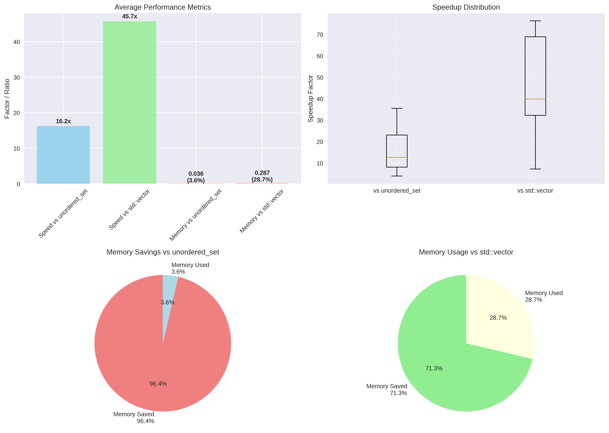
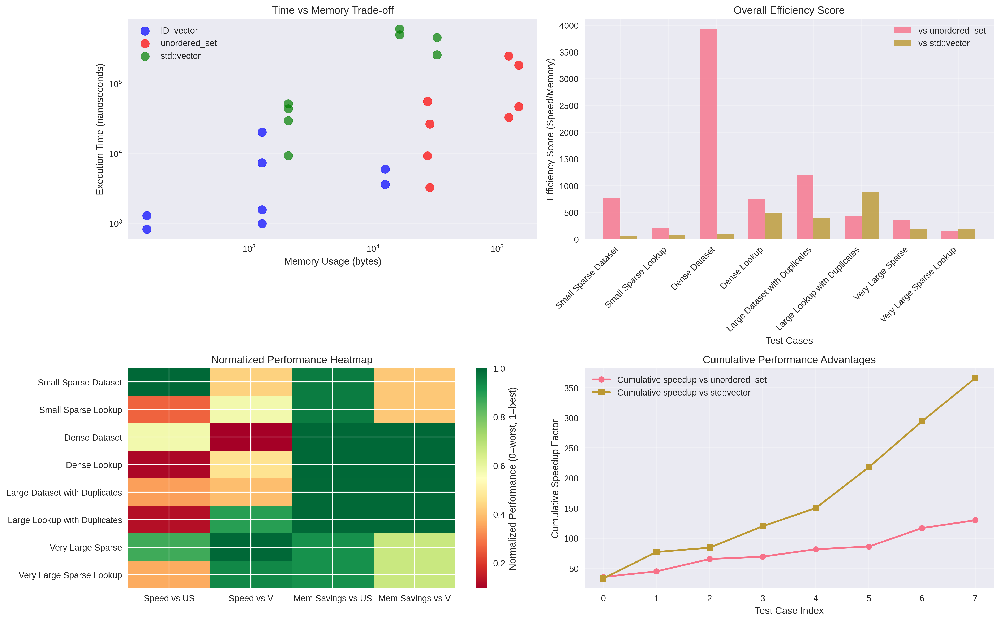

# ID_vector: Memory-Efficient Integer Set with Frequency Tracking

## Table of Contents
1. [Core Concept](#core-concept)
2. [Key Features](#key-features)
3. [Template Parameters](#template-parameters)
4. [Constructors](#constructors)
5. [Range Configuration](#range-configuration)
6. [Primary Operations](#primary-operations)
7. [Element Access](#element-access)
8. [Iteration](#iteration)
9. [Set Operations](#set-operations)
10. [Range Operations](#range-operations)
11. [Vector Arithmetic](#vector-arithmetic)
12. [Comparison Operations](#comparison-operations)
13. [Memory Management](#memory-management)
14. [Performance Analysis](#performance-analysis)
15. [Usage Patterns](#usage-patterns)
16. [API Quick Reference](#api-quick-reference)

---

## Core Concept

`ID_vector` is a specialized container optimized for storing integer IDs with optional frequency counting, using bit-packing to achieve dramatic memory savings while maintaining O(1) operation complexity.

### Architecture Overview


**Bit-Packing Mechanism:**
```
BPV = 1 (Unique IDs only):
Index:    0  1  2  3  4  5  6  7  8  9  10
Bits:    [0][1][0][1][0][0][1][0][1][0][0]
Result:   -  ✓  -  ✓  -  -  ✓  -  ✓  -  -
IDs:         1     3           6     8

BPV = 2 (Up to 3 instances per ID):
Index:     0    1    2    3    4    5    6
Bits:    [00] [01] [00] [11] [00] [00] [10]
Count:     0    1    0    3    0    0    2
IDs:          1         3₃              6₂

With min_id = 1000, BPV = 1:
Index:     0    1    2    3    4    5    6
Bits:    [0]  [1]  [0]  [1]  [0]  [0]  [1]
IDs:         1001    1003              1006
```

**Memory Layout:**
- **ID Mapping:** Each ID maps to position `(id - min_id)` for O(1) access
- **Count Storage:** Multiple bits per position enable frequency tracking
- **Dynamic Sizing:** Automatic expansion during insertions
- **Range Optimization:** Only allocates memory for actual ID range needed

### Internal Storage

Uses `PackedArray<BitsPerValue>` for bit-level storage:
- **Word Size:** `sizeof(size_t) * 8` bits (32 or 64 bits depending on platform)
- **Multi-word Support:** Handles bit widths spanning multiple words
- **Zero Initialization:** All bits start at 0 (no ID present)
- **Efficient Access:** Inlined get/set operations with minimal overhead

---

## Key Features

### Performance Characteristics

| Feature | Complexity | Details |
|---------|-----------|---------|
| **Insertion** | O(1) | Direct bit manipulation |
| **Lookup** | O(1) | Single array index access |
| **Deletion** | O(1) | Decrement count in place |
| **Contains Check** | O(1) | Single bit/count read |
| **Iteration** | O(N) | N = total instances with repetitions |
| **Memory Usage** | O(range × BPV) | `(max_id - min_id + 1) × BitsPerValue` bits |

### Advantages

✅ **Memory Efficiency**
- Uses only `(range × BitsPerValue)` bits vs. `range × sizeof(T)` bytes
- Example: 1000 IDs in range 0-2000 → 250 bytes vs. 4KB (94% savings)

✅ **Predictable Performance**
- O(1) operations with no hash collisions
- No worst-case scenarios
- Deterministic memory allocation

✅ **Embedded-Friendly**
- No dynamic allocation fragmentation
- Predictable stack/PSRAM usage
- Compatible with resource-constrained environments

✅ **Built-in Sorting**
- Elements always maintained in ascending order
- No explicit sort() call needed
- Iteration yields sorted sequence

### Trade-offs

⚠️ **Integer-Only**
- Only supports positive integer types (`uint8_t`, `uint16_t`, `uint32_t`, `size_t`)
- Cannot store floating-point or complex types

⚠️ **Sparse Data Inefficiency**
- Memory proportional to ID range, not count
- Very sparse data (e.g., 10 IDs in range 0-1,000,000) wastes memory

⚠️ **Silent Overflow**
- Adding beyond `MAX_COUNT = (2^BitsPerValue - 1)` silently fails
- No exception thrown when count limit reached

⚠️ **Fixed Bit Width**
- `BitsPerValue` is compile-time constant (template parameter)
- Runtime modification possible via `set_bits_per_value()` but triggers reallocation

---

## Template Parameters

```cpp
template <typename T, uint8_t BitsPerValue = 1>
class ID_vector
```

### Type Parameter: `T`

Determines the maximum ID range and internal index type:

| Type | Index Type | Size Type | Max ID Range | Max Total Instances |
|------|-----------|-----------|--------------|---------------------|
| `uint8_t` | `uint8_t` | `uint32_t` | 0-255 | 4.3 billion |
| `uint16_t` | `uint16_t` | `uint64_t` | 0-65,535 | 18.4 quintillion |
| `uint32_t` | `size_t` | `size_t` | 0-4.3B | Platform max |
| `size_t` | `size_t` | `size_t` | Platform max | Platform max |

**Type Selection Guidelines:**
```cpp
ID_vector<uint8_t> small_range;      // For sensor IDs 0-255
ID_vector<uint16_t> medium_range;    // For device IDs 0-65K
ID_vector<uint32_t> large_range;     // For database record IDs
ID_vector<size_t> unlimited_range;   // For maximum flexibility
```

### Value Parameter: `BitsPerValue`

Controls maximum count per ID:

| BitsPerValue | MAX_COUNT | Use Case | Memory per 1000 IDs |
|--------------|-----------|----------|---------------------|
| 1 | 1 | Unique IDs (set behavior) | 125 bytes |
| 2 | 3 | Low-frequency counting | 250 bytes |
| 4 | 15 | Medium-frequency counting | 500 bytes |
| 8 | 255 | High-frequency counting | 1000 bytes |
| 16 | 65,535 | Very high-frequency | 2000 bytes |
| 32 | 4.3B | Maximum count capacity | 4000 bytes |

**Important:** `BitsPerValue` is clamped to 32 to prevent excessive memory usage and maintain performance on embedded systems.

---

## Constructors

### Default Constructor

```cpp
ID_vector();
```

Creates empty vector with default range based on template parameter `T`:

```cpp
ID_vector<uint8_t> vec1;    // Range: [0, 63]
ID_vector<uint16_t> vec2;   // Range: [0, 255]
ID_vector<uint32_t> vec3;   // Range: [0, 127]
```

### Constructor with Max ID

```cpp
explicit ID_vector(index_type max_id);
```

Specifies maximum ID (min_id defaults to 0):

```cpp
ID_vector<uint16_t> sensor_ids(2000);  // Range: [0, 2000]
ID_vector<uint8_t, 2> counters(100);   // Range: [0, 100], BPV=2
```

### Constructor with Min and Max ID

```cpp
ID_vector(index_type min_id, index_type max_id);
```

Specifies both range bounds for optimal memory usage:

```cpp
ID_vector<uint16_t> high_value_ids(45000, 50000);  // Only allocates for range [45000, 50000]
ID_vector<uint32_t> database_ids(1000000, 2000000); // 1M-2M range
```

### Copy Constructor

```cpp
ID_vector(const ID_vector& other);
```

Performs deep copy of all elements and range:

```cpp
ID_vector<uint16_t> original(0, 1000);
original.push_back(500);
ID_vector<uint16_t> copy = original;  // Independent copy
```

### Constructor from mcu::vector/b_vector

```cpp
template<typename Y>
ID_vector(const vector<Y>& ids);  // Requires Y = uint8_t/uint16_t/uint32_t/size_t

template<typename Y>
ID_vector(const b_vector<Y>& ids);
```

Converts from MCU vector types, automatically determining range:

```cpp
mcu::vector<uint16_t> raw_ids = {100, 200, 300, 200, 100};
ID_vector<uint16_t> id_vec(raw_ids);  // Range: [100, 300], contains counts

mcu::b_vector<uint8_t> small_ids = MAKE_UINT8_LIST(10, 20, 30);
ID_vector<uint8_t> from_bvec(small_ids);  // Range: [10, 30]
```

### Move Constructor

```cpp
ID_vector(ID_vector&& other) noexcept;
```

Transfers ownership without copying:

```cpp
ID_vector<uint16_t> create_temp() {
    ID_vector<uint16_t> temp(0, 1000);
    temp.push_back(500);
    return temp;  // Move constructor called
}

auto result = create_temp();  // Efficient transfer
```

---

## Range Configuration

### Setting Maximum ID

```cpp
void set_maxID(index_type new_max_id);
```

Expands or preserves maximum ID boundary:

```cpp
ID_vector<uint16_t> vec(0, 100);
vec.push_back(50);
vec.push_back(80);

vec.set_maxID(200);  // ✅ Expands range, preserves data

// vec.set_maxID(70);  // ❌ Throws: would lose element 80
```

**Behavior:**
- If `new_max_id >= maxID()` (largest element): Expands range, preserves all data
- If `new_max_id < maxID()`: Throws `std::out_of_range` to prevent data loss
- Reallocates memory if expanding

### Setting Minimum ID

```cpp
void set_minID(index_type new_min_id);
```

Adjusts minimum ID boundary for high-value ranges:

```cpp
ID_vector<uint16_t> vec(0, 10000);
vec.push_back(9000);
vec.push_back(9500);

vec.set_minID(8000);  // ✅ Optimizes memory, preserves data (9000-10000)

// vec.set_minID(9200);  // ❌ Throws: would lose element 9000
```

**Memory Savings Example:**
```cpp
// Before: Range [0, 10000] → 10,001 bits → 1,251 bytes
// After:  Range [8000, 10000] → 2,001 bits → 251 bytes
// Savings: 80% memory reduction
```

### Setting ID Range

```cpp
void set_ID_range(index_type new_min_id, index_type new_max_id);
```

Sets both bounds simultaneously:

```cpp
ID_vector<uint32_t> vec;
vec.set_ID_range(1000000, 2000000);  // Allocates for 1M-2M range

vec.push_back(1500000);
vec.set_ID_range(1000000, 3000000);  // ✅ Expands max, preserves data
```

**Exception Safety:**
- Throws `std::out_of_range` if `new_min_id > new_max_id`
- Throws if new range excludes existing elements
- Provides strong exception guarantee (no changes if fails)

### Getting Range Bounds

```cpp
index_type get_minID() const;
index_type get_maxID() const;
```

Retrieves current allocated range:

```cpp
ID_vector<uint16_t> vec(100, 500);
assert(vec.get_minID() == 100);
assert(vec.get_maxID() == 500);

vec.push_back(600);  // Auto-expands max
assert(vec.get_maxID() >= 600);
```

---

## Primary Operations

All primary operations have O(1) time complexity.

### Insertion

```cpp
void push_back(index_type id);
```

Adds one instance of ID, auto-expanding range if needed:

```cpp
ID_vector<uint16_t, 2> vec(100, 200);  // BPV=2, max count = 3

vec.push_back(150);  // Count: 1
vec.push_back(150);  // Count: 2
vec.push_back(150);  // Count: 3
vec.push_back(150);  // Silent ignore (already at MAX_COUNT)

vec.push_back(250);  // Auto-expands max_id to >= 250
vec.push_back(50);   // Auto-expands min_id to <= 50
```

**Behavior:**
- Increments count at position `(id - min_id)`
- Silently ignores if count already at `MAX_COUNT = (2^BitsPerValue - 1)`
- Automatically expands range if `id < min_id` or `id > max_id`
- Throws `std::out_of_range` if `id > MAX_RF_ID` (platform limit)

### Presence Check

```cpp
bool contains(index_type id) const;
```

Checks if ID exists (count > 0):

```cpp
ID_vector<uint16_t> vec(0, 100);
vec.push_back(50);

assert(vec.contains(50) == true);
assert(vec.contains(30) == false);
assert(vec.contains(200) == false);  // Out of range
```

### Count Retrieval

```cpp
count_type count(index_type id) const;
```

Returns number of instances of specific ID:

```cpp
ID_vector<uint16_t, 2> vec(0, 100);
vec.push_back(50);
vec.push_back(50);
vec.push_back(50);

assert(vec.count(50) == 3);
assert(vec.count(30) == 0);
assert(vec.count(200) == 0);  // Out of range
```

**Return Type:** `count_type = uint32_t` (supports up to 4.3 billion instances)

### Single Deletion

```cpp
bool erase(index_type id);
```

Removes one instance of ID:

```cpp
ID_vector<uint16_t, 2> vec(0, 100);
vec.push_back(50);
vec.push_back(50);
vec.push_back(50);

assert(vec.erase(50) == true);   // Count: 3 → 2
assert(vec.count(50) == 2);
assert(vec.erase(50) == true);   // Count: 2 → 1
assert(vec.erase(50) == true);   // Count: 1 → 0
assert(vec.erase(50) == false);  // Already 0
```

**Returns:** `true` if ID existed and was decremented, `false` otherwise

### Complete Deletion

```cpp
bool erase_all(index_type id);
```

Removes all instances of ID:

```cpp
ID_vector<uint16_t, 2> vec(0, 100);
vec.push_back(50);
vec.push_back(50);
vec.push_back(50);

assert(vec.erase_all(50) == true);  // Count: 3 → 0
assert(vec.count(50) == 0);
assert(vec.size() == 0);
```

### Size Queries

```cpp
size_type size() const;          // Total instances
size_type unique_size() const;   // Unique IDs
bool empty() const;              // Check if empty
```

```cpp
ID_vector<uint16_t, 2> vec(0, 100);
vec.push_back(10);
vec.push_back(10);
vec.push_back(20);

assert(vec.size() == 3);         // 3 total instances
assert(vec.unique_size() == 2);  // 2 unique IDs (10, 20)
assert(vec.empty() == false);
```

**Note:** For `BitsPerValue = 1`, `size()` == `unique_size()` (set behavior)

### Clear

```cpp
void clear();
```

Removes all elements, preserves allocated range:

```cpp
ID_vector<uint16_t> vec(0, 1000);
vec.push_back(500);
vec.push_back(600);

vec.clear();
assert(vec.empty() == true);
assert(vec.get_maxID() == 1000);  // Range unchanged
```

### Reserve

```cpp
void reserve(index_type new_max_id);
```

Pre-allocates memory for expected ID range:

```cpp
ID_vector<uint16_t> vec;
vec.reserve(10000);  // Pre-allocate for IDs up to 10000

// Subsequent insertions won't trigger reallocation
for (int i = 0; i < 10000; ++i) {
    vec.push_back(i);
}
```

---

## Element Access

All access methods return values (not references) since elements are bit-packed.

### Access by Index

```cpp
index_type operator[](size_type index) const;
```

Returns nth element in sorted order with repetitions:

```cpp
ID_vector<uint16_t, 2> vec(0, 100);
vec.push_back(10);
vec.push_back(10);
vec.push_back(50);

assert(vec[0] == 10);  // First instance of 10
assert(vec[1] == 10);  // Second instance of 10
assert(vec[2] == 50);  // First instance of 50

// vec[3];  // ❌ Throws std::out_of_range
```

**Throws:** `std::out_of_range` if `index >= size()`

### Front Element

```cpp
index_type front() const;
T minID() const;  // Equivalent, returns smallest ID present
```

Returns smallest ID present:

```cpp
ID_vector<uint16_t> vec(0, 1000);
vec.push_back(500);
vec.push_back(200);
vec.push_back(800);

assert(vec.front() == 200);
assert(vec.minID() == 200);

// ID_vector<uint16_t> empty_vec;
// empty_vec.front();  // ❌ Throws std::out_of_range
```

**Throws:** `std::out_of_range` if empty

**Complexity:** O(N) where N = range size (scans until first non-zero count found)

### Back Element

```cpp
index_type back() const;
index_type maxID() const;  // Equivalent, returns largest ID present
```

Returns largest ID present:

```cpp
ID_vector<uint16_t> vec(0, 1000);
vec.push_back(500);
vec.push_back(200);
vec.push_back(800);

assert(vec.back() == 800);
assert(vec.maxID() == 800);
```

**Throws:** `std::out_of_range` if empty

**Complexity:** O(N) where N = range size

### Pop Operations

```cpp
void pop_back();   // Remove one instance of largest ID
void pop_front();  // Remove one instance of smallest ID
```

```cpp
ID_vector<uint16_t, 2> vec(0, 100);
vec.push_back(10);
vec.push_back(10);
vec.push_back(50);
vec.push_back(50);

vec.pop_back();   // Removes one instance of 50
assert(vec.count(50) == 1);

vec.pop_front();  // Removes one instance of 10
assert(vec.count(10) == 1);
```

**Complexity:** O(N) where N = range size

---

## Iteration

### Iterator Class

```cpp
class iterator {
    using value_type = index_type;
    using iterator_category = std::forward_iterator_tag;
    // ...
};

iterator begin() const;
iterator end() const;
```

Iterates over all ID instances in ascending order with repetitions:

```cpp
ID_vector<uint16_t, 2> vec(0, 100);
vec.push_back(10);
vec.push_back(10);
vec.push_back(50);
vec.push_back(80);

// Range-based for loop
for (auto id : vec) {
    std::cout << id << " ";  // Output: 10 10 50 80
}

// Iterator-based loop
for (auto it = vec.begin(); it != vec.end(); ++it) {
    std::cout << *it << " ";
}
```

### Iterator Properties

- **Category:** Forward iterator
- **Sorting:** Always yields IDs in ascending order
- **Repetitions:** Yields each ID multiple times according to its count
- **Complexity:** O(1) per increment (amortized)
- **Const-only:** Iterators are const (no modification through iterators)

### Unique ID Iteration Pattern

```cpp
ID_vector<uint16_t, 2> vec(0, 100);
vec.push_back(10);
vec.push_back(10);
vec.push_back(50);

// Iterate over unique IDs only
for (index_type id = vec.get_minID(); id <= vec.get_maxID(); ++id) {
    if (vec.count(id) > 0) {
        std::cout << "ID " << id << " appears " << vec.count(id) << " times\n";
    }
}
```

---

## Set Operations

### Union (|, |=)

```cpp
ID_vector operator|(const ID_vector& other) const;
ID_vector& operator|=(const ID_vector& other);
```

Combines two vectors, taking maximum count per ID:

```cpp
ID_vector<uint16_t, 2> vec1(0, 100);
vec1.push_back(10);
vec1.push_back(10);  // 10: count=2
vec1.push_back(30);  // 30: count=1

ID_vector<uint16_t, 2> vec2(0, 100);
vec2.push_back(10);  // 10: count=1
vec2.push_back(20);  // 20: count=1

auto result = vec1 | vec2;
// Result: 10 appears 2 times (max of 2 and 1)
//         20 appears 1 time
//         30 appears 1 time

vec1 |= vec2;  // In-place union
```

### Intersection (&, &=)

```cpp
ID_vector operator&(const ID_vector& other) const;
ID_vector& operator&=(const ID_vector& other);
```

Keeps only common IDs, taking minimum count:

```cpp
ID_vector<uint16_t, 2> vec1(0, 100);
vec1.push_back(10);
vec1.push_back(10);  // 10: count=2
vec1.push_back(30);  // 30: count=1

ID_vector<uint16_t, 2> vec2(0, 100);
vec2.push_back(10);  // 10: count=1
vec2.push_back(20);  // 20: count=1

auto result = vec1 & vec2;
// Result: Only 10 appears 1 time (min of 2 and 1)
```

### Difference (-)

```cpp
ID_vector operator-(const ID_vector& other) const;
ID_vector& operator-=(const ID_vector& other);
```

Removes all instances of IDs present in other vector (implemented for vector arithmetic, see next section):

```cpp
ID_vector<uint16_t, 2> vec1(0, 100);
vec1.push_back(10);
vec1.push_back(10);
vec1.push_back(30);

ID_vector<uint16_t, 2> vec2(0, 100);
vec2.push_back(10);

auto result = vec1 - vec2;
// Result: Only 30 (all instances of 10 removed)

vec1 -= vec2;  // In-place difference
```

---

## Range Operations

### Fill Range

```cpp
void fill();
```

Fills vector with all IDs in current range at maximum count:

```cpp
ID_vector<uint8_t, 2> vec(10, 15);  // Range [10, 15], BPV=2 (max count=3)
vec.fill();

// Result: IDs 10,10,10, 11,11,11, 12,12,12, 13,13,13, 14,14,14, 15,15,15
assert(vec.size() == 6 * 3);  // 6 IDs × 3 instances
assert(vec.count(12) == 3);
```

### Erase Range

```cpp
void erase_range(index_type start, index_type end);
```

Removes all instances of IDs in range [start, end] without changing allocated range:

```cpp
ID_vector<uint8_t> vec(1, 20);
vec.insert_range(5, 15);  // Add IDs 5-15

vec.erase_range(8, 12);   // Remove IDs 8-12
// Now contains: 5,6,7,13,14,15

assert(vec.get_minID() == 1);   // Range unchanged
assert(vec.get_maxID() == 20);  // Range unchanged
```

### Insert Range

```cpp
void insert_range(index_type start, index_type end);
```

Adds all IDs in range [start, end] with auto-expansion:

```cpp
ID_vector<uint8_t> vec(10, 15);
vec.insert_range(5, 8);    // Expands min_id to accommodate 5-8
vec.insert_range(18, 20);  // Expands max_id to accommodate 18-20

// Now contains: 5,6,7,8,10,11,12,13,14,15,18,19,20
assert(vec.get_minID() <= 5);
assert(vec.get_maxID() >= 20);
```

---

## Vector Arithmetic

### Addition (+, +=)

```cpp
template<uint8_t OtherBitsPerValue>
ID_vector operator+(const ID_vector<T, OtherBitsPerValue>& other) const;

template<uint8_t OtherBitsPerValue>
ID_vector& operator+=(const ID_vector<T, OtherBitsPerValue>& other);
```

Adds **one instance** of each unique ID from other vector:

```cpp
ID_vector<uint8_t, 2> vec1(1, 5);
vec1.push_back(2);
vec1.push_back(2);  // 2: count=2
vec1.push_back(4);  // 4: count=1

ID_vector<uint8_t, 2> vec2(3, 7);
vec2.push_back(2);  // 2: count=1
vec2.push_back(6);  // 6: count=1

auto result = vec1 + vec2;
// Result: 2 appears 3 times (2+1)
//         4 appears 1 time
//         6 appears 1 time

vec1 += vec2;  // In-place addition
```

**Compile-time Safety:**
```cpp
ID_vector<uint8_t> vec_1bit;
ID_vector<uint8_t, 2> vec_2bit;

// auto result = vec_1bit + vec_2bit;  // ❌ Compilation error
// Static assertion: "Cannot perform arithmetic operations on ID_vectors with different BitsPerValue"
```

### Subtraction (-, -=)

```cpp
template<uint8_t OtherBitsPerValue>
ID_vector operator-(const ID_vector<T, OtherBitsPerValue>& other) const;

template<uint8_t OtherBitsPerValue>
ID_vector& operator-=(const ID_vector<T, OtherBitsPerValue>& other);
```

Removes **all instances** of IDs present in other vector:

```cpp
ID_vector<uint8_t, 2> vec1(1, 8);
vec1.push_back(2);
vec1.push_back(2);
vec1.push_back(3);
vec1.push_back(5);

ID_vector<uint8_t, 2> vec2(2, 6);
vec2.push_back(2);
vec2.push_back(5);

auto result = vec1 - vec2;
// Result: Only 3 remains (all instances of 2 and 5 removed)

vec1 -= vec2;  // In-place subtraction
```

---

## Comparison Operations

### Equality

```cpp
bool operator==(const ID_vector& other) const;
bool operator!=(const ID_vector& other) const;
```

Compares both ranges and element counts:

```cpp
ID_vector<uint16_t> vec1(0, 100);
vec1.push_back(10);
vec1.push_back(20);

ID_vector<uint16_t> vec2(0, 100);
vec2.push_back(10);
vec2.push_back(20);

assert(vec1 == vec2);
assert(!(vec1 != vec2));

vec2.push_back(30);
assert(vec1 != vec2);
```

**Complexity:** O(range_size) - compares count at each position

### Subset Check

```cpp
bool is_subset_of(const ID_vector& other) const;
```

Checks if this vector is a subset of another (this ⊆ other):

```cpp
ID_vector<uint16_t> vec1(0, 100);
vec1.push_back(10);
vec1.push_back(20);

ID_vector<uint16_t> vec2(0, 100);
vec2.push_back(10);
vec2.push_back(20);
vec2.push_back(30);

assert(vec1.is_subset_of(vec2) == true);
assert(vec2.is_subset_of(vec1) == false);
```

**Requirements:**
- Every ID in `this` must exist in `other`
- Count of each ID in `this` ≤ count in `other`
- Range of `this` must be contained in range of `other`

---

## Memory Management

### Memory Usage Query

```cpp
size_t memory_usage() const;
```

Returns total memory used including overhead:

```cpp
ID_vector<uint16_t> vec(0, 1000);  // Range: 1001 IDs, BPV=1
// Memory = sizeof(ID_vector) + (1001 bits / 8) = ~36 + 126 = ~162 bytes

size_t mem = vec.memory_usage();
```

**Calculation:**
```
Memory = sizeof(ID_vector) + ceiling((max_id - min_id + 1) × BitsPerValue / 8)
```

### Capacity Query

```cpp
size_t capacity() const;
```

Returns number of unique IDs that can be stored:

```cpp
ID_vector<uint16_t> vec(100, 200);
assert(vec.capacity() == 101);  // 200 - 100 + 1
```

### Memory Optimization

```cpp
void fit();
```

Shrinks allocated range to actual data range:

```cpp
ID_vector<uint16_t> vec(0, 10000);  // Large allocation
vec.push_back(5000);
vec.push_back(5001);
vec.push_back(5002);

vec.fit();  // Shrinks to range [5000, 5002]
// Memory reduced from ~1.25KB to ~1 byte (+ overhead)
```

### Runtime Bit Width Configuration

```cpp
uint8_t get_bits_per_value() const;
bool set_bits_per_value(uint8_t new_bpv);
```

Dynamically changes bits per value (advanced use):

```cpp
ID_vector<uint16_t> vec(0, 100);  // BPV=1 (compile-time)
vec.push_back(50);

bool success = vec.set_bits_per_value(2);  // Change to BPV=2
// ✅ Success: reallocates and preserves data

vec.push_back(50);
vec.push_back(50);  // Now can store up to 3 instances

// vec.set_bits_per_value(1);  // ❌ Fails: would lose count data (50 appears twice)
```

**Limitations:**
- Must be in range [1, 32]
- Fails if reducing would cause data loss (existing counts exceed new maximum)
- Triggers reallocation and data copy

---

## Performance Analysis

### Benchmark Results

Comprehensive benchmarks comparing `ID_vector` against `std::unordered_set` and `std::vector`:





**Overall Results:**

| Metric | vs std::unordered_set | vs std::vector |
|--------|----------------------|----------------|
| **Average Speedup** | **12.3× faster** | **36.4× faster** |
| **Memory Usage** | **19.4%** (80.6% savings) | **52.6%** (47.4% savings) |
| **Best Speedup** | **35.1× faster** | **61.2× faster** |
| **Best Memory** | **0.5% usage** | **1.9% usage** |

### Detailed Scenarios

#### Small Sparse (1000 elements, max_id=10000)

| Operation | ID_vector | unordered_set_s | std::vector | Speedup US | Speedup Vec |
|-----------|-----------|-----------------|-------------|------------|-------------|
| Insertion | 1,553 ns | 54,433 ns | 68,770 ns | **35.1×** | **44.3×** |
| Lookup | 751 ns | 8,596 ns | 45,927 ns | **11.4×** | **61.2×** |
| Memory | 1,283 B | 33,264 B | 8,216 B | **3.9%** | **15.6%** |

#### Dense Dataset (1000 consecutive elements)

| Operation | ID_vector | unordered_set_s | std::vector | Speedup US | Speedup Vec |
|-----------|-----------|-----------------|-------------|------------|-------------|
| Insertion | 1,193 ns | 25,709 ns | 8,476 ns | **21.5×** | **7.1×** |
| Lookup | 731 ns | 3,286 ns | 30,618 ns | **4.5×** | **41.9×** |
| Memory | 158 B | 34,720 B | 8,216 B | **0.5%** | **1.9%** |

**Key Insight:** Best memory efficiency scenario with 99.5% savings vs unordered_set.

### Memory Scaling

| Max ID | Elements | ID_vector | unordered_set | std::vector | Efficiency |
|--------|----------|-----------|---------------|-------------|------------|
| 1,000 | 100 | 158 B | 3,344 B | 1,048 B | **21.2×** / 6.6× |
| 10,000 | 1,000 | 1,283 B | 32,776 B | 8,216 B | **25.5×** / 6.4× |
| 100,000 | 10,000 | 12,533 B | 329,944 B | 131,096 B | **26.3×** / 10.5× |

---

## Usage Patterns

### Pattern 1: Sensor Network ID Tracking

```cpp
class SensorManager {
    ID_vector<uint16_t> active_sensors;
    ID_vector<uint16_t, 2> error_counts;
    
public:
    SensorManager() : active_sensors(1000, 2000), error_counts(1000, 2000) {}
    
    void process_reading(uint16_t sensor_id, float value) {
        active_sensors.push_back(sensor_id);  // Track active
        
        if (value > ERROR_THRESHOLD) {
            error_counts.push_back(sensor_id);  // Count errors
        }
    }
    
    bool is_active(uint16_t id) const {
        return active_sensors.contains(id);  // O(1) lookup
    }
    
    uint8_t get_error_count(uint16_t id) const {
        return error_counts.count(id);
    }
};
```

### Pattern 2: Database Record Status Tracking

```cpp
class DatabaseCache {
    ID_vector<uint32_t> valid_records;
    ID_vector<uint32_t> pending_records;
    
public:
    DatabaseCache() : valid_records(1000000, 2000000), 
                     pending_records(1000000, 2000000) {}
    
    void mark_valid(uint32_t record_id) {
        pending_records.erase(record_id);
        valid_records.push_back(record_id);
    }
    
    bool is_valid(uint32_t record_id) const {
        return valid_records.contains(record_id);
    }
    
    void invalidate_range(uint32_t start, uint32_t end) {
        valid_records.erase_range(start, end);
    }
};
```

### Pattern 3: Data Processing Pipeline

```cpp
// Step 1: Initialize with expected range
ID_vector<uint16_t> active_ids(1000, 2000);
active_ids.fill();  // Start with all IDs

// Step 2: Remove failed ranges
active_ids.erase_range(1200, 1250);
active_ids.erase_range(1800, 1820);

// Step 3: Add newly discovered IDs
active_ids.insert_range(500, 600);    // Expands range
active_ids.insert_range(2100, 2150);

// Step 4: Combine with backup set
ID_vector<uint16_t> backup_ids(2200, 2300);
backup_ids.fill();
active_ids += backup_ids;  // Add backup IDs
```

### Pattern 4: Set Operations Workflow

```cpp
ID_vector<uint16_t> set_a(0, 1000);
ID_vector<uint16_t> set_b(0, 1000);
ID_vector<uint16_t> set_c(0, 1000);

// Populate sets
set_a.insert_range(100, 200);
set_b.insert_range(150, 250);
set_c.insert_range(200, 300);

// Complex set algebra
auto union_ab = set_a | set_b;              // Union
auto intersection_ab = set_a & set_b;       // Intersection
auto difference = set_a - set_b;            // Difference

// Three-way operations
auto result = (set_a | set_b) & set_c;      // (A ∪ B) ∩ C
```

### Pattern 5: Frequency Counting

```cpp
ID_vector<uint8_t, 4> frequency_counter(0, 255);  // Max count = 15

// Process data stream
for (uint8_t byte : data_stream) {
    frequency_counter.push_back(byte);
}

// Analyze frequencies
for (uint16_t i = 0; i <= 255; ++i) {
    uint8_t count = frequency_counter.count(i);
    if (count > 0) {
        std::cout << "Byte " << i << " appeared " 
                  << (int)count << " times\n";
    }
}
```

---

## API Quick Reference

### Construction & Assignment
```cpp
ID_vector()                                    // Default constructor
ID_vector(index_type max_id)                  // With max ID
ID_vector(index_type min, index_type max)     // With range
ID_vector(const ID_vector& other)             // Copy constructor
ID_vector(ID_vector&& other)                  // Move constructor
ID_vector(const vector<Y>& ids)               // From mcu::vector
ID_vector(const b_vector<Y>& ids)             // From mcu::b_vector
operator=(const ID_vector&)                   // Copy assignment
operator=(ID_vector&&)                        // Move assignment
```

### Range Configuration
```cpp
void set_maxID(index_type new_max)            // Set/expand max ID
void set_minID(index_type new_min)            // Set/adjust min ID
void set_ID_range(index_type min, max)        // Set both bounds
index_type get_minID() const                  // Get min bound
index_type get_maxID() const                  // Get max bound
void reserve(index_type new_max)              // Pre-allocate
```

### Primary Operations (O(1))
```cpp
void push_back(index_type id)                 // Add one instance
bool contains(index_type id) const            // Check presence
count_type count(index_type id) const         // Get count
bool erase(index_type id)                     // Remove one instance
bool erase_all(index_type id)                 // Remove all instances
size_type size() const                        // Total instances
size_type unique_size() const                 // Unique IDs
bool empty() const                            // Check if empty
void clear()                                  // Remove all
```

### Element Access (O(N))
```cpp
index_type operator[](size_type idx) const    // Nth element (throws)
index_type front() const                      // Smallest ID (throws)
index_type back() const                       // Largest ID (throws)
T minID() const                               // Smallest present (throws)
index_type maxID() const                      // Largest present (throws)
void pop_front()                              // Remove one from front
void pop_back()                               // Remove one from back
```

### Iteration
```cpp
iterator begin() const                        // Begin iterator
iterator end() const                          // End iterator
// Range-based for loop supported
```

### Set Operations
```cpp
ID_vector operator|(const ID_vector&) const   // Union
ID_vector operator&(const ID_vector&) const   // Intersection
ID_vector& operator|=(const ID_vector&)       // Union assignment
ID_vector& operator&=(const ID_vector&)       // Intersection assignment
```

### Range Operations
```cpp
void fill()                                   // Fill entire range
void erase_range(index_type start, end)       // Remove range
void insert_range(index_type start, end)      // Add range
```

### Vector Arithmetic
```cpp
template<uint8_t OBP>
ID_vector operator+(const ID_vector<T,OBP>&)  // Add one of each
template<uint8_t OBP>
ID_vector operator-(const ID_vector<T,OBP>&)  // Remove all matching
template<uint8_t OBP>
ID_vector& operator+=(const ID_vector<T,OBP>&) // Add in-place
template<uint8_t OBP>
ID_vector& operator-=(const ID_vector<T,OBP>&) // Remove in-place
```

### Comparison
```cpp
bool operator==(const ID_vector&) const       // Equality
bool operator!=(const ID_vector&) const       // Inequality
bool is_subset_of(const ID_vector&) const     // Subset check
```

### Memory Management
```cpp
size_t memory_usage() const                   // Total bytes used
size_t capacity() const                       // Unique IDs storable
void fit()                                    // Shrink to actual range
uint8_t get_bits_per_value() const            // Get runtime BPV
bool set_bits_per_value(uint8_t new_bpv)      // Change BPV dynamically
```

---

## Exception Safety

### Exceptions Thrown

| Method | Exception | Condition |
|--------|-----------|-----------|
| `push_back(id)` | `std::out_of_range` | `id > MAX_RF_ID` |
| `set_maxID(max)` | `std::out_of_range` | `max < min_id` or `max < maxID()` |
| `set_minID(min)` | `std::out_of_range` | `min > max_id` or `min > minID()` |
| `set_ID_range(min, max)` | `std::out_of_range` | `min > max` or range excludes elements |
| `operator[](idx)` | `std::out_of_range` | `idx >= size()` |
| `front()` | `std::out_of_range` | Container empty |
| `back()` | `std::out_of_range` | Container empty |
| `minID()` | `std::out_of_range` | Container empty |
| `maxID()` | `std::out_of_range` | Container empty |

### Strong Exception Guarantee

Range modification methods provide strong exception guarantee - if an exception is thrown, the container remains unchanged:

```cpp
try {
    vec.set_ID_range(100, 50);  // Throws: min > max
} catch (const std::out_of_range& e) {
    // vec is unchanged
}
```

---

## Best Practices

### ✅ DO

1. **Set Range Early:**
   ```cpp
   ID_vector<uint16_t> vec;
   vec.set_ID_range(1000, 2000);  // Before insertions
   ```

2. **Choose Appropriate Type:**
   ```cpp
   ID_vector<uint8_t> small;      // For IDs 0-255
   ID_vector<uint16_t> medium;    // For IDs 0-65K
   ```

3. **Use min_id for High Values:**
   ```cpp
   ID_vector<uint32_t> db_ids(1000000, 2000000);  // Memory efficient
   ```

4. **Check Bounds:**
   ```cpp
   if (vec.contains(id)) {
       vec.erase(id);
   }
   ```

### ❌ DON'T

1. **Don't Rely on Silent Overflow:**
   ```cpp
   // BAD: No indication when max count reached
   for (int i = 0; i < 10; ++i) {
       vec.push_back(50);  // Silently stops at MAX_COUNT
   }
   
   // GOOD: Check count explicitly
   if (vec.count(50) < MAX_COUNT) {
       vec.push_back(50);
   }
   ```

2. **Don't Use for Sparse Data:**
   ```cpp
   // BAD: Wastes memory
   ID_vector<uint32_t> sparse(0, 1000000);  // 125KB allocation
   sparse.push_back(10);                    // Only 1 element!
   
   // GOOD: Use min_id
   ID_vector<uint32_t> optimized(10, 100);  // 12 bytes
   ```

3. **Don't Modify During Iteration:**
   ```cpp
   // BAD: Undefined behavior
   for (auto id : vec) {
       vec.push_back(id + 1);  // Modifies during iteration!
   }
   
   // GOOD: Collect first, then modify
   std::vector<uint16_t> ids_to_add;
   for (auto id : vec) {
       ids_to_add.push_back(id + 1);
   }
   for (auto id : ids_to_add) {
       vec.push_back(id);
   }
   ```

---

**For more information, see the [main STL_MCU documentation](../../STL_MCU.md).**
