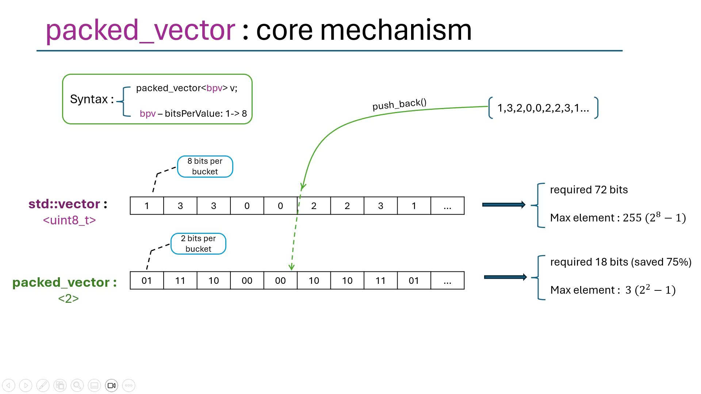

# `packed_vector`

A `packed_vector` stores values using only the minimum number of bits per element through tight bit-packing. This is ideal for memory-constrained environments where large collections of small values (e.g., categorical features, bitfields, quantized data) need to be stored efficiently.

---

## 🧠 Core Concept



**Template Parameters:**
```cpp
template<uint8_t BitsPerElement, typename ValueType = size_t>
class packed_vector;
```

- **`BitsPerElement`** (1..255): Compile-time maximum bit width per value
  - Supports arbitrary bit widths from 1 to 255 bits
  - Platform-independent: uses multi-word storage when `BitsPerElement > WORD_BITS`
  - On 32-bit MCUs: `WORD_BITS = 32`, on 64-bit: `WORD_BITS = 64`
  
- **`ValueType`** (default = `size_t`): The external value type users work with
  - Built-in support: all integral types (`uint8_t`, `uint16_t`, `int`, etc.), enums
  - Custom types: supported via `packed_value_traits` specialization
  - Automatically converts between `ValueType` and bit-packed storage

**Internal Architecture:**
- **`PackedArray<BitsPerElement>`**: Low-level bit-packing engine
  - Uses `word_t = size_t` for platform-optimized storage
  - Elements may span multiple words when needed
  - Provides `set_unsafe()`/`get_unsafe()` for direct bit manipulation
  
- **Runtime `bpv` (bits-per-value)**: Dynamically adjustable bit width
  - Default equals `BitsPerElement` on construction
  - Can be changed via `set_bits_per_value()` (clears data)
  - Allows switching between 1-bit, 2-bit, 4-bit modes at runtime

---

## ✨ Key Features

| Feature | Description |
|---------|-------------|
| **Tight Bit-Packing** | Only `bpv` bits per element (default = `BitsPerElement`). Supports widths > native word size via multi-word reads/writes |
| **ValueType Flexibility** | Generic template parameter supports integers, enums, and custom types via trait specialization |
| **Constructors** | Default, capacity-only, size+fill-value, initializer lists, range copy (cross-type compatible) |
| **Assignment** | `assign(count, value)`, `assign(min_init_list)`, element-wise via `set()` method |
| **Iterators** | Random-access iterators (`begin()`, `end()`) with pointer-like arithmetic and bounds-checked access |
| **Dynamic Operations** | `push_back`, `resize`, `reserve`, `fill`, `pop_back`, `clear`, `fit` |
| **Runtime Reconfiguration** | `set_bits_per_value()` allows changing bit width (clears data, keeps capacity) |
| **Memory Efficiency** | `memory_usage()` reports actual bytes used. `fit()` shrinks capacity to current size |

---

## 🛠 Constructors

```cpp
using mcu::packed_vector;

// Basic constructors
packed_vector<3> empty;                       // default: capacity=1, size=0, bpv=3
packed_vector<4> with_capacity(32);           // reserve 32 slots, size=0, bpv=4
packed_vector<2> with_data(8, 3);             // size=8, all values=3 (clamped to 2-bit max)

// Custom value types
packed_vector<8, uint8_t> bytes;              // 8-bit values as uint8_t
packed_vector<4, int16_t> signed_vals;        // 4-bit storage, int16_t interface

// Wide bit-widths (multi-word storage)
packed_vector<48, uint64_t> wide48;           // 48-bit elements
packed_vector<40, size_t> wide40;             // 40-bit elements

// For BitsPerElement > WORD_BITS (32 on most MCUs):
// - Values automatically span multiple storage words
// - Use wide ValueType (uint64_t) to avoid narrowing warnings
// - Platform-independent behavior (works on 32-bit and 64-bit)
```

### Initializer List Support

Use `mcu::min_init_list<T>` or convenience macros:

```cpp
// Macro with optional header (auto-detected and stripped)
packed_vector<3> test_vec = MAKE_UINT8_LIST(3, 1, 2, 3, 4, 5, 6, 7, 0);
// First value '3' matches bpv=3, so it's treated as header and stripped
// Actual data: [1, 2, 3, 4, 5, 6, 7, 0]

// Macro without header
packed_vector<3> test_vec = MAKE_LIST(uint8_t, 1, 2, 0, 4, 6, 2, 7, 0);
// Direct data storage

// Direct min_init_list construction
auto init = mcu::min_init_list<uint8_t>((const uint8_t[]){1, 2, 3, 0}, 4);
packed_vector<2> from_list(init);

// Assignment after construction
packed_vector<4> vec;
vec.assign(MAKE_UINT8_LIST(4, 15, 14, 13, 12));
```

**Header Detection Logic:**
- If `first_value == bpv` AND any subsequent value `> bpv`: first value is a header, strip it
- Otherwise: treat all values as data
- Values are automatically clamped to `max_value = (1 << bpv) - 1`

### Range Constructors

Copy elements from another `packed_vector` with automatic type conversion:

```cpp
packed_vector<3> source = MAKE_UINT8_LIST(3, 1, 2, 3, 4, 5);

// Same BitsPerElement
packed_vector<3> mid(source, 1, 4);           // copies indices [1, 4) → [2, 3, 4]

// Cross BitsPerElement (automatic clamping)
packed_vector<2> cross(source, 0, 5);         // clamps values to 2-bit max: [1, 2, 3, 3, 3]
                                              // value 4 → 3, value 5 → 3

// Cross ValueType
packed_vector<8, uint8_t> bytes = MAKE_UINT8_LIST(8, 10, 20, 30);
packed_vector<4, uint16_t> shorts(bytes, 1, 3); // [20, 30] as uint16_t

// Optimized bulk copy when:
// - Same bpv
// - Word-aligned starting position
// Uses memcpy for maximum speed
```

**Range Validation:**
- Automatically clamps `end_index` to `source.size()`
- Skips invalid ranges (`start > end` or `start >= size`)
- Destination capacity clamped to `VECTOR_MAX_CAP`

---

## 📦 Runtime Operations

```cpp
packed_vector<4> vec;
vec.push_back(9);                // append value (auto-grows capacity)
vec.resize(5, 7);                // size=5, new elements filled with 7
vec.fill(2);                     // set all elements to 2
vec.reserve(100);                // pre-allocate capacity
vec.pop_back();                  // remove last element
vec.clear();                     // size=0 (keeps capacity)
vec.fit();                       // shrink capacity to size

// Capacity management
size_t cap = vec.capacity();     // current capacity
size_t sz = vec.size();          // current size
bool empty = vec.empty();        // size == 0?
```

### ⚠️ Important: Element Access

**`packed_vector` does NOT support direct assignment via `operator[]`** because elements are bit-packed and cannot return references. This is similar to `std::vector<bool>`.

```cpp
packed_vector<4> vec;
vec.push_back(5);

// ❌ WRONG - Compilation error
vec[0] = 10;

// ✅ CORRECT - Use set() for assignment
vec.set(0, 10);

// ✅ Reading works normally
auto value = vec[0];      // Returns by value
auto val2 = vec.at(3);    // Bounds-checked read (throws if out of range)
```

**Why this limitation?**
- Elements are bit-packed across byte/word boundaries
- No physical memory address for a single bit-packed element
- C++ references require an addressable location (can't create a reference to 3 bits)

**Complete Element Access API:**

| Operation | Syntax | Description | Bounds Check |
|-----------|--------|-------------|--------------|
| **Read** | `vec[index]` | Get element value (returns by value) | No (returns last element if OOB) |
| **Read Safe** | `vec.at(index)` | Bounds-checked read | Yes (throws `std::out_of_range`) |
| **Write** | `vec.set(index, value)` | Set element value | No (silent no-op if OOB) |
| **Write Unsafe** | `vec.set_unsafe(index, value)` | Fastest write (no bounds check) | No (undefined if OOB) |
| **Get** | `vec.get(index)` | Explicit read with default return | No (returns default if OOB) |
| **Front/Back** | `vec.front()` / `vec.back()` | First/last element | Throws if empty |
| **Append** | `vec.push_back(value)` | Add to end (auto-grows) | N/A |

### Iterators

```cpp
packed_vector<4, uint8_t> vec = MAKE_UINT8_LIST(4, 1, 2, 3, 4);

// Range-based for loop
for (auto v : vec) {
    // v has type ValueType (uint8_t here)
}

// Manual iteration
for (auto it = vec.begin(); it != vec.end(); ++it) {
    auto value = *it;  // dereference returns ValueType
}

// Random access
auto it = vec.begin();
auto third = *(it + 2);   // same as vec[2]
auto diff = vec.end() - vec.begin();  // == size()

// Iterator debugging
size_t idx = it.get_index();  // current position
```

**Iterator Features:**
- **Category**: Random-access iterator
- **Operations**: `++`, `--`, `+`, `-`, `+=`, `-=`, comparison operators
- **Dereferencing**: Returns `ValueType` by value (not reference)
- **Const-correctness**: Separate `iterator` and `const_iterator` types

### Dynamic Bits-Per-Value (bpv)

Runtime bit-width reconfiguration for space/precision tradeoffs:

```cpp
packed_vector<5> dyn(4, 31);         // bpv=5, all values=31
uint8_t current = dyn.get_bits_per_value();  // returns 5

// Switch to 3-bit mode (clears data, keeps capacity)
dyn.set_bits_per_value(3);           // bpv=3, max_value=7
assert(dyn.empty());                 // size=0 after bpv change

// Repopulate with new max value
for (uint8_t i = 0; i < 4; ++i) {
    dyn.push_back(i);                // values: [0, 1, 2, 3]
}

// Query limits
auto max = dyn.max_value();          // returns 7 (2^3 - 1)
auto bpe = dyn.bits_per_element();   // returns 5 (compile-time limit)
```

**Key Points:**
- **`get_bits_per_value()`**: Returns active runtime bpv (may differ from `BitsPerElement`)
- **`set_bits_per_value(bpv)`**: Changes bit width, **clears all data**, retains capacity
- **`max_value()`**: Returns maximum representable value for current bpv
- **`bits_per_element()`**: Returns compile-time `BitsPerElement` limit

**Use Cases:**
- Start with 1-bit (bool flags), switch to 2-bit (4 states) as needed
- Quantization: adjust precision dynamically (3-bit → 5-bit → 8-bit)
- Memory optimization: use minimum bits after analyzing data range

---

## 🧮 Memory Footprint

### Memory Calculation

```cpp
packed_vector<3> vec(100);  // 100 elements, 3 bits each
size_t bytes = vec.memory_usage();  // Returns actual heap bytes used

// Formula: ceil((capacity * bpv) / 8) bytes
// 100 elements * 3 bits = 300 bits = 37.5 → 38 bytes (rounded up)
```

**Components:**
- **Object size**: `sizeof(packed_vector)` ≈ 16-24 bytes (stack/heap header)
  - `PackedArray` instance
  - `size_` and `capacity_` members
- **Data allocation**: Returned by `memory_usage()`
  - Actual bits: `capacity * bpv`
  - Allocated: rounded up to word boundary

### Word Size & Multi-Word Support

```cpp
// Platform-dependent word size
using word_t = size_t;                    // Storage word type
constexpr size_t WORD_BITS = sizeof(size_t) * 8;

// 32-bit MCU: WORD_BITS = 32
// 64-bit PC:  WORD_BITS = 64
```

**Multi-Word Elements:**
- Elements with `bpv > WORD_BITS` automatically span multiple words
- Read/write operations loop across word boundaries
- Fully portable between 32-bit and 64-bit platforms

**Examples:**
```cpp
// 32-bit platform (WORD_BITS=32)
packed_vector<40, uint64_t> wide;  // Each element uses 2 words (40 > 32)
wide.push_back(0x123456789A);      // Splits across two 32-bit words

// 64-bit platform (WORD_BITS=64)
packed_vector<40, uint64_t> wide;  // Each element uses 1 word (40 < 64)
```

**Memory Efficiency:**
- No artificial 32-bit limit
- Bit-level precision (no byte rounding per element)
- Optimal for small values: 3-bit elements use 3 bits, not 8

### Detailed Memory Analysis

Memory overhead breakdown for a 32-bit MCU system:

**Object Size (Header - typically on stack):**
```cpp
sizeof(packed_vector<BPV, ValueType>) ≈ 16-24 bytes:
  - PackedArray<BPV> instance: ~12 bytes
    - word_t* data pointer: 4 bytes
    - uint8_t bpv_: 1 byte
    - size_t capacity_words_: 4 bytes
    - padding: 3 bytes
  - size_t size_: 4 bytes
  - size_t capacity_: 4 bytes
```

**Heap Allocation (Data Storage):**
```cpp
Formula: words_needed = ceil((capacity * bpv) / WORD_BITS)
Bytes used: words_needed * sizeof(word_t)

// Example: 100 elements, 3 bpv, 32-bit system
// bits = 100 * 3 = 300
// words = ceil(300 / 32) = 10 words
// bytes = 10 * 4 = 40 bytes
```

### Real-World Memory Comparison

Estimated total RAM usage vs `std::vector<uint8_t>` (32-bit system, fitted capacity):

| Scenario | Config | Elements | bpv | Header | Data | **`packed_vector` Total** | `std::vector<uint8_t>` Total | **Savings** |
|----------|--------|----------|-----|--------|------|--------------------------|------------------------------|-------------|
| Bit flags | `packed_vector<1>` | 64 | 1 | ~20 bytes | 8 bytes | **28 bytes** | ~76 bytes | **63%** |
| Tiny lookup | `packed_vector<2>` | 12 | 2 | ~20 bytes | 4 bytes | **24 bytes** | ~24 bytes | **0%** |
| Sensor states | `packed_vector<3>` | 120 | 3 | ~20 bytes | 48 bytes | **68 bytes** | ~132 bytes | **48%** |
| Quantized features | `packed_vector<5>` | 200 | 5 | ~20 bytes | 128 bytes | **148 bytes** | ~212 bytes | **30%** |
| Full byte fallback | `packed_vector<8>` | 128 | 8 | ~20 bytes | 128 bytes | **148 bytes** | ~140 bytes | **-6%*** |

\* *When `bpv=8`, bit-packing overhead makes `packed_vector` slightly less efficient than byte arrays. Consider using `std::vector<uint8_t>` or `mcu::vector<uint8_t>` for 8-bit values.*

**Key Insights:**
- **Sweet spot**: 1-5 bits per element (30-63% memory savings)
- **Break-even**: ~12 elements for 2-bit values
- **Not recommended**: 8-bit values (native byte alignment is more efficient)
- **Header overhead**: ~20 bytes fixed cost (amortized over many elements)

### Getting Memory Usage

```cpp
packed_vector<4> vec(100);
size_t heap_bytes = vec.memory_usage();      // Heap allocation only
size_t total = sizeof(vec) + heap_bytes;     // Total memory footprint

vec.fit();  // Shrink capacity to size, reclaim unused memory
```

---

## 🎯 User-Defined Types (UDTs)

`packed_vector` supports custom types via `packed_value_traits` specialization:

### Built-in Support (No Specialization Needed)

```cpp
// Integers: automatic support
packed_vector<4, uint8_t> bytes;
packed_vector<16, int16_t> shorts;
packed_vector<32, uint32_t> ints;

// Enums: automatic support
enum class Color : uint8_t { Red = 0, Green = 1, Blue = 2 };
packed_vector<2, Color> colors;
colors.push_back(Color::Red);
```

### Custom Type Specialization

For non-integral types, specialize `packed_value_traits`:

```cpp
namespace mcu {

// Example: Custom struct with bit conversion
struct MyType {
    uint8_t field1 : 4;
    uint8_t field2 : 4;
};

template<>
struct packed_value_traits<MyType> {
    static size_t to_bits(const MyType& value) noexcept {
        return (value.field1 & 0xF) | ((value.field2 & 0xF) << 4);
    }
    
    static MyType from_bits(size_t bits) noexcept {
        MyType result;
        result.field1 = bits & 0xF;
        result.field2 = (bits >> 4) & 0xF;
        return result;
    }
};

} // namespace mcu

// Usage
mcu::packed_vector<8, MyType> vec;
vec.push_back(MyType{3, 7});
```

### Trivially Copyable Types

Small trivially-copyable types (≤ `sizeof(size_t)`) get automatic support via memcpy:

```cpp
struct Point2D {
    int16_t x;
    int16_t y;
};
static_assert(std::is_trivially_copyable_v<Point2D>);

// Automatic support (no trait specialization needed)
packed_vector<32, Point2D> points;  // 32 bits = 4 bytes = sizeof(Point2D)
points.push_back(Point2D{10, 20});
```

**Requirements for Automatic Support:**
- `std::is_trivially_copyable_v<T> == true`
- `sizeof(T) <= sizeof(size_t)` (usually 4 or 8 bytes)

### Type Constraints

```cpp
// ❌ This won't compile (no trait specialization)
struct LargeType {
    uint64_t data[10];
};
packed_vector<640, LargeType> fail;  // Error: no packed_value_traits

// ✅ Provide specialization or use smaller type
```

---

## 🧪 Usage Patterns & Best Practices

### Element Assignment Patterns

```cpp
packed_vector<4> vec(10);  // 10 elements, bpv=4, max_value=15

// ✅ Correct assignment patterns
vec.set(0, 10);            // Individual element
vec.fill(5);               // All elements
vec.resize(15, 7);         // Grow and fill new elements
vec.push_back(12);         // Append

// ⚠️ Common mistakes
vec[3] = 8;                // ❌ Compile error - no operator[] assignment
vec.get(3) = 8;            // ❌ Compile error - returns by value

// 🎯 Best practices
vec.set_unsafe(5, 9);      // Fastest (no bounds check) - use in tight loops
if (index < vec.size()) {
    vec.set_unsafe(index, value);  // Safe when bounds pre-checked
}
```

### Capacity Management

```cpp
packed_vector<3> vec;

// Pre-allocate for bulk operations
vec.reserve(1000);         // Reserve capacity upfront
for (size_t i = 0; i < 1000; ++i) {
    vec.push_back(i % 8);  // No reallocations
}

// Memory optimization
vec.fit();                 // Shrink capacity to size
size_t saved = vec.capacity() - vec.size();  // Bytes freed
```

### Value Clamping

Values are automatically clamped to `max_value = (1 << bpv) - 1`:

```cpp
packed_vector<3> vec;      // max_value = 7 (2^3 - 1)

vec.push_back(10);         // Stored as 7 (clamped)
vec.set(0, 255);           // Stored as 7 (clamped)
vec.resize(5, 100);        // All new elements = 7 (clamped)

assert(vec[0] == 7);       // Reads return clamped value
```

### Runtime bpv Switching

```cpp
packed_vector<8> vec;      // BitsPerElement=8 (max compile-time width)

// Start with 2-bit mode
vec.set_bits_per_value(2); // max_value = 3
vec.push_back(0);
vec.push_back(1);
vec.push_back(2);
vec.push_back(3);

// Switch to 4-bit mode (clears data!)
vec.set_bits_per_value(4); // max_value = 15, size=0, capacity retained
vec.resize(4, 10);         // Repopulate with new range

// Query current state
uint8_t runtime_bpv = vec.get_bits_per_value();  // 4
uint8_t compile_max = vec.bits_per_element();    // 8
auto max_val = vec.max_value();                  // 15
```

### Cross-Type Conversions

```cpp
// Convert between different BitsPerElement
packed_vector<3> source = MAKE_UINT8_LIST(3, 1, 2, 3, 4, 5);

packed_vector<5> expanded(source, 0, source.size());  // Expand to 5-bit
packed_vector<2> compressed(source, 0, source.size()); // Compress (clamps)

// Convert between different ValueType
packed_vector<8, uint8_t> bytes = MAKE_UINT8_LIST(8, 10, 20, 30);
packed_vector<8, uint16_t> shorts(bytes, 0, bytes.size());
```

### When to Use `packed_vector`

**✅ Ideal Use Cases:**
- **Categorical features**: Classes, labels, states with limited range (2-5 bits)
- **Bit flags**: Boolean arrays (1 bit per element) - 87% memory savings
- **Quantized data**: ML features quantized to 3-5 bit precision
- **Sparse indices**: Small integer IDs (6-12 bits) in large collections
- **Sensor states**: Limited-range values (temperature zones, alert levels)
- **Lookup tables**: Small key spaces (8-16 bit indices)

**❌ Not Recommended For:**
- **8-bit values**: Use `std::vector<uint8_t>` or `mcu::vector<uint8_t>` instead
- **Floating-point data**: Use `std::vector<float>` unless quantized
- **Frequently modified**: Bit manipulation overhead on every write
- **Very small collections** (< 10 elements): Header overhead dominates
- **Random access hot path**: Native arrays are faster for tight loops

### Performance Characteristics

| Operation | Complexity | Notes |
|-----------|------------|-------|
| `operator[]` (read) | O(1) | Bit extraction, ~2-3x slower than native array |
| `set(index, value)` | O(1) | Bit masking, ~2-3x slower than native array |
| `push_back()` | O(1) amortized | May trigger reallocation |
| `resize()` | O(n) | Fills new elements |
| `reserve()` | O(n) | Copies existing data |
| Iteration | O(n) | ~1.5-2x slower than native due to bit unpacking |
| Memory usage | O(n * bpv / 8) | Tight bit-packing, no waste |

---

## 🧪 Usage Patterns & Best Practices

### Element Assignment Patterns

```cpp
packed_vector<4> vec(10);  // 10 elements, bpv=4, max_value=15

// ✅ Correct assignment patterns
vec.set(0, 10);            // Individual element
vec.fill(5);               // All elements
vec.resize(15, 7);         // Grow and fill new elements
vec.push_back(12);         // Append

// ⚠️ Common mistakes
vec[3] = 8;                // ❌ Compile error - no operator[] assignment
vec.get(3) = 8;            // ❌ Compile error - returns by value

// 🎯 Best practices
vec.set_unsafe(5, 9);      // Fastest (no bounds check) - use in tight loops
if (index < vec.size()) {
    vec.set_unsafe(index, value);  // Safe when bounds pre-checked
}
```

### Capacity Management

```cpp
packed_vector<3> vec;

// Pre-allocate for bulk operations
vec.reserve(1000);         // Reserve capacity upfront
for (size_t i = 0; i < 1000; ++i) {
    vec.push_back(i % 8);  // No reallocations
}

// Memory optimization
vec.fit();                 // Shrink capacity to size
size_t saved = vec.capacity() - vec.size();  // Bytes freed
```

### Value Clamping

Values are automatically clamped to `max_value = (1 << bpv) - 1`:

```cpp
packed_vector<3> vec;      // max_value = 7 (2^3 - 1)

vec.push_back(10);         // Stored as 7 (clamped)
vec.set(0, 255);           // Stored as 7 (clamped)
vec.resize(5, 100);        // All new elements = 7 (clamped)

assert(vec[0] == 7);       // Reads return clamped value
```

### Runtime bpv Switching

```cpp
packed_vector<8> vec;      // BitsPerElement=8 (max compile-time width)

// Start with 2-bit mode
vec.set_bits_per_value(2); // max_value = 3
vec.push_back(0);
vec.push_back(1);
vec.push_back(2);
vec.push_back(3);

// Switch to 4-bit mode (clears data!)
vec.set_bits_per_value(4); // max_value = 15, size=0, capacity retained
vec.resize(4, 10);         // Repopulate with new range

// Query current state
uint8_t runtime_bpv = vec.get_bits_per_value();  // 4
uint8_t compile_max = vec.bits_per_element();    // 8
auto max_val = vec.max_value();                  // 15
```

### Cross-Type Conversions

```cpp
// Convert between different BitsPerElement
packed_vector<3> source = MAKE_UINT8_LIST(3, 1, 2, 3, 4, 5);

packed_vector<5> expanded(source, 0, source.size());  // Expand to 5-bit
packed_vector<2> compressed(source, 0, source.size()); // Compress (clamps)

// Convert between different ValueType
packed_vector<8, uint8_t> bytes = MAKE_UINT8_LIST(8, 10, 20, 30);
packed_vector<8, uint16_t> shorts(bytes, 0, bytes.size());
```

---

## ✅ Compatibility & Requirements

**Standard:** C++17 or later
- Uses `if constexpr`, `std::enable_if_t`, `std::is_integral_v`
- Requires `<type_traits>`, `<cstring>`, `<limits>`

**Platforms:** Optimized for memory-constrained microcontrollers
- ESP32, ESP8266, STM32, Arduino
- 32-bit and 64-bit architectures
- Automatically adapts `WORD_BITS` to platform

**Dependencies:**
- `PackedArray<BitsPerElement>`: Low-level bit-packing engine
- `min_init_list<T>`: Lightweight initializer list alternative
- `packed_value_traits<T>`: Type conversion system
- `mem_alloc`: Custom allocator with PSRAM support (ESP32)

**Memory Allocator Features:**
- Automatic PSRAM allocation on ESP32 when available
- Falls back to DRAM if PSRAM unavailable
- Proper alignment for all types
- No exceptions (returns nullptr on allocation failure)

**Thread Safety:** Not thread-safe (requires external synchronization)

---

## 📝 API Quick Reference

### Construction & Assignment
```cpp
packed_vector<BPV, ValueType>();                  // Default
packed_vector<BPV, ValueType>(capacity);          // Reserve capacity
packed_vector<BPV, ValueType>(size, value);       // Fill constructor
packed_vector<BPV, ValueType>(init_list);         // From min_init_list
packed_vector<BPV, ValueType>(source, start, end); // Range copy

vec = other;                                      // Copy/move assignment
vec.assign(count, value);                         // Replace with count*value
vec.assign(init_list);                            // Replace with init list
```

### Element Access
```cpp
ValueType vec[index];                             // Read (clamped to bounds)
ValueType vec.at(index);                          // Read (throws if OOB)
vec.set(index, value);                            // Write (bounds-checked)
vec.set_unsafe(index, value);                     // Write (unchecked, fastest)
ValueType vec.get(index);                         // Explicit read
ValueType vec.front();                            // First element (throws if empty)
ValueType vec.back();                             // Last element
```

### Capacity & Size
```cpp
size_t vec.size();                                // Current element count
size_t vec.capacity();                            // Current capacity
bool vec.empty();                                 // size() == 0?
vec.reserve(new_capacity);                        // Pre-allocate
vec.resize(new_size, fill_value);                 // Grow/shrink
vec.fit();                                        // Shrink capacity to size
vec.clear();                                      // size=0, keep capacity
```

### Modifiers
```cpp
vec.push_back(value);                             // Append element
vec.pop_back();                                   // Remove last element
vec.fill(value);                                  // Set all elements
```

### Iteration
```cpp
for (auto v : vec) { ... }                        // Range-based for
auto it = vec.begin();                            // Iterator to first
auto it = vec.end();                              // Iterator past last
auto cit = vec.cbegin();                          // Const iterator
```

### Configuration & Queries
```cpp
uint8_t vec.get_bits_per_value();                 // Runtime bpv
vec.set_bits_per_value(new_bpv);                  // Change bpv (clears data)
ValueType vec.max_value();                        // Max representable value
uint8_t vec.bits_per_element();                   // Compile-time BitsPerElement
size_t vec.memory_usage();                        // Heap bytes used
```

### Comparison
```cpp
bool vec1 == vec2;                                // Element-wise equality
bool vec1 != vec2;                                // Inequality
```

---

## 🔗 See Also

- **[STL_MCU Overview](../../STL_MCU.md)** - Complete library documentation
- **[ID_vector](../ID_vector/README.md)** - Optimized for repeated integer IDs
- **[vector & b_vector](../b_vector_and_vector/README.md)** - Standard dynamic arrays
- **[Hash Containers](../../unordered_map_set/README.md)** - Memory-efficient hash maps/sets

---

*`packed_vector` is part of the STL_MCU library, designed for embedded machine learning and memory-constrained applications on microcontrollers.*
