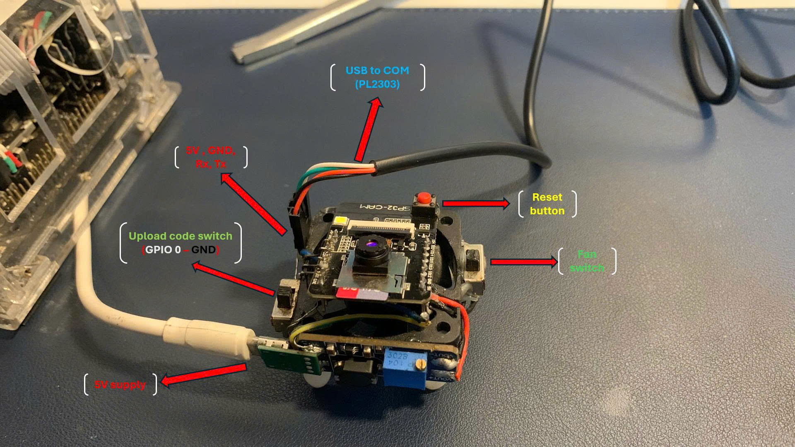

# Ondevice training - full pipeline demo

This example demonstrates the complete workflow of collecting image data on ESP32, pre-training a model on a PC, running the model on an ESP32, and then re-training and updating the model in real time entirely on the ESP32. This allows the model to adapt to new data throughout its lifecycle without needing to reload code or require any intervention.

 

>**Note:** 
 - This library is designed for sensor data, this example uses an image classification task to visualization the full pipeline, feedback mechanism and retraining the model.
 - The feedback and retraining mechanisms used in the demo are user-initiated for demonstration purposes only. In practical implementation, these mechanisms are automatic and based on your specific application requirements.
 - Quantization, pre-train.. step in this demo use default configs and simplified. Please refer to the documentations for more optimized in practical use cases.

## Prerequisites
- ESP32-CAM AI thinker board (4MB-8MB PSRAM recommended).
- OV2640 camera module (usually included with ESP32-CAM).
- Stable 5V/2A power supply.
- USB-to-Serial adapter for programming.
- microSD card (formatted to FAT32).
- Python 3.x on PC with `pyserial` library (`pip3 install pyserial`).

Running the demo code with the server inference online will consume a lot of electricity and heat, so in this demo, I use a hardware with a complete and stable setup, including a 5v power supply, a cooling fan, an OV2640 camera, a microSD card, along with some adjustments to the switches and pinouts for easy operation.

**Note:** The above setup is for demo only, doesn't make much sense in real life or production.

**watch the full video demo here:** [Youtube: Ondevice_training_demo](https://youtu.be/YCBXlie-bYs)

## Detailed Steps

>**Note:** Make sure you have STL_MCU library installed in Arduino IDE.

1. **Collect Dataset on ESP32-CAM**
    - Navigate to [tools/data_collector](../../tools/data_collector/):
    - Open new sketch in Arduino IDE.
    - Copy & paste `dataset_capture_server.ino` + `camera_pins.h` in `dataset_capture_server/` into the sketch.
    - Select ESP32-CAM board and port.
    - Keep following guides in [data_collector/README.md](../../tools/data_collector/README.md) to capture and save images to SD card.

>**Result:** You will have a dataset of images stored on the SD card in a folder named `dataset_images/`.

2. **Transfer Dataset to PC**
    - Inside `tools/data_collector/`,navigate to [data_transfer/](../../tools/data_collector/data_transfer/):
    - Follow steps in [data_transfer/README.md](../../tools/data_collector/data_transfer/README.md) to transfer dataset from ESP32 to PC.
>**Result:** In `result/` folder, u will have `<data_set_name>/` folder (image dataset) and `<model_name>_camera_config.json` (camera config).

3. **Extract features (using hog_transform)**
    - Navigate to [tools/hog_transform](../../tools/hog_transform/).
    - Copy & paste `<model_name>/` dataset from `data_collector/result/` into `hog_transform/datasets`.
    - Follow steps in [hog_transform/README.md](../../tools/hog_transform/README.md) to extract HOG features and generate `*_hogcfg.json` config file for ESP32.

>**Result:** In `hog_transform/result/` folder, u will have `<model_name>.csv` (feature vectors) and `<model_name>_hogcfg.json` (HOG config for ESP32).

4. **Quantize dataset**
    - Navigate to [tools/data_quantization](../../tools/data_quantization/).
    - Copy & paste `<model_name>.csv` from `hog_transform/result/` into `data_quantization/datasets`.
    - Follow instructions in [data_quantization/README.md](../../tools/data_quantization/README.md) to quantize dataset and generate quantized dataset files.
>**Result:** In `data_quantization/data/result/` folder, u will have 4 files : `<model_name>_nml.bin`, `<model_name>_nml.csv`, `<model_name>_ctg.csv`, `<model_name>_dp.csv`.

5. **Pre-train Random Forest model on PC**
    - Navigate to [tools/pre_train](../../tools/pre_train/).
    - Follow instructions in [pre_train/README.md](../../tools/pre_train/README.md) to pre-train a Random Forest model using the quantized dataset.
>**Result:** In `pre_train/trained_model/` folder, u will have 4 files : `<model_name>_forest.bin`, `<model_name>_config.json`, `<model_name>_ndp.bin`, `<model_name>_nlg.csv`.

6. **Transfer all dataset & model files back to ESP32**
    - Navigate to [tools/data_transfer/](../../tools/data_transfer/).
    - Follow instructions in [data_transfer/README.md](../../tools/data_transfer/README.md) to transfer all 8 model files from PC to ESP32 via Serial.
>**Result:** On ESP32, u will have all 8 model files stored in `/model_name/` folder.

7. **Run streaming inference and ondevice training on ESP32**
    - Open [retrain_ondevice_demo.ino](../retrain_ondevice_demo/retrain_ondevice_demo.ino) in Arduino IDE.
    - Select ESP32-CAM board and port.
    - Upload the sketch and open Serial Monitor (115200 baud).
    - Follow instructions in Serial Monitor to perform streaming inference and ondevice training.

**Note:** The steps (tools) `data_collector`, `hog_transform` only apply to vision tasks. For models using sensor data, mainly 2 steps are used: `data_quantization` and `pre-train`.