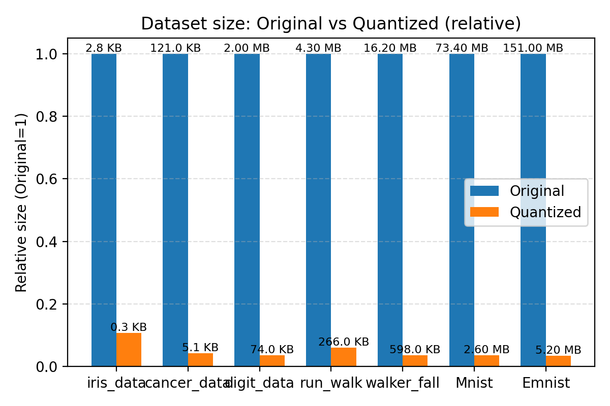
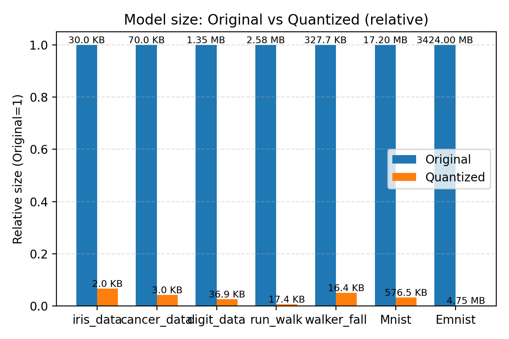
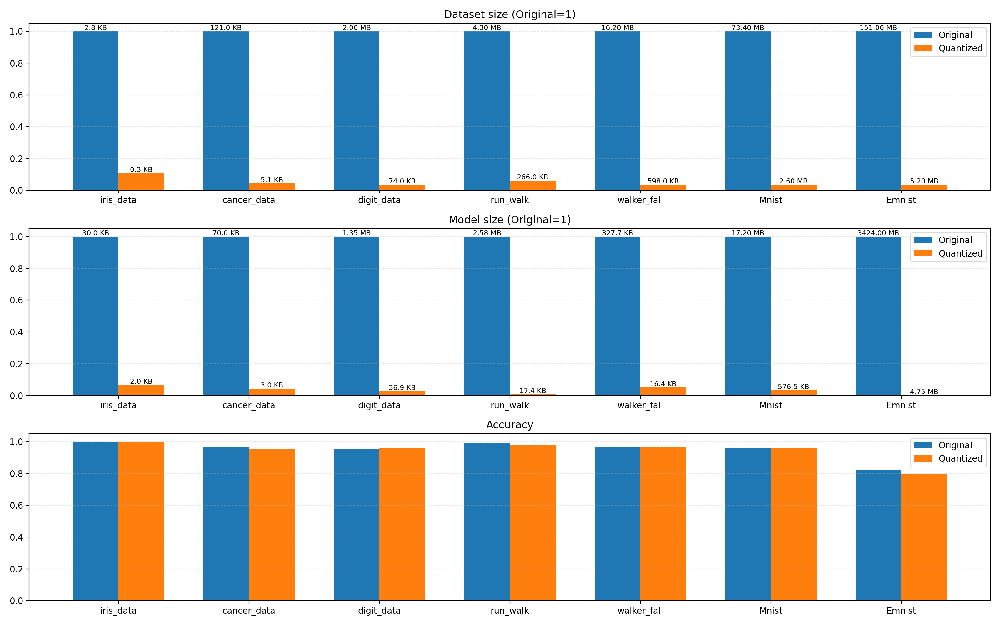
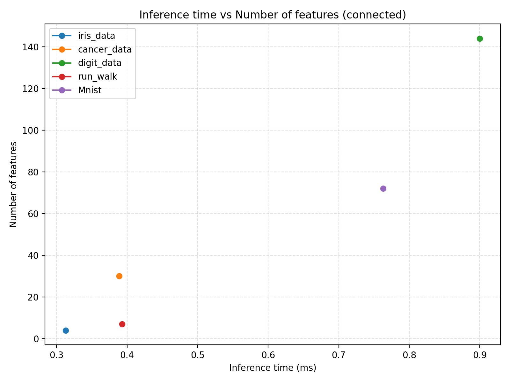

# STL_MCU — Quantization & Performance Report

This document summarizes the compression, precision, inference performance, and memory behavior of quantized random-forest models produced by the STL_MCU toolchain. The reports and benchmarks are run on 7 datasets provided in the tools/data folder: iris_data, cancer_data, walker_fall, digit_data, run_walk, mnist, emnist with various sizes, number of samples and classes.

**What this file contains:** a brief introduction, compression & precision tables, inference-time benchmark notes and graphs, memory/disk/fragmentation observations, and a short conclusion.

---

## Compression & Precision

The table below reports dataset and model compression achieved by variable-bit quantization alongside resulting accuracy changes.

| Dataset | Dataset size (orig → quant) | Dataset ratio | Model size (orig → quant) | Model ratio | Accuracy orig → quant |
|---|---:|---:|---:|---:|---:|
| iris_data (150) | 2.8 KB → 0.3 KB | x9.3 | 30 KB → 2 KB | x15.0 | 1.000 → 1.000 |
| cancer_data (570) | 121 KB → 5.1 KB | x23.7 | 70 KB → 3 KB | x23.3 | 0.965 → 0.956 |
| digit_data (2000) | 2.0 MB → 74 KB | x27.7 | 1.35 MB → 36.9 KB | x37.5 | 0.951 → 0.958 |
| run_walk (89000) | 4.3 MB → 266 KB | x16.6 | 2.58 MB → 17.4 KB | x151.7 | 0.991 → 0.978 |
| walker_fall (2400) | 16.2 MB → 598 KB | x27.8 | 0.32 MB → 16.4 KB | x20.0 | 0.968 → 0.968 |
| Mnist (70000) | 73.4 MB → 2.6 MB | x28.2 | 17.2 MB → 0.563 MB | x30.6 | 0.960 → 0.958 |
| Emnist (274000) | 151 MB → 5.2 MB | x29.0 | 3424 MB → 4.75 MB | x721.3 | 0.823 → 0.795 |

Note: Compression ratios are rounded and computed as (original size / quantized size). Sizes use 1 MB = 1024 KB.

Important clarification: The reported **model_size** mentioned is the model size when loaded into RAM. The model file size can be larger (0 -> 40%) due to the dynamic node layout packing mechanism when the model is loaded into RAM.

Embedded visuals (relative compression and accuracy):

---

## Inference Time (benchmark)

The performance table below summarizes inference time and RAM required across datasets.

| Dataset | # Features | Inference time | 
|---|---:|---:|
| iris_data | 4 | 0.313 ms |
| cancer_data | 30 | 0.389 ms |
| digit_data | 144 | 0.900 ms |
| run_walk | 7 | 0.393 ms |
| Mnist | 72 | 0.763 ms |

Performance plot:

Benchmark note: these inference-time results were recorded on an `esp32-cam` board using an SD_MMC interface in 1-bit mode with an external SD card and PSRAM enabled. In practice, inference can be faster when running on devices with built-in flash/PSRAM or with SD_MMC in 4-bit mode (or when model assets are stored on internal flash or faster storage). Use these results as a representative baseline: your board, SD interface mode, PSRAM availability, and storage location (SD vs internal flash) will affect measured throughput.

## Memory Usage, Disk & Fragmentation

The repo includes memory logs and visualizations showing heap usage, largest free block (fragmentation), and free disk over time for representative runs.

Files of interest:

- `esp32_cam_mlog.txt` — example memory log from an ESP32 run (Time(s), FreeHeap, Largest_Block, FreeDisk, Event)
- `esp32c3_mini_mlog.txt` — example log for an ESP32-C3 mini device
- `imgs/memory_report.png` — normalized memory usage over time (FreeHeap, Largest free block, FreeDisk)
- `imgs/esp32_mini_mreport.png` — example memory report (Digit dataset)

Key observations:

- Disk vs RAM: when models or datasets are stored on external SD, available disk space and SD throughput matter primarily during load/unpack operations. Once the model is loaded and packed into RAM, inference uses the in-memory packed layout for speed.
- Fragmentation: the runtime packing strategy prioritizes compact in-memory layouts and minimizes fragmentation. The plotted 'Largest free block' metric shows fragmentation behavior across runs — the implementation is optimized to keep large contiguous blocks available for allocations where possible.
- PSRAM impact: enabling PSRAM increases total available heap for large models but may change latency characteristics; measure on your target board.

Memory usage plots:

---

## Conclusion

- Quantization yields significant dataset and model compression (commonly 10-30x depending on dataset and bit choices) while preserving accuracy for many use-cases.
- Always evaluate the **runtime in-memory model size** (RAM footprint) rather than on-disk file size when planning deployments on RAM-constrained MCUs.
- Inference latency depends on storage interface, PSRAM presence, and whether the model is loaded from SD or internal flash — benchmark on the actual target hardware and storage configuration.

If you'd like, I can:

- Commit these updated docs and/or embed the images into the README for easier preview.
- Run the plotting script here and attach the generated images to this file.

References and further reading:

- `docs/Quantization/Rf_quantizer.md` — quantizer design and PC-to-ESP32 workflow
- `tools/pre_train/random_forest_pc.cpp` and `tools/pre_train/pc_components.h` — PC-side quantization implementation
- `report/plot_compare.py` — plotting and report generation script

