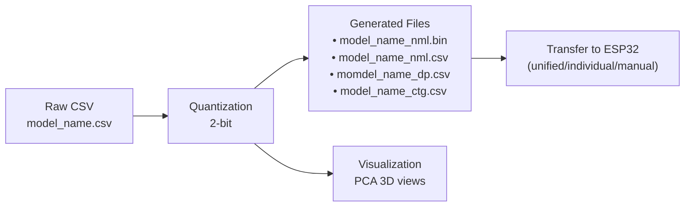
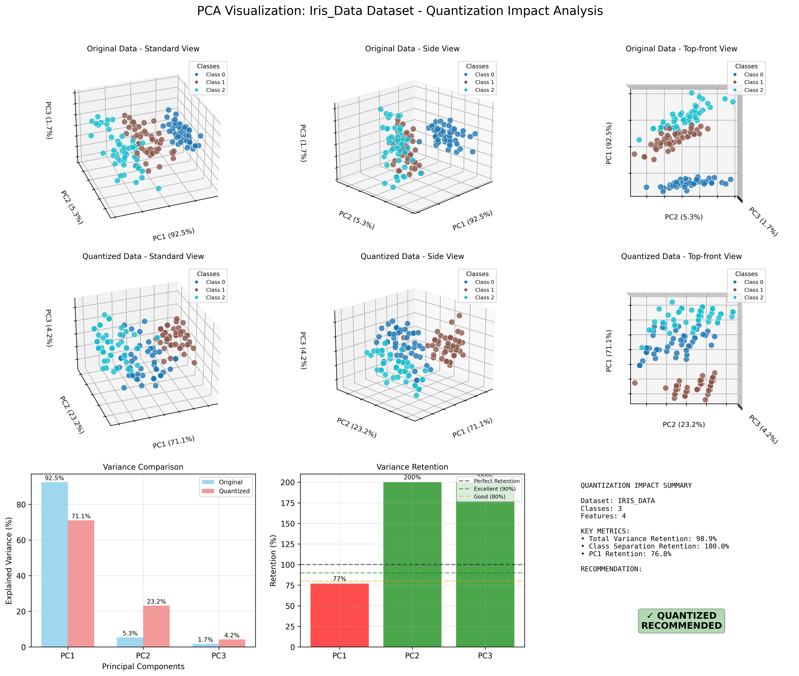
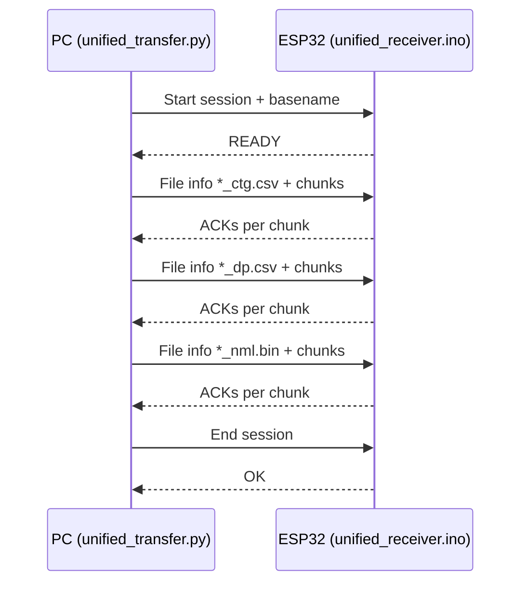

# ESP32 Dataset Processing, Visualization, and Transfer (STL_MCU)

Process CSV datasets → quantize to 2-bit categories → transfer to ESP32.

Complete pipeline for STL_MCU Random Forest: converts CSV data to ESP32-ready format with automatic header detection, 2-bit quantization, and binary export.

## 🎯 What you get

- Automatic CSV processing (handles headers intelligently)
- 2-bit quantization (values 0-3) optimized for ESP32
- Binary export ready for microcontroller memory
- Optional visualization
- Simple transfer to ESP32

## 📛 Model Name Concept

**Important:** The system uses your CSV filename (without .csv extension) as the `model_name` throughout the entire pipeline.

**Example:**
- Input: `digit_data.csv` → Model name: `digit_data`
- Input: `walker_fall.csv` → Model name: `walker_fall`

**All generated files use this model_name:**
- `{model_name}_nml.csv` - Quantized dataset
- `{model_name}_nml.bin` - ESP32 binary format  
- `{model_name}_ctg.csv` - Categorizer rules
- `{model_name}_dp.csv` - Dataset parameters

**For transfer and identification:**
- Transfer command: `python3 unified_transfer.py {model_name} /dev/ttyUSB0`
- ESP32 identifies data by this model_name
- All references in documentation use this naming convention

**On the ESP32 side:**
- `model_name` is used to load and manage datasets, initialize model, file components, etc.

💡 **Remember:** Choose meaningful CSV filenames as they become your model identifiers!

## 🧭 Pipeline at a glance


```
📊 Raw Dataset (CSV)
    ↓
� Smart Header Handling
    ├── Headers detected → Skip first line
    └── No headers → Process all lines
    ↓
�🔄 Quantization Process (2-bit: 0..3)
    ↓
📁 Generated Files:
   ├── *_nml.csv (quantized data only)
   ├── *_ctg.csv (categorizer rules) 
   ├── *_dp.csv (dataset params)
   └── *_nml.bin (ESP32 binary)
    ↓
📈 Visualization (Optional)
   └── PCA 3D plots
    ↓
🔌 Transfer to ESP32
   ├── Unified (recommended)
   ├── Individual files
   └── Manual (Serial Monitor)
```

## 📋 Requirements

- Linux/macOS/WSL
- g++ with C++17
- Python 3.7+ (for visualization/transfer)
- Python packages: numpy, pandas, matplotlib, scikit-learn (installed via Makefile)

## 🚀 Quick start

### Basic Processing

```bash
# Process a dataset (automatic header detection)
./quantize_dataset.sh -p data/iris_data.csv
```

### With Visualization

```bash
# Process and generate plots
./quantize_dataset.sh -p data/iris_data.csv --visualize
```

Generated files will be in `data/result/` directory, ready for ESP32 transfer.

## 🔧 Commands and interfaces

### Basic Script

`./quantize_dataset.sh -p <csv_file> [--visualize]`

### Available Options
- `-p, --path <file>`: input CSV (required)
- `-he, --header <yes/no>`: Skip header if 'yes', process all lines if 'no' (auto-detect if not specified)
- `-v, --visualize`: run visualization after processing
- `-h, --help`: usage

## 📊 Input format

Your CSV should have:
- Column 1: label (string or numeric)
- Columns 2..N: features (any numeric data)
- Headers: optional (automatically handled)

Example:
```
Species,SepalLength,SepalWidth,PetalLength,PetalWidth
setosa,5.1,3.5,1.4,0.2
versicolor,7.0,3.2,4.7,1.4
```

## 🔌 Transfer to ESP32

```bash
cd data_transfer/pc_side
python3 unified_transfer.py <dataset_name> /dev/ttyUSB0
```

## 📊 Visualization

The visualization feature reveals how 2-bit quantization affects your dataset's classification performance. When data is compressed from continuous values to just 4 categories (0,1,2,3), some information is inevitably lost. The PCA analysis shows you exactly what happens:

**What you'll see:**
- **3D PCA plots**: Original data vs quantized data comparison
- **Class separation**: How well different classes remain distinguishable after quantization
- **Variance retention**: Information preserved through the quantization process



The visualization compares original high-dimensional data vs quantized data in 3D PCA space, helping you understand:
- **Before Quantization**: Natural class boundaries and feature relationships
- **After Quantization**: How 2-bit compression affects class separability
- **Trade-off Assessment**: Whether the compression is suitable for your classification task

**Classification Impact:**
- **Class Separation**: How well different classes remain distinguishable after quantization
- **Information Loss**: Which features lose the most discriminative power
- **Clustering Quality**: Whether similar samples still group together post-quantization

### Generate Visualizations

```bash
# Include visualization during processing
./quantize_dataset.sh -p data/your_dataset.csv --visualize

# Or generate plots for existing processed data
make visualize NAME=your_dataset
```

Plots are saved to `plots/` directory with descriptive filenames.

---

## 🔧 Advanced Usage

### Complete Setup Workflow

```bash
# 1. Navigate to the tool directory
cd /path/to/STL_MCU/tools/data_processing

# 2. One-time setup (builds C++, creates Python env, makes folders)
make setup

# 3. Check available datasets
ls data/*.csv
# You'll see: iris_data.csv, digit_data.csv, cancer_data.csv, walker_fall.csv

# 4. Process with full options
./quantize_dataset.sh -p data/iris_data.csv --visualize

# 5. Check the generated files
ls -la data/result/
# You'll see: iris_data_nml.csv, iris_data_ctg.csv, iris_data_dp.csv, iris_data_nml.bin

# 6. Transfer to ESP32 (close Serial Monitor first!)
cd data_transfer/pc_side
python3 unified_transfer.py iris_data /dev/ttyUSB0
```

### Detailed Script Options

`quantize_dataset.sh`
- Options:
  - `-p, --path <file>`: input CSV (required)
  - `-he, --header <yes/no>`: Skip header if 'yes', process all lines if 'no' (auto-detect if not specified)
  - `-v, --visualize`: run visualization after processing
  - `-h, --help`: usage

Examples:
- Auto-detect header: `./quantize_dataset.sh -p data/iris_data.csv`
- Force skip header: `./quantize_dataset.sh -p data/iris_data.csv --header yes`
- Force process all lines: `./quantize_dataset.sh -p data/iris_data.csv --header no`
- Auto-detect + visualize: `./quantize_dataset.sh -p data/iris_data.csv -v`

**Header Detection Logic:**
- Analyzes first two rows to detect header presence
- Compares numeric content ratio between rows
- `--header yes`: Skip first line (treat as header)
- `--header no`: Process all lines (no header present)
- (no --header): Automatically detect and handle appropriately

### Alternative Build Tools

#### Makefile

- `make setup` – build C++ tool, create venv, and make folders
- `make unified FILE=data/file.csv [HEADER=yes] [VIZ=yes]` – full workflow
- `make process FILE=data/file.csv` – process only
- `make process-viz FILE=data/file.csv` – process + visualize
- `make visualize NAME=dataset_name` – visualize existing results
- `make test` / `make test-viz` – quick tests
- `make status` – project health

#### C++ tool (low-level)

- Binary: `processing_data`
- Options:
  - `-p, -path <file>`: input CSV
  - `-he, -header <yes/no>`: Skip header if 'yes', process all lines if 'no' (auto-detect if not specified)
  - `-v, -visualize`
  - `-h, --help`

The script compiles this automatically if needed.

---

## 🧪 Processing details

### Smart Header Handling
- **Automatic Detection**: System analyzes your CSV to determine if it has headers
- **No Configuration Needed**: Just run the tool and it handles headers correctly
- **Manual Override**: Use `--header yes/no` if you need to force specific behavior

### Quantization (quantization_coefficient = 2)
- Outlier handling: Z-score ±3σ clipping
- Continuous features → 4 quantile-based bins
- Discrete detection for integer-like features
- Encode features into 2-bit categories {0,1,2,3}
- Label normalization: map strings → numeric indices

Derived properties:
- Groups per feature: 2^2 = 4
- Features per byte: 8/2 = 4
- Max features supported: 1023

### Outputs (in `data/result/`)
- `<name>_nml.csv` – normalized CSV (quantized data only, no headers)
- `<name>_ctg.csv` – CTG2 categorizer rules
- `<name>_dp.csv` – dataset parameters/metadata
- `<name>_nml.bin` – ESP32 binary dataset
- `plots/` – visuals if `-v` or Makefile visualize
- `<name>_nml.bin` – ESP32 binary dataset
- `plots/` – visuals if `-v` or Makefile visualize

### Binary file format (ESP32)

Header (6 bytes):
- numSamples: 4 bytes, uint32_t, LE
- numFeatures: 2 bytes, uint16_t, LE

Each sample:
- sampleID: 2 bytes, uint16_t, LE
- label: 1 byte, uint8_t
- features: packed, 2 bits/feature (4 features per byte)

Validation performed:
- Ensures features are ∈ [0..3]
- Consistent size vs. expected structure
- Read-back check and summary logging

## 👀 Visualization

PCA-based inspection comparing class separability and variance retention post-quantization.
- Multi-angle images (standard, top-front, side)
- Downsampling for large datasets
- Top-5 class limiting for highly multi-class sets

Generate by either:
- `./quantize_dataset.sh -p data/your.csv -v`
- or `make visualize NAME=<dataset_base_name>` (expects processed files)

## 🔌 Transfer to ESP32

Close the Arduino Serial Monitor before automatic transfer.

Options:

1) Unified transfer (recommended)
- From `tools/data_processing/data_transfer/pc_side/`:
  - `python3 unified_transfer.py <dataset_base_name> <serial_port>`
  - Looks for files in `tools/data_processing/data/result/`:
    - `<name>_ctg.csv`, `<name>_dp.csv`, `<name>_nml.bin`
- ESP32 sketch: `data_transfer/esp32_side/unified_receiver.ino`

2) Individual transfer
- From `data_transfer/pc_side/`:
  - `transfer_categorizer.py ../data/result/<name>_ctg.csv <serial>`
  - `transfer_dataset_params.py ../data/result/<name>_dp.csv <serial>`
  - `transfer_dataset.py ../data/result/<name>_nml.bin <serial>`
- ESP32 sketches: use corresponding receivers in `data_transfer/esp32_side/`

3) Manual (Serial Monitor)
- Use CSV versions and manual copy/paste:
  - `manual_transfer/csv_dataset_receiver.ino`
  - `manual_transfer/ctg_receiver.ino`
  - `manual_transfer/dataset_params_receiver.ino`

Transfer sequence (high level):



ESP32-C3 notes:
- If transfers fail (USB-CDC), tune in `unified_transfer.py`:
  - Reduce `CHUNK_SIZE` (e.g., 128/256)
  - Increase `ACK_TIMEOUT`
  - Add small inter-chunk delays

## 🧰 Examples

### Process Different Dataset Types

- **Iris dataset (with headers)**:
  ```bash
  # Automatically handles headers and skips them
  ./quantize_dataset.sh -p data/iris_data.csv -v
  # Output: 150 samples (header skipped)
  ```

- **Digit dataset (no headers)**:
  ```bash
  # Automatically detects no headers, processes all rows
  ./quantize_dataset.sh -p data/digit_data.csv
  # Output: All rows processed as data
  ```

### Override Automatic Behavior

- **Force skip first line**:
  ```bash
  ./quantize_dataset.sh -p data/iris_data.csv --header yes
  # Skips first line regardless of content
  ```

- **Force process all lines**:
  ```bash
  ./quantize_dataset.sh -p data/iris_data.csv --header no
  # Processes all lines including first row as data
  # Output: 151 samples (first row processed as data)
  ```

### Batch Processing

- **With Makefile**:
  ```bash
  make unified FILE=data/sensor_data.csv HEADER=yes VIZ=yes
  ```
  Check `data/result/` for outputs

### Sample Dataset Formats

**Dataset with headers:**
```csv
Species,SepalLength,SepalWidth,PetalLength,PetalWidth
setosa,5.1,3.5,1.4,0.2
versicolor,7.0,3.2,4.7,1.4
```
→ **Result**: Headers detected and skipped (0% vs 100% numeric)

**Dataset without headers:**
```csv
0,5.1,3.5,1.4,0.2
1,7.0,3.2,4.7,1.4
2,6.3,3.3,6.0,2.5
```
→ **Result**: No headers detected, all rows processed (100% vs 100% numeric)

## 🧱 Folder structure

```
tools/data_processing/
├── Makefile
├── quantize_dataset.sh             # Main script: CSV → quantized outputs
├── processing_data.cpp             # C++ quantizer + binary exporter
├── quantization_visualizer.py
├── requirements.txt
├── data/
│   ├── iris_data.csv
│   ├── digit_data.csv
│   ├── walker_fall.csv
│   └── result/
│       ├── <name>_nml.csv        # Quantized CSV (0..3)
│       ├── <name>_nml.bin        # ESP32 binary dataset
│       ├── <name>_ctg.csv        # Categorizer rules (CTG2)
│       └── <name>_dp.csv         # Dataset params/metadata
├── plots/                         # Visualization outputs
└── data_transfer/
    ├── pc_side/
    │   ├── unified_transfer.py
    │   ├── transfer_categorizer.py
    │   ├── transfer_dataset.py
    │   └── transfer_dataset_params.py
    └── esp32_side/
        ├── unified_receiver.ino
        ├── binary_dataset_receiver.ino
        ├── dataset_params_receiver.ino
        └── manual_transfer/
            ├── csv_dataset_receiver.ino
            ├── ctg_receiver.ino
            └── dataset_params_receiver.ino
```

## 🧪 Tips, limits, and troubleshooting

Performance & limits:
- >10K samples may take several minutes
- ~1GB RAM suggested for >1M samples
- Max features: 1023 (extra truncated)
- Disable `-v` to speed up large runs

Common issues:
- Missing compiler: install build-essential on Debian/Ubuntu
- Python deps: use `make setup-python` or `make clean-python && make setup-python`
- Permission: `chmod +x quantize_dataset.sh processing_data`
- Wrong paths: verify files under `tools/data_processing/data/`

ESP32 compatibility checks (done automatically):
- Features in [0..3]
- Binary structure size matches expectations
- Read-back verification pass
- Sample count reasonable (<10,000 recommended)

ESP32-C3 transfer hiccups (USB-CDC):
- Use unified transfer first
- If still flaky, try CHUNK_SIZE=128, ACK_TIMEOUT=30, and small delays
- Consider classic UART via USB-Serial (e.g., /dev/ttyUSB0)

## 📘 Notes

- This tool is part of the STL_MCU ecosystem; designed for Random Forest on ESP32
- Keep datasets tidy; inspect `_ctg.csv` and `_dp.csv` when debugging quantization
- The binary converter is integrated inside `processing_data.cpp` (no separate build needed)

---

Ready to process and deploy your datasets to ESP32. 🚀
