# ESP32 Dataset Processing, Visualization, and Transfer (STL_MCU)

Process CSV datasets → quantize with variable 1-8 bit coefficients → transfer to ESP32.

Complete pipeline for STL_MCU Random Forest: converts CSV data to ESP32-ready format with automatic header detection, configurable quantization (1-8 bits per feature), and binary export.

## 🎯 What you get

- Variable quantization (1-8 bits per feature, configurable via command-line)
- Visualization effects of quantization
- Transfer to ESP32

## 🧭 Pipeline at a glance

```mermaid
flowchart LR
  A["Raw CSV<br/>[model_name.csv]"] --> B["Quantization<br/>1-8 bits"]
  B --> C["Generated Files<br/>• model_name_nml.bin <br/>• model_name_nml.csv <br/>• model_name_dp.csv <br/>• model_name_ctg.csv"]
  B --> D["Visualization<br/>PCA 3D views"]
  C --> E["Transfer to ESP32<br/> (unified /individual /manual)"]
```


```
📊 Raw Dataset (CSV)
    ↓
🔍 Internal pre-processing
    ├── Headers detected → Skip first line
    ├── No headers → Process all lines
    └── exceeds limits → truncate  
    ↓
🔄 Quantization Process (1-8 bits configurable)
    ├── Feature categorizing (variable bits per feature)
    └── Label mapping
    ↓
📁 Generated Files:
   ├── model_name_nml.bin 
   ├── model_name_nml.csv 
   ├── model_name_dp.csv  
   └── model_name_ctg.csv 
    ↓
📈 Visualization (Optional)
   └── PCA 3D plots
    ↓
🔌 Transfer to ESP32
   ├── Unified (recommended)
   ├── Individual files
   └── Manual (Serial Monitor)
```

## 📛 Model Name Concept

**Model Name Usage:**
The system uses your CSV filename (without .csv extension) as the `model_name` by default. However, you can now **override this with the `-m` / `--model` option** to use a custom model name for your output files.

**Examples:**
- **Default (from filename):**
  - Input: `digit_data.csv` → Model name: `digit_data`
  - Input: `walker_fall.csv` → Model name: `walker_fall`

- **Custom model name:**
  - Input: `digit_data.csv` with `-m digit_classifier` → Model name: `digit_classifier`
  - Input: `walker_fall.csv` with `-m fall_detector_v2` → Model name: `fall_detector_v2`

**All generated files use the model_name:**
- `{model_name}_nml.bin` - Standard format for transfer to ESP32
- `{model_name}_nml.csv` - Used for pre_train tool or manual transfer
- `{model_name}_dp.csv` - File containing general parameters of the dataset
- `{model_name}_ctg.csv` - File containing quantizer

**Technical Details:**
For details on how variable quantization (1-8 bits) and quantizer work, please refer to:
`/home/viettran/Arduino/libraries/STL_MCU/docs/Quantization/Rf_quantizer_Technical_Overview.md`

⚠️ **Dataset Limits:**
- **Max Labels**: 255 unique classes
- **Max Features**: 1023 features per sample (configurable via `-f` option, range: 1-65535)
- **Max Samples**: 65,535 samples per dataset
- Datasets exceeding these limits will be automatically truncated (except labels)

**For transfer and identification:**
- Transfer command: `python3 unified_transfer.py {model_name} /dev/ttyUSB0`
- ESP32 identifies data by this model_name
- All references in documentation use this naming convention

**On the ESP32 side:**
- `model_name` is used to load and manage datasets, initialize model, file components, etc.

💡 **Remember:** Choose meaningful model names for easy identification of your datasets!

## 📋 Requirements

- Linux/macOS/WSL
- g++ with C++17
- Python 3.7+ (for visualization/transfer)
- Python packages: numpy, pandas, matplotlib, scikit-learn (installed via Makefile)

## 🚀 Quick start

### Basic Processing

```bash
# Process with default settings (2-bit quantization, auto-detect header, visualization enabled)
./quantize_dataset.sh -p data/iris_data.csv

# Use custom model name for output files
./quantize_dataset.sh -p data/iris_data.csv -m iris_classifier

# Use 3-bit quantization instead of default 2-bit
./quantize_dataset.sh -p data/iris_data.csv -q 3

# Use 1-bit quantization (binary features)
./quantize_dataset.sh -p data/iris_data.csv -q 1

# Use 8-bit quantization (more granular, uses more memory)
./quantize_dataset.sh -p data/iris_data.csv -q 8

# Skip visualization for faster processing
./quantize_dataset.sh -p data/iris_data.csv -nv

# Limit to 512 features maximum
./quantize_dataset.sh -p data/iris_data.csv -f 512

# Combine options: 4-bit quantization + custom model name + 256 features + no visualization
./quantize_dataset.sh -p data/iris_data.csv -m iris_v2 -q 4 -f 256 -nv
```

### With/Without Visualization and Quantization Options

```bash
# Process with visualization (default 2-bit quantization)
./quantize_dataset.sh -p data/iris_data.csv

# Use 1-bit (binary) quantization with visualization
./quantize_dataset.sh -p data/iris_data.csv -q 1 -v

# Use 3-bit quantization, skip visualization for faster processing
./quantize_dataset.sh -p data/iris_data.csv -q 3 -nv

# Compare different quantization levels (run separately):
./quantize_dataset.sh -p data/iris_data.csv -q 2    # Default: 4 categories
./quantize_dataset.sh -p data/iris_data.csv -q 3    # 8 categories (more detail)
./quantize_dataset.sh -p data/iris_data.csv -q 4    # 16 categories (higher precision)

# With custom feature limit and quantization, no visualization
./quantize_dataset.sh -p data/iris_data.csv -q 2 -f 512 -nv
```

Generated files will be in `data/result/` directory, ready for ESP32 transfer.

## 🔧 Commands and interfaces

### Basic Script

`./quantize_dataset.sh -p <csv_path> [options]`

### Available Options
- `-p, --path <file>`: input CSV (required)
- `-m, --model <name>`: Model name for output filenames (optional; if not provided, extracted from input filename)
- `-he, --header <yes/no>`: Skip header if 'yes', process all lines if 'no' (auto-detect if not specified)
- `-f, --features <number>`: Maximum number of features (default: 1023, range: 1-65535)
- `-q, --bits <1-8>`: Quantization coefficient in bits per feature (default: 2, range: 1-8)
- `-v, --visualize`: run visualization after processing (default: enabled)
- `-nv, --no-visualize`: skip visualization for faster processing
- `-h, --help`: usage

## 📊 Input format

Your CSV should have:
- Column 1: label (string or numeric)
- Columns 2..N: features (any numeric data)
- Headers: optional (automatically handled)

Example:
```
Species,SepalLength,SepalWidth,PetalLength,PetalWidth
setosa,5.1,3.5,1.4,0.2
versicolor,7.0,3.2,4.7,1.4
```

## 🔌 Transfer to ESP32

```bash
cd data_transfer/pc_side
python3 unified_transfer.py <dataset_name> /dev/ttyUSB0
```

## 📊 Visualization

The visualization feature reveals how variable quantization affects your dataset's classification performance. By choosing quantization coefficient between 1-8 bits, you can control the trade-off between model accuracy and resource consumption:

**Quantization Levels:**
- **1-bit**: 2 categories (binary split) - Extreme compression, fastest inference
- **2-bit**: 4 categories (default) - Good balance of accuracy and memory
- **3-bit**: 8 categories - More detail, slightly higher memory usage
- **4-bit**: 16 categories - Higher precision, noticeable memory increase
- **8-bit**: 256 categories - Near-original precision, significant memory cost

**What you'll see:**
- **3D PCA plots**: Original data vs quantized data comparison (with your chosen quantization level)
- **Class separation**: How well different classes remain distinguishable after quantization
- **Variance retention**: Information preserved through the quantization process


The visualization compares original high-dimensional data vs quantized data in 3D PCA space, helping you understand:
- **Before Quantization**: Natural class boundaries and feature relationships
- **After Quantization**: How your chosen bit quantization affects class separability
- **Trade-off Assessment**: Whether the compression is suitable for your classification task

**Classification Impact:**
- **Class Separation**: How well different classes remain distinguishable after quantization
- **Information Loss**: Which features lose the most discriminative power
- **Clustering Quality**: Whether similar samples still group together post-quantization

### Generate Visualizations

```bash
# Include visualization during processing
./quantize_dataset.sh -p data/your_dataset.csv --visualize

# Or generate plots for existing processed data
make visualize NAME=your_dataset
```

Plots are saved to `plots/` directory with descriptive filenames.

---

## 🔧 Advanced Usage

### Complete Setup Workflow

```bash
# 1. Navigate to the tool directory
cd /path/to/STL_MCU/tools/data_quantization

# 2. One-time setup (builds C++, creates Python env, makes folders)
make setup

# 3. Check available datasets
ls data/*.csv
# You'll see: iris_data.csv, digit_data.csv, cancer_data.csv, walker_fall.csv

# 4. Process with full options
./quantize_dataset.sh -p data/iris_data.csv --visualize

# 5. Check the generated files
ls -la data/result/
# You'll see: iris_data_nml.csv, iris_data_ctg.csv, iris_data_dp.csv, iris_data_nml.bin

# 6. Transfer to ESP32 (close Serial Monitor first!)
cd data_transfer/pc_side
python3 unified_transfer.py iris_data /dev/ttyUSB0
```

### Detailed Script Options

`quantize_dataset.sh`
- Options:
  - `-p, --path <file>`: input CSV (required)
  - `-m, --model <name>`: Model name for output filenames (optional; if not provided, extracted from input filename)
  - `-he, --header <yes/no>`: Skip header if 'yes', process all lines if 'no' (auto-detect if not specified)
  - `-f, --features <number>`: Maximum number of features (default: 1023, range: 1-65535)
  - `-q, --bits <1-8>`: Quantization coefficient in bits per feature (default: 2, range: 1-8)
  - `-v, --visualize`: run visualization after processing (default: enabled)
  - `-nv, --no-visualize`: skip visualization for faster processing
  - `-h, --help`: usage

Examples:
- Auto-detect header: `./quantize_dataset.sh -p data/iris_data.csv`
- Custom model name: `./quantize_dataset.sh -p data/iris_data.csv -m iris_classifier`
- Force skip header: `./quantize_dataset.sh -p data/iris_data.csv --header yes`
- Force process all lines: `./quantize_dataset.sh -p data/iris_data.csv --header no`
- Limit to 512 features: `./quantize_dataset.sh -p data/iris_data.csv -f 512`
- Use 3-bit quantization: `./quantize_dataset.sh -p data/iris_data.csv -q 3`
- Binary features (1-bit): `./quantize_dataset.sh -p data/iris_data.csv -q 1 -nv`
- High precision (4-bit) with custom model name: `./quantize_dataset.sh -p data/iris_data.csv -m iris_precise -q 4 -f 256`
- Skip visualization: `./quantize_dataset.sh -p data/iris_data.csv -nv`
- Combined options: `./quantize_dataset.sh -p data/iris_data.csv -m iris_v2 -q 2 -f 256 --header yes -nv`

**Header Detection Logic:**
- Analyzes first two rows to detect header presence
- Compares numeric content ratio between rows
- `--header yes`: Skip first line (treat as header)
- `--header no`: Process all lines (no header present)
- (no --header): Automatically detect and handle appropriately

**Feature Limit:**
- Default: 1023 features (optimized for ESP32 memory constraints)
- Range: 1-65535 features
- Higher limits may require more ESP32 memory during model training/inference
- Datasets exceeding the limit will be automatically truncated horizontally

**Quantization Coefficient:**
- Range: 1-8 bits per feature
- Default: 2 bits (4 categories per feature)
- Lower bits = smaller model, faster inference, less accuracy
- Higher bits = larger model, slower inference, more accuracy
- 1-bit: Use for binary features or extreme memory constraints
- 2-bit: Recommended default, good balance
- 3-4 bits: For higher accuracy requirements
- 8-bit: Near-original precision but significant memory usage
- Choose based on your accuracy vs memory/speed trade-off requirements
- Datasets exceeding the limit will be automatically truncated horizontally

### Alternative Build Tools

#### Makefile

- `make setup` – build C++ tool, create venv, and make folders
- `make unified FILE=data/file.csv [HEADER=yes] [VIZ=yes]` – full workflow
- `make process FILE=data/file.csv` – process only
- `make process-viz FILE=data/file.csv` – process + visualize
- `make visualize NAME=dataset_name` – visualize existing results
- `make test` / `make test-viz` – quick tests
- `make status` – project health

#### C++ tool (low-level)

- Binary: `processing_data`
- Options:
  - `-p, -path <file>`: input CSV
  - `-m, -model <name>`: Model name for output filenames (optional; if not provided, extracted from input filename)
  - `-he, -header <yes/no>`: Skip header if 'yes', process all lines if 'no' (auto-detect if not specified)
  - `-f, -features <number>`: Maximum number of features (default: 1023, range: 1-65535)
  - `-q, -bits <1-8>`: Quantization coefficient in bits per feature (default: 2, range: 1-8)
  - `-v, -visualize`
  - `-h, --help`

The script compiles this automatically if needed.

---

## 🧪 Processing details

### How Quantization Work

For comprehensive technical details on the variable quantization process (1-8 bits) and quantizer implementation, please refer to:

**📖 [Rf_quantizer Technical Overview](../../docs/Quantization/Rf_quantizer.md)**

This document covers:
- Detailed variable quantization algorithms (1-8 bits per feature)
- Quantizer architecture and optimization
- Feature binning strategies (quantile-based, discrete detection)
- Label normalization processes
- Memory optimization techniques for ESP32
- Performance benchmarks with different quantization levels

### Quick Overview

- **Input**: Continuous feature values and string/numeric labels
- **Process**: Variable quantization (1-8 bits configurable, default 2-bit = 4 categories) with outlier handling
- **Output**: Categorical dataset optimized for ESP32 Random Forest
- **Compression**: Overall compression ratio varies by quantization level (1-bit ~50% of 2-bit, 8-bit ~4× of 2-bit)


## 🔌 Transfer to ESP32

Close the Arduino Serial Monitor before automatic transfer.

Options:

1) Unified transfer (recommended)
- From `tools/data_quantization/data_transfer/pc_side/`:
  - `python3 unified_transfer.py <dataset_base_name> <serial_port>`
  - Looks for files in `tools/data_quantization/data/result/`:
    - `<name>_ctg.csv`, `<name>_dp.csv`, `<name>_nml.bin`
- ESP32 sketch: `data_transfer/esp32_side/unified_receiver.ino`

2) Individual transfer
- From `data_transfer/pc_side/`:
  - `transfer_quantizer.py ../data/result/<name>_ctg.csv <serial>`
  - `transfer_dataset_params.py ../data/result/<name>_dp.csv <serial>`
  - `transfer_dataset.py ../data/result/<name>_nml.bin <serial>`
- ESP32 sketches: use corresponding receivers in `data_transfer/esp32_side/`

3) Manual (Serial Monitor)
- Use CSV versions and manual copy/paste:
  - `manual_transfer/csv_dataset_receiver.ino`
  - `manual_transfer/ctg_receiver.ino`
  - `manual_transfer/dataset_params_receiver.ino`

Transfer sequence (high level):


ESP32-C3 notes:
- If transfers fail (USB-CDC), tune in `unified_transfer.py`:
  - Reduce `CHUNK_SIZE` (e.g., 128/256)
  - Increase `ACK_TIMEOUT`
  - Add small inter-chunk delays

## 🧰 Examples

### Process Different Dataset Types

- **Iris dataset (with headers)**:
  ```bash
  # Automatically handles headers and skips them
  ./quantize_dataset.sh -p data/iris_data.csv -v
  # Output: 150 samples (header skipped)
  ```

- **Digit dataset (no headers)**:
  ```bash
  # Automatically detects no headers, processes all rows
  ./quantize_dataset.sh -p data/digit_data.csv
  # Output: All rows processed as data
  ```

### Override Automatic Behavior

- **Force skip first line**:
  ```bash
  ./quantize_dataset.sh -p data/iris_data.csv --header yes
  # Skips first line regardless of content
  ```

- **Force process all lines**:
  ```bash
  ./quantize_dataset.sh -p data/iris_data.csv --header no
  # Processes all lines including first row as data
  # Output: 151 samples (first row processed as data)
  ```

### Batch Processing

- **With Makefile**:
  ```bash
  make unified FILE=data/sensor_data.csv HEADER=yes VIZ=yes
  ```
  Check `data/result/` for outputs

### Sample Dataset Formats

**Dataset with headers:**
```csv
Species,SepalLength,SepalWidth,PetalLength,PetalWidth
setosa,5.1,3.5,1.4,0.2
versicolor,7.0,3.2,4.7,1.4
```
→ **Result**: Headers detected and skipped (0% vs 100% numeric)

**Dataset without headers:**
```csv
0,5.1,3.5,1.4,0.2
1,7.0,3.2,4.7,1.4
2,6.3,3.3,6.0,2.5
```
→ **Result**: No headers detected, all rows processed (100% vs 100% numeric)

## 🧱 Folder structure

```
tools/data_quantization/
├── Makefile
├── quantize_dataset.sh             # Main script: CSV → quantized outputs
├── processing_data.cpp             # C++ quantizer + binary exporter
├── quantization_visualizer.py
├── requirements.txt
├── data/
│   ├── iris_data.csv
│   ├── digit_data.csv
│   ├── walker_fall.csv
│   └── result/                     # Generated files
│       ├── <name>_nml.csv      
│       ├── <name>_nml.bin        
│       ├── <name>_ctg.csv       
│       └── <name>_dp.csv         
├── plots/                          # Visualization outputs
└── data_transfer/                  # Transfer tools
    ├── pc_side/
    │   ├── unified_transfer.py
    │   ├── transfer_quantizer.py
    │   ├── transfer_dataset.py
    │   └── transfer_dataset_params.py
    └── esp32_side/
        ├── unified_receiver.ino
        ├── binary_dataset_receiver.ino
        ├── dataset_params_receiver.ino
        └── manual_transfer/
            ├── csv_dataset_receiver.ino
            ├── ctg_receiver.ino
            └── dataset_params_receiver.ino
```

## 🧪 Tips, limits, and troubleshooting

Common issues:
- Missing compiler: install build-essential on Debian/Ubuntu
- Python deps: use `make setup-python` or `make clean-python && make setup-python`
- Permission: `chmod +x quantize_dataset.sh processing_data`
- Wrong paths: verify files under `tools/data_quantization/data/`

ESP32 compatibility checks (done automatically):
- Features in [0..3]
- Binary structure size matches expectations
- Read-back verification pass
- Sample count reasonable (<10,000 recommended)

ESP32-C3 transfer hiccups (USB-CDC):
- Use unified transfer first
- If still flaky, try CHUNK_SIZE=128, ACK_TIMEOUT=30, and small delays
- Consider classic UART via USB-Serial (e.g., /dev/ttyUSB0)

## 📘 Notes

- This tool is part of the STL_MCU ecosystem; designed for Random Forest on ESP32
- Keep datasets tidy; inspect `_ctg.csv` and `_dp.csv` when debugging quantization
- The binary converter is integrated inside `processing_data.cpp` (no separate build needed)

---

Ready to process and deploy your datasets to ESP32. 🚀
